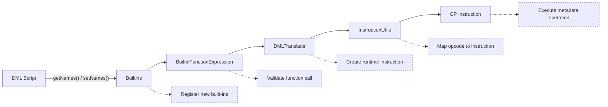
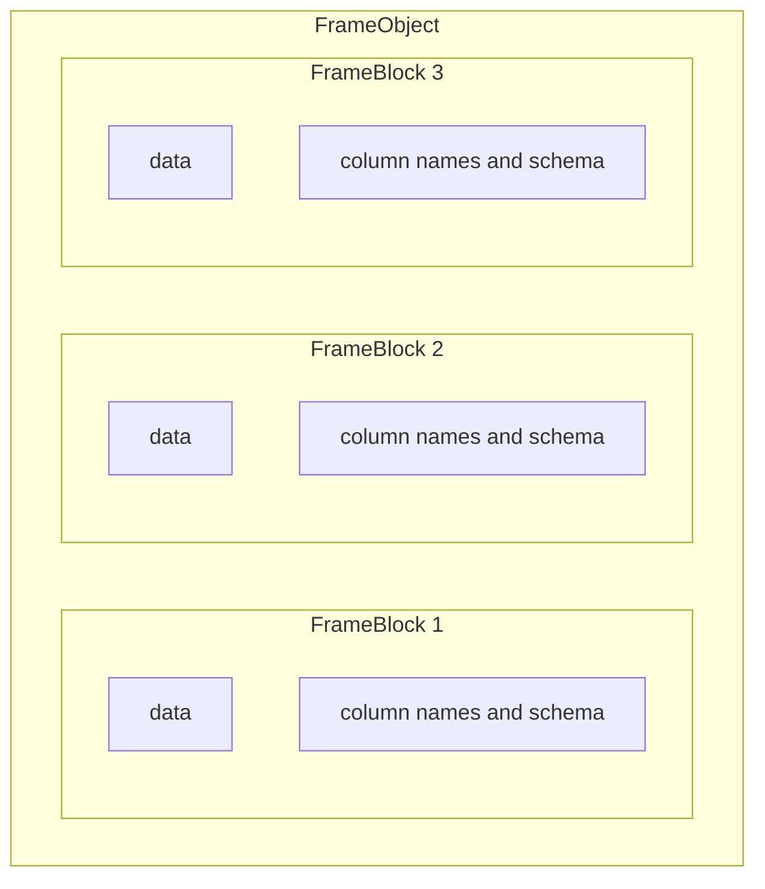

# Final Report

This report covers three related development tasks. The first task implemented getter and setter functionality for frame column names as part of SYSTEMDS-3857. During its validation, a separate defect in CSV header generation was identified and fixed. Further propagation tests then revealed broader inconsistencies in the runtime 
handling of column-name metadata, which motivated the third task and the corresponding redesign.

---

# Getters and Setters

The following sections describe the work carried out as part of the original Ticket: **SYSTEMDS-3857**, 
including the development approach, the implementation of the new built-in functions, and their validation.

## Objective

The objective of the initial ticket **SYSTEMDS-3857** was to implement and test getter and setter
functionality for frames in SystemDS.

Accessing and modifying column names is a common operation in data processing workflows.
Similar functionality is provided by widely used data analysis frameworks such as Pandas and R,
where column names are treated as an integral part of a data frame's metadata.

## Initial Architecture


Prior to this work, SystemDS exposed the built-in function `colnames()` to DML for retrieving
the column names of a frame. However, no complementary operation was available to modify column 
names. Consequently, DML provided only read access to this aspect of frame metadata, without a
corresponding write operation.

In contrast, data analysis environments such as Pandas and R provide a symmetric interface
for both retrieving and assigning column names. Establishing the same symmetry in the SystemDS
DML interface was therefore one of the primary objectives of the initial ticket.


## Analysis

Although the necessary functionality for setting column names already existed 
internally, there was no way to access or use these operations directly from DML code.
This ticket addressed that limitation by exposing the corresponding functionality to the
DML language and validating it through appropriate tests.

### Approach

The development process followed a top-down, trace-driven approach. As a starting point,
a DML script was created that called the desired function, even though the
functionality had not yet been implemented. Executing this script revealed
missing components in the processing pipeline.

The execution path was then traced with the help of a debugger and the behavior was compared with that of existing built-in functions implementing
similar functionality, such as `colnames(x)`. Whenever a missing implementation or unsupported
code path was encountered, the corresponding component was analyzed, extended, and integrated
before continuing with the next execution step.

This iterative process made it possible to identify all components involved in the execution
of the new built-in functions and to implement the required functionality incrementally across
the different layers of the SystemDS architecture.




### Implementation

The implementation of the `getNames()` and `setNames()` built-in functions required changes across multiple layers of the SystemDS architecture. The following table summarizes the relevant classes, their purpose, and the modifications introduced.

| Class | Method | Purpose | Changes |
|-------|---------|---------|---------|
| `Builtins` | - | Defines all built-in DML functions. | Registered `getNames()` and `setNames()`. |
| `Opcodes` | - | Defines runtime opcodes for instructions. | Added opcodes for the new built-in functions. |
| `BuiltinFunctionExpression` | - | Parses and validates built-in function calls. | Added parsing support for the new functions. |
| `DMLTranslator` | - | Translates DML expressions into runtime instructions. | Added translation of the new built-ins into CP instructions. |
| `InstructionUtils` | - | Parses instruction strings and creates runtime instructions. | Registered the new instruction types. |
| `UnaryFrameCPInstruction` | `processInstruction()` | Executes unary frame instructions. | Implemented `getNames()`. |
| `BinaryFrameFrameCPInstruction` | `processInstruction()` | Executes binary frame instructions. | Implemented `setNames()`. |

### Validation
The implementation was verified using round-trip tests.
Column names are first written to a frame using `setNames()` and
subsequently read back using `getNames()`.
These tests were executed in both CP and Spark execution modes to ensure
consistent behavior across different execution environments.
Their purpose is to verify that the assigned column names are
preserved correctly and that no information is lost or modified during the round-trip process.

### Documentation

The behaviour and usage of this implementation are documented in the corresponding `dml-language-reference.md`


---

# CSV-Header Bug Fix

During the implementation and testing of the column-name functions, a separate defect was 
discovered in CSV header generation.
The bug caused incorrect header generation under specific conditions and was
investigated and fixed in a separate branch/PR.
The following sections describe the underlying problem,
its root cause, and the implemented solution.

### Objective and Initial Architecture
During CSV export, the header row was generated using incorrect array indices.
Since column names are stored using zero-based indexing, iterating from `1` to `<= numColumns`
caused the first column name to be skipped and resulted in an out-of-bounds access for the
last iteration. The objective of this task was to implement and test a corresponding fix.

#### Original Implementation

```java
for (int j = 1; j <= blk.getNumColumns(); j++) {
        sb.append(blk.getColumnNames()[j]
        + ((j < blk.getNumColumns() - 1) ? _props.getDelim() : ""));
        }
```

### Analysis

The bug was investigated using a test-guided debugging approach similar to the implementation
of the getter and setter implementation.
First, a dedicated test case was given to reproduce the incorrect CSV header behavior reliably.
The test constructs a `FrameBlock` with predefined column names, writes it to a CSV file
with an enabled header, and reads the generated output back.

The failing test was then executed with a debugger.
By tracing the CSV write path step by step, the header generation logic
was identified as the source of the error. Comparing the loop bounds with the
zero-based indexing of the `columnNames` array revealed the off-by-one error in `FrameRDDConverterUtils`.

### Approach and Implementation

The implementation was corrected by using zero-based iteration (`0` to `< numColumns`)
and adjusting the delimiter condition accordingly.


#### Corrected Implementation

```java
for (int j = 0; j < blk.getNumColumns(); j++) {
        sb.append(blk.getColumnNames()[j])
        .append(j < blk.getNumColumns() - 1 ? _props.getDelim() : "");
        }
```

### Validation


The fix for this bug was validated by a regression test.
The test verifies that explicitly assigned frame column names are preserved throughout a
complete CSV processing pipeline.

First, a FrameBlock with three columns is created using the
schema FP64. The frame is assigned the custom column names customer_id,
signup_date, and score. It is then populated with 42 rows of randomly generated data.

The input frame is subsequently written to a CSV file with header generation enabled.
The corresponding DML script reads the generated CSV input and writes the resulting
frame back to another CSV file. The output file is then read again into a FrameBlock,
and the resulting column names are compared with the original array using
`Assert.assertArrayEquals`.

With the previous implementation, the test failed because the generated
CSV header did not contain the complete set of column names.
The first column name was omitted, and the final iteration attempted to access an 
index beyond the array bounds. After applying the bug fix, the test passes in both
execution modes and confirms that all column names are preserved correctly.
Since the test is part of the automated test suite, it also serves as a regression test.
Future modifications to the CSV writer or frame I/O implementation will therefore be checked
against the expected behavior, greatly reducing the risk that the same off-by-one error is introduced
again in the future.

---

# Metadata Handling
The implementation of getter and setter functions exposed several inconsistencies in the handling of frame column-name metadata.. 
During testing it became apparent that column names were not propagated reliably across all investigated frame operations. 
This motivated a more comprehensive analysis of the metadata architecture presented in this chapter.

This chapter analyzes how frame metadata is represented and managed in the original
SystemDS implementation. Understanding the existing architecture is essential for
identifying the limitations that motivated the redesign of the column names later in this chapter.

## Problem Description

The original implementation stores column names inside each individual FrameBlock rather than at the frame level,
which introduced several challenges.
Whenever new frame blocks are created during execution, the associated metadata must be
propagated explicitly. If this propagation is omitted or implemented inconsistently,
column names may be lost, reset, or become inconsistent across operations.
This issue becomes particularly apparent for operations that repartition frames,
such as `cbind` and `rbind`.

## Initial Architecture

A FrameObject acts as the runtime representation of a logical frame, while the underlying 
frame data may be represented by one or more `FrameBlock`s.

During execution, several operations create, combine, replace, or select 
subsets of `FrameBlock`s. The investigated operations included:

* `cbind`
* `rbind`
* `leftIindexing`
* `slice`

Because column names were stored in individual `FrameBlock`s
rather than managed centrally at runtime, each of these execution
paths had to preserve or reconstruct the relevant names explicitly.




## Analysis

To identify the root cause of the metadata propagation issues, several aspects of the existing
implementation were investigated. This included experimental propagation tests, an analysis
of the relevant system components, and an examination of the metadata flow throughout the
frame processing pipeline. The methodology and findings of this analysis form the basis for the design
decisions presented in the following section.

### Analysis Methodology

The analysis was conducted in two distinct phases.

The first phase focused on understanding the existing metadata handling by tracing a
typical frame processing workflow using the `cbind` operation as a representative example.
The complete execution path was analyzed step by step with the help of a debugger, 
allowing the involved components and the metadata flow to be examined in detail. 
Although no metadata loss was observed during this initial analysis, several instructions 
and components were identified as potential sources of inconsistent metadata propagation.

The second phase aimed to verify these observations experimentally.
A series of propagation tests was developed to exercise the identified
execution paths under different conditions, particularly in scenarios where frames
are partitioned into multiple `FrameBlock`s. These tests confirmed the suspected
metadata propagation issues and provided the basis for the subsequent redesign.

### Metadata Flow

The metadata flow was analyzed by tracing representative frame operations through the
runtime execution pipeline. Starting from the `ExecutionContext`, the associated
`FrameObject` and its underlying `FrameBlock` instances were inspected to determine
where column names were stored, accessed, and propagated.

The analysis showed that runtime instructions obtain frame variables through the
`ExecutionContext`, while many frame operations are ultimately executed directly on
`FrameBlock` instances. Since column names were stored at block level, newly created
blocks had to receive the corresponding metadata explicitly.

This became particularly relevant for operations that create, combine, partition, or
replace `FrameBlock` instances. If the respective instruction did not copy or restore
the column names, the resulting frame could lose its metadata even though the underlying
data remained correct.

In the original design, the propagation of column names along this path depended on the
individual instruction implementation. This instruction-specific handling was identified
as a major source of inconsistent metadata behavior.


### Relevant Components

The execution trace identified a considerably larger number of involved classes. 
The following components were selected for detailed investigation because
they either create new `FrameObject`s, manipulate `FrameBlock`s directly, or
are responsible for metadata propagation between runtime objects.

| Component | Responsibility | Why Investigated | Observations |
|-----------|----------------|------------------|--------------|
| `FrameBlock` | Original storage location for frame metadata, including column names. | Investigated to understand how column names are stored, accessed, and propagated. In particular, the relationship between `FrameBlock` and `FrameObject` was analyzed to evaluate possible approaches for centralizing metadata management. | The analysis showed that `FrameBlock`s do not maintain a reference to their owning `FrameObject`. Consequently, metadata cannot be propagated directly from a `FrameBlock` to its corresponding `FrameObject`. Furthermore, several instructions operate directly on standalone `FrameBlock` instances without access to an `ExecutionContext`, making centralized metadata management more challenging. |
| `FrameObject` | Runtime representation of a frame and proposed central location for runtime metadata. | Investigated to determine whether it could serve as the authoritative source for metadata and how metadata could be synchronized with the associated `FrameBlock`s. | Since `FrameObject` represents the runtime abstraction of a frame, it provides a suitable location for storing frame-level metadata such as column names. Additional accessor methods can be introduced without significantly affecting the existing architecture. |
| `ExecutionContext` | Manages runtime variables and provides access to `FrameObject` instances during instruction execution. | Investigated to understand how runtime instructions obtain `FrameObject`s and whether this access path could be used to support centralized metadata propagation. | The `ExecutionContext` provides reliable access to the corresponding `FrameObject` during instruction execution. However, it is only available within runtime instructions, whereas many lower-level operations manipulate `FrameBlock`s directly without access to an `ExecutionContext`. |

### Relevant Methods

Based on the execution trace, the following methods were identified as particularly relevant for the 
column-name metadata analysis. They represent important execution points where `FrameObject`s or 
`FrameBlock`s are created, transformed, combined, or synchronized.

| Class                       | Method                      | Purpose                                                                   | Why Investigated                                                                           | Observations                                                                                                                                                                                                                         |
| --------------------------- | --------------------------- | ------------------------------------------------------------------------- | ------------------------------------------------------------------------------------------ | ------------------------------------------------------------------------------------------------------------------------------------------------------------------------------------------------------------------------------------ |
| `BuiltinNaryCPInstruction`  | `processInstruction()`      | Executes n-ary built-in operations in CP, including `cbind`               | Creates a new output frame during CP column-wise concatenation                             | Schema and column names must be propagated explicitly to the output.                                                                                                                                                                 |
| `BuiltinNarySPInstruction`  | `processInstruction()`      | Executes distributed n-ary built-in operations, including `cbind`         | Implements the Spark execution path for column-wise concatenation                          | Column names must be merged and synchronized with the output `FrameObject`.                                                                                                                                                          |
| `FrameAppendRSPInstruction` | `processInstruction()`      | Executes distributed frame append operations for both `cbind` and `rbind` | Handles an additional Spark append path that creates or combines distributed `FrameBlock`s | For `cbind`, column names from both inputs are concatenated; for `rbind`, the column names of the left input are preserved. The resulting names must be assigned to both the output `FrameObject` and its distributed `FrameBlock`s. |
| `ReblockSPInstruction`      | `processInstruction()`      | Reblocks frames for distributed execution                                 | May create a new distributed block representation of an existing frame                     | Column names must remain available after reblocking.                                                                                                                                                                                 |
| `CSVReblockSPInstruction`   | `processInstruction()`      | Converts CSV input into distributed frame blocks                          | Acts as an entry point for frames imported from CSV                                        | Column names obtained from the CSV header must be transferred to the output runtime representation.                                                                                                                                  |
| `ExecutionContext`          | `createFrameObject()`       | Creates new `FrameObject` instances                                       | Central creation path for runtime frame objects                                            | Column names must be initialized when a `FrameObject` is created from an existing `FrameBlock`.                                                                                                                                      |
| `MLContextConversionUtil`   | `frameBlockToFrameObject()` | Converts a `FrameBlock` into a `FrameObject`                              | Represents an additional conversion path into the runtime representation                   | Existing column names must be preserved during the conversion.                                                                                                                                                                       |
| `DecodeMatrix`              | `execute()`                 | Creates frames by decoding encoded matrices                               | Represents an additional frame creation path                                               | Column-name metadata must be initialized or propagated consistently for the resulting frame.                                                                                                                                         |


### Propagation Tests

The metadata propagation behavior was evaluated using a dedicated set of propagation tests.
The selected operations (`cbind`, `rbind`, `leftIndexing`, and `slice`) were chosen because
they represent common frame transformations that either create new `FrameBlock`s or operate
on subsets of existing frames. Consequently, these operations were considered particularly
likely to expose inconsistencies in metadata propagation.

Each test was executed with progressively increasing frame sizes (10, 100, 1000, and 2500 rows)
in both CP and Spark execution modes. 

In the propagation test setup, larger inputs caused disproportionate execution times and memory pressure.
Therefore, 2500 rows were selected as the largest stable automated test configuration.

The gradual increase in input size served two purposes.
First, it verified that metadata propagation behaved consistently for small and medium-sized
frames. Second, and more importantly, larger inputs were verified to produce multiple `FrameBlock`s 
in the investigated execution paths. This allowed the propagation behavior to be observed under realistic
distributed execution conditions, where metadata synchronization between multiple blocks
becomes necessary.

For every test case, the frame was assigned a predefined set of column names before the
respective operation was executed. The resulting frame was then inspected to verify whether
the original column names were preserved correctly. By comparing the behavior across different
operations, execution modes, and frame sizes, it was possible to identify the execution paths
where metadata propagation was incomplete or inconsistent.

### Key Findings

The analysis resulted in the following observations:

1. Metadata is stored within individual `FrameBlock`s.
2. `FrameBlock`s do not maintain a reference to their owning `FrameObject`.
3. Runtime instructions obtain frames through the `ExecutionContext`.
4. Numerous low-level operations manipulate standalone `FrameBlock`s directly.
5. Metadata propagation is implemented individually across multiple instructions.
6. The current architecture lacks a single authoritative source for runtime metadata.

## Solution Development

Based on the findings of the analysis, several design alternatives were evaluated.
The following sections describe the objectives of the redesign, discuss the considered
approaches, and justify the final design decisions.

### Objectives

The redesigned metadata handling should adhere to the following design goals.

#### I. Establish an Authoritative Runtime Source for Column Names

Column names should have one clearly defined authoritative source at 
runtime. Although block-level copies may remain for backward compatibility, 
runtime instructions should use the `FrameObject` as the primary source.
This reduces the risk of inconsistent representations and avoids relying exclusively 
on instruction-specific propagation between individual `FrameBlock`s.


#### II. Preserve Column Names Across Distributed Frame Operations

Column names should remain consistent regardless of the execution mode
or the operations applied to a frame. In particular, metadata must be 
preserved when frames are partitioned into multiple `FrameBlock`s during
operations such as `cbind` and `rbind`.

#### III. Maintain Backward Compatibility with Existing `FrameBlock`-Based Components

The redesigned metadata handling should integrate seamlessly with the existing SystemDS 
architecture. Components that currently rely solely on `FrameBlock` should continue to function
, minimizing the impact on the existing codebase while allowing a gradual migration to the new design.

### Design Alternatives

During the analysis process, a total of three possible approaches emerged.

##### I. MetaData as the Central Source
The first alternative was to extend the existing `MetaData` class to store column names
in addition to frame characteristics. This would consolidate all frame-related metadata
within a single dedicated structure.

However, the `MetaData` class is primarily intended to store static properties such as
dimensions, block sizes, and file format information. Since column names represent mutable
runtime metadata that may change during execution, this approach would require extending
the responsibilities of the `MetaData` abstraction beyond its original purpose.

##### II. FrameObject as the Central Source
The second approach was to store column names directly in the `FrameObject`.

Since the `FrameObject` already represents the runtime state of a frame and manages its
cached data, it provides a natural location for mutable frame-level metadata. Furthermore,
metadata propagation can be performed independently of individual `FrameBlock` instances,
avoiding the inconsistencies observed in the previous implementation.

##### III. Complete Migration
A third option would have been to remove column names entirely from the `FrameBlock`
and store them exclusively in the `FrameObject`.

While this would eliminate duplicated metadata completely, it would also require extensive
changes to existing components that intentionally operate directly on standalone
`FrameBlock` instances, including low-level I/O and legacy APIs.

### Design Decisions

Based on the analysis, **the second approach was selected**.

The `FrameObject` was introduced as the authoritative source for column names. Since
runtime instructions already operate on `FrameObject` instances through the
`ExecutionContext`, metadata propagation can be performed consistently during frame
operations without relying on individual `FrameBlock` instances.

The existing representation of column names inside the `FrameBlock` was intentionally
retained. This preserves compatibility with components that explicitly operate on
standalone `FrameBlock` objects while allowing runtime metadata management to be handled
centrally through the `FrameObject`.

This design therefore separates the runtime management of column names from
their block-level representation.

### Solution Implementation

After the conceptual design had been finalized, the required changes were implemented
across the affected SystemDS components. The following sections summarize the modified
classes and explain how metadata propagation was adapted.

#### Implementation Overview

| Class                                | Method                              | Purpose                                               | Changes                                                                                            |
| :----------------------------------- | :---------------------------------- | :---------------------------------------------------- | :------------------------------------------------------------------------------------------------- |
| `FrameObject`                        | -                                   | Runtime representation of a frame.                    | Added runtime storage for column names.                                                            |
| `FrameObject`                        | `getColumnNames()`                  | Returns all column names.                             | Implemented runtime column-name retrieval.                                                         |
| `FrameObject`                        | `getColumnNames(int cl, int cu)`    | Returns a subset of column names.                     | Implemented partial column-name retrieval.                                                         |
| `FrameObject`                        | `setColumnNames(String[] colnames)` | Updates runtime column names.                         | Implemented runtime column-name assignment.                                                        |
| `FrameObject`                        | `mergeColumnNames(FrameObject fo)`  | Merges column names of two `FrameObject`s.            | Implemented column-name merging for frame concatenation.                                           |
| `FrameObject`                        | `readBlobFromHDFS()`                | Loads frame data from HDFS.                           | Initialized runtime column names from imported CSV and Parquet metadata if not already present.    |
| `ExecutionContext`                   | `createFrameObject()`               | Creates new `FrameObject` instances.                  | Preserved column names when creating a `FrameObject` from a `FrameBlock`.                          |
| `FrameReaderTextCSV`                 | `readColumnNamesFromHDFS()`         | Reads CSV frame headers.                              | Added dedicated CSV header parsing to extract column names during import.                          |
| `BuiltinNarySPInstruction`           | `processInstruction()`              | Executes distributed n-ary frame operations.          | Added column-name propagation for `cbind` by merging the names of all input `FrameObject`s.        |
| `FrameAppendRSPInstruction`          | `processInstruction()`              | Executes distributed frame append operations.         | Added column-name propagation for `cbind` by concatenating the names of both input `FrameObject`s. |
| `FrameIndexingSPInstruction`         | `processInstruction()`              | Executes distributed frame indexing operations.       | Propagated the corresponding subset of column names to the output `FrameObject`.                   |
| `CSVReblockSPInstruction`            | `processInstruction()`              | Reblocks CSV frames for distributed execution.        | Propagated column names from the input to the output `FrameObject`.                                |
| `ReblockSPInstruction`               | `processInstruction()`              | Reblocks frames for distributed execution.            | Propagated column names from the input to the output `FrameObject`.                                |
| `PreparedScript`                     | `setFrame()`                        | Registers input frames for execution.                 | Propagated column names when creating a new input `FrameObject`.                                   |
| `MLContextConversionUtil`            | `frameBlockToFrameObject()`         | Converts `FrameBlock`s to `FrameObject`s.             | Preserved column names during `FrameBlock`-to-`FrameObject` conversion.                            |
| `ParameterizedBuiltinFEDInstruction` | `processInstruction()`              | Executes federated parameterized built-in operations. | Propagated schema and column names to decoded `FrameObject`s.                                      |

## Validation
The redesigned metadata handling was validated using the previously developed
propagation test suite. The tests were executed in both CP and Spark execution 
modes and covered the operations cbind, rbind, leftIndexing, and slice using 
frame sizes ranging from 10 to 2500 rows. For every test case, predefined 
column names were assigned before the operation and verified afterwards. 
Following the implementation, all propagation tests completed successfully,
demonstrating that column names are preserved consistently across the investigated
execution paths and frame partitioning scenarios.

## Future Work

While the proposed solution centralizes the runtime management of column names without
breaking the existing architecture, a more fundamental redesign could be considered in 
the future. Such an approach would remove the remaining duplication by establishing a 
single representation of column names throughout the frame infrastructure and limiting 
the responsibility of FrameBlock to storing block-level data.

However, this would introduce significant breaking changes and require 
substantial modifications to the existing data-handling architecture. 
In particular, components and instructions that currently operate directly
on FrameBlock instances would need to be adapted to the new design. 
Consequently, such a redesign should only be considered after carefully evaluating 
its impact on compatibility, maintainability, and the existing runtime infrastructure.
