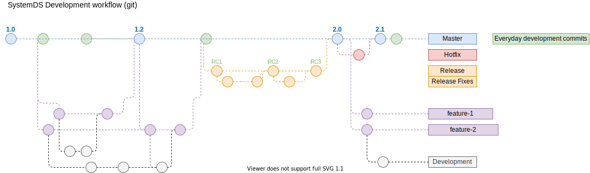

## Release story

The Apache SystemDS project publishes new version of the software on a regular basis.
Releases are the interface of the project with the public and most users interact with
the project only through the released software (this is intentional!). Releases are a
formal offering, which are publicly voted by the SystemDS community.

Releases are executed by a Release Manager, who is one of the project committers.

Release has legal consequences to the team. Make sure to comply with all the procedures
outlined by the ASF via [Release Policy](https://www.apache.org/legal/release-policy.html) and
[Release Distribution](https://infra.apache.org/release-distribution.html). Any deviations or
compromises are to be discussed in private@ or dev@ mail list appropriately.


## Before you begin

Install the basic software and procure the required code and dependencies, credentials.

OS Requirement: (One of the following)
  1. Linux based OS
  2. Windows Subsystem for Linux (WSL) for Windows 10.
  3. Mac OS
  
RAM requirement: 8 GB +

Software Requirements:

  1. Apache Maven (3.8.1 or newer). [link](https://maven.apache.org/download.cgi)
  2. GnuPG [link](https://www.gnupg.org/download/index.html)
  3. Install jq utility (size 1MB). [link](https://stedolan.github.io/jq/download/)


Credential Requirements:

- GPG passphrase
- Apache ID and Password
- GitHub ID and Password
- DockerHub ID and Password (if applicable)
- PyPi.org ID and password (if applicable)


## Architecture of the release pipeline

An important part of the software development life cycle (SDLC)
is ensuring software release follow the ASF approved processes.

The following diagram illustrates the release pipeline


The release pipeline consists of the following steps:
  1. Builds the artifacts (binary, zip files) with source code.
  2. Pushes the artifacts to staging repository
  3. Check for the vulnerabilities. Voting process.

The project PMC and community inspects the build files by 
downloading and testing. If it passes their requirements, they vote
appropriately in the mailing list. The release version metadata is
updated and the application is deployed to the public release.

## Setting up your environment


## Access to Apache Nexus repository

Note: Only PMC can push to the Release repo for legal reasons.

Apache Nexus repository is located at [repository.apache.org](https://repository.apache.org), it is Nexus 2.x Profession edition.

1. Login with Apache Credentials
2. Confirm access to `org.apache.systemds` by visiting https://repository.apache.org/#stagingProfiles;1486a6e8f50cdf


## Add future release version to JIRA

1. In JIRA, navigate to `SYSTEMDS > Administration > Versions`.
2. Add a new release version.

Know more about versions in JIRA at 
[`view-and-manage-a-projects-versions` guide](https://support.atlassian.com/jira-core-cloud/docs/view-and-manage-a-projects-versions/)

## Performance regressions

Investigating performance regressions is a collective effort. Regressions can happen during
release process, but they should be investigated and fixed.

Release Manger should make sure that the JIRA issues are filed for each regression and mark
`Fix Version` to the to-be-released version.

The regressions are to be informed to the dev@ mailing list, through release duration.

## Release tags or branch

Our git workflow looks as shown in the below diagram:



### The chosen commit for RC

Release candidates are built from single commits off the development branch. Before building,
the version must be set to a non `SNAPSHOT`/`dev` version.

Here:
- The master branch is unchanged
- There is a commit not on the master branch with the version adjusted
- The RC tag points to that commit

### Inform the team

Mail dev@systemds.apache.org of the release tags and triage information.
This list of pending issues will be refined and updated collaboratively.

## Creating builds

### Checklist

1. Release Manager's GPG key is publised to [dist.apache.org](https://dist.apache.org/repos/dist/release/systemds/KEYS)
2. Release Manager's GPG key is configured in `git` configuration
3. Set `JAVA_HOME` to JDK 8


### Release build to create a release candidate

1. In the shell, build artifacts and deploy to staging

```sh
./do-release.sh
```

Answer the prompts with appropriate details as shown:

```
Branch [gh-pages]: master
Current branch version is 2.1.0-SNAPSHOT.
Release [2.1.0]: 
RC # [1]: 1
ASF user [ubuntu]: firstname
Full name [Firstname Lastname]: 
GPG key [firstname@apache.org]: 
================
Release details:
BRANCH:     master
VERSION:    2.1.0
TAG:        2.1.0-rc1
NEXT:       2.1.1-SNAPSHOT
ASF USER:   firstname
GPG KEY ID:    firstname@apache.org
FULL NAME:  Firstname Lastname
E-MAIL:     firstname@apache.org
================
Is this info correct [Y/n]? 
```


## Upload release candidate to PyPi

1. Download python binary artifacts
2. Deploy release candidate to PyPi

## Prepare documentation

### Build and verify JavaDoc

- Confirm that version names are appropriate.

### Build the Pydoc API reference

The docs will generated in `build` directory.


## Snapshot deployment setup


### Use a fresh SystemDS Repository

Since the artifacts will be deployed publicly, use a completely fresh
copy of the SystemDS project used only for building and deploying.

Therefore, create a directory such as 

```sh
mkdir ~/systemds-release
```

In this directory, clone a copy of the project.

```sh
git clone https://github.com/apache/systemds.git
```

## Release candidate build

### Checklist

#### 1. All artifacts and checksums present

Verify that each expected artifact is present at
https://dist.apache.org/repos/dist/dev/systemds/ and that
each artifact has accompanying checksums (such as .asc and .sha512)

#### 2. Release candidate build

The release candidate should build on Windows, OS X, and Linux. To do
this cleanly, the following procedure can be performed.

Note: Use an empty local maven repository

Example:

```sh
git clone https://github.com/apache/systemds.git
cd systemds
git tag -l
git checkout tags/2.1.0-rc1 -b 2.1.0-rc1
mvn -Dmaven.repo.local=$HOME/.m2/temp-repo clean package -P distribution
```

#### 3. Test suite check

The entire test suite should pass on Windows, OS X, Linux.

For verification:

```sh
mvn clean verify
```

#### 4. Execute all binary

All of the binary artifacts should execute, including the ones packaged
in other artifacts (in tgz, zip artifacts).

The build artifacts should be downloaded from
https://dist.apache.org/repos/dist/dev/systemds.

They can tested as follows:

For example, OS X:
```sh
# download artifacts
wget -r -nH -nd -np -R 'index.html*' https://dist.apache.org/repos/dist/dev/systemds

# verify that standalone tgz works
tar -xvzf systemds-2.1.0-bin.tgz
cd systemds-2.1.0-bin
echo "print('I am from SystemDS')" > hello.dml
./systemds hello.dml
cd ..
```

Verify that standalone zip works

```sh
rm -rf systemds-2.1.0-bin
unzip systemds-2.1.0-bin.zip
cd systemds-2.1.0-bin
echo "print('Trees are our friends')" > hello.dml
./systemds hello.dml
cd ..
```

Verify that src works

```sh
tar -xvzf systemds-2.1.0-src.tgz
cd systemds-2.1.0-src
mvn clean package -P distribution
cd target/
java -cp "./lib/*:systemds-2.1.0.jar" org.apache.sysds.api.DMLScript -s "print('hello')"

java -cp "./lib/*:SystemDS.jar" org.apache.sysds.api.DMLScript -s "print('hello')"
cd ../..
```

Verify spark batch mode

```sh
export SPARK_HOME=~/spark
cd systemds-2.1.0-bin/target/lib
$SPARK_HOME/bin/spark-submit systemds-2.1.0.jar -s "print('hello')" -exec hybrid_spark
```

Verify hadoop batch mode

```sh
hadoop jar systemds-2.1.0.jar -s "print('hello')"
```

Verify python artifact

```sh
# install numpy, pandas, scipy & set SPARK_HOME
pip install numpy pandas scipy
export SPARK_HOME=~/spark

# open interactive python shell
python

import systemds as sds
import numpy as np
m1 = sml.matrix(np.ones((3,3)) + 2)
m2 = sml.matrix(np.ones((3,3)) + 3)
m2 = m1 * (m2 + m1)
m4 = 1.0 - m2
m4.sum(axis=1).toNumPy()

```

The output would be

```out
array([[-60.],
       [-60.],
       [-60.]])
```

### Python Tests

TODO: manual python tests

For example,

```sh
# this command may not work.
spark-submit --driver-class-path SystemDS.jar test_matrix_agg_fn.py
```


### LICENSE and NOTICE

Each artifact must contain LICENSE and NOTICE files. These files must
reflect the contents of the artifacts. If the project dependencies
(i.e., libraries) have changed since the last release, the LICENSE and
NOTICE files to be updated to reflect these changes.

For more information, see:

1. http://www.apache.org/dev/#releases
2. http://www.apache.org/dev/licensing-howto.html

### Build src artifact and verify

The project should also be built using the `src` (tgz and zip).

```sh
tar -xvzf systemds-2.1.0-src.tgz
cd systemds-2.1.0-src
mvn clean package -P distribution
mvn verify
```

### Single node standalone

The standalone `tgz` and `zip` artifacts contain `systemds` files.
Verify that the algorithms can be run on single node using these 
standalone distributions.

Here is an example:

see standalone guide of the documenation for more details.

```sh
tar -xvzf systemds-2.1.0-bin.tgz
cd systemds-2.1.0-bin
wget -P data/ http://archive.ics.uci.edu/ml/machine-learning-databases/haberman/haberman.data
echo '{"rows": 306, "cols": 4, "format": "csv"}' > data/haberman.data.mtd
echo '1,1,1,2' > data/types.csv
echo '{"rows": 1, "cols": 4, "format": "csv"}' > data/types.csv.mtd

systemds scripts/algorithms/Univar-Stats.dml -nvargs X=data/haberman.data TYPES=data/types.csv STATS=data/univarOut.mtx CONSOLE_OUTPUT=TRUE
cd ..
```

Also check for Hadoop, and spark

#### Notebooks

Verify that the notebooks run correctly.

#### Performance suite

Verify that the performance suite executes on Spark and Hadoop.
The datasizes are 80MB, 800MB, 8GB, and 80GB.


## Voting process

Following a successful release candidate vote by  SystemDS PMC members
on the dev mailing list, the release candidate shall be approved.

## Release

### Release deployment

The scripts will execute the release steps. and push the changes
to the releases.

### Deploy artifacts to Maven Central

In the [Apache Nexus Repo](https://repository.apache.org), release
the staged artifacts to the Maven Central repository.

Steps:
1. In the `Staging Repositories` section, find the relevant release candidate entry
2. Select `Release`
3. Drop all the other release candidates

### Deploy Python artifacts to PyPI

- Use upload script.
- Verify that the files at https://pypi.org/project/systemds/#files are correct.

### Update website

- Listing the release
- Publish Python API reference, and the Java API reference

### Mark the released version in JIRA

1. Go to https://issues.apache.org/jira/plugins/servlet/project-config/SYSTEMDS/versions
2. Hover over the released version and click `Release`

### Recordkeeping

Update the record at https://reporter.apache.org/addrelease.html?systemds

### Checklist

1. Maven artifacts released and indexed in the [Maven Central Repository](https://search.maven.org/search?q=g:org.apache.systemds)
2. Source distribution available in the [release repository `/release/systemds/`](https://dist.apache.org/repos/dist/release/systemds/)
3. Source distribution removed from the [dev repository `/dev/systemds/`](https://dist.apache.org/repos/dist/dev/systemds/)
4. Website is completely updated (Release, API manuals)
5. The release tag available on GitHub at https://github.com/apache/systemds/tags
6. The release notes are published on GitHub at https://github.com/apache/systemds/release
7. Release version is listed at reporter.apache.org

### Announce Release

Announce Released version within the project and public.

#### Apache Mailing List

1. Announce on the dev@ mail list that the release has been completed
2. Announce on the user@ mail list, listing major improving and contributions
3. Announce the release on the announce@apache.org mail list. This can only be
  done from the `@apache.org` email address. This email has to be in plain text.

#### Social media

Update Wikipedia article on Apache SystemDS.

## Checklist to declare the release process complete

1. Release announce on the user@ mail list
2. Release recorded in reporter.apache.org
3. Completion declared on the dev@ mail list
4. Update Wikipedia Apache SystemDS article

## Improve the process

Once the release is complete, let us retrospectively update changes and improvements
to this guide. Help the community adapt this guide for release validation before casting their
vote.

Perhaps some steps can be simplified or require more clarification.

# Appendix

### Generate GPG key

1. Create a folder for GNUPGHOME or use default `~/.gnupg`.

```sh
sudo mkdir -m 700 /usr/local/.gnupg
```

2. Generate the gpg key

```sh
sudo GNUPGHOME=/usr/local/.gnupg gpg --gen-key
```

output will be, like the following:

```
gpg: /usr/local/.gnupg/trustdb.gpg: trustdb created
gpg: key F164B430F91D6*** marked as ultimately trusted
gpg: directory '/usr/local/.gnupg/openpgp-revocs.d' created
gpg: revocation certificate stored as '/usr/local/.gnupg/openpgp-revocs.d/AD**...*.rev'
public and secret key created and signed.
```

3. Export the environmental variable

Note: Use `sudo` on requirement.

```sh
export GNUPGHOME=/usr/local/.gnupg

gpg --homedir $GNUPGHOME --list-keys
gpg --homedir $GNUPGHOME --list-secret-keys
```

#### Maven password encryption

Follow the instructions at [encryption guide](https://maven.apache.org/guides/mini/guide-encryption.html)

```sh
mvn --encrypt-master-password
```

This commands produces an output as encrypted version of the password
```output
{jSMOWnoPFgsHVpMvz5VrIt5kRbzGpI8u+9EF1iFQyJQ=}
```

Store this password in `${user.home}/.m2/settings-security.xml`; it
should look like

```xml
<settingsSecurity>
  <master>{jSMOWnoPFgsHVpMvz5VrIt5kRbzGpI8u+9EF1iFQyJQ=}</master>
</settingsSecurity>
```

Create an Encrypted version of the Apache Password

```sh
mvn --encrypt-password
```

Add a server entry to `~/.m2/settings.xml` file (create this file if
it doesn't already exist). This server entry will have the Apache
Snapshot ID, your Apache ID, and your encrypted password.

```sh
<settings>
  <servers>
    <server>
      <id>apache.snapshots.systemds</id>
      <username>APACHE_ID</username>
      <password>{COQLCE6DU6GtcS5P=}</password>
    </server>
  </servers>
</settings>
```

Note: editing `settings.xml` and running the above commands can still
leave your password stored locally in plaintext. You may want to check
the following locations:

  - Shell history (eg. run `history`). Even best clear command line
    history after encrypting the above passwords.
  - Editor caches (eg. `~/.viminfo`)


## Submit your GPG public key to a Public key server

Use [MIT PGP Public Key Server](http://pgp.mit.edu:11371/) or [key server at `ubuntu.com`](https://keyserver.ubuntu.com/)
at your convenience.

The versioning scheme is as follows.

### Semantic versioning

Semantic versioning is a formal convention for specifying compatibility. It uses a three-part version number: **major version**; **minor version**; and **patch**.  Version numbers  convey meaning about the underlying code and what has been modified. For example, versioning could be handled as follows:

| Code status  | Stage  | Rule  | Example version  |
|---|---|---|---|
| First release  | New product  | Start with 1.0.0  | 1.0.0  |
| Backward compatible fix  | Patch release  | Increment the third digit  | 1.0.1  |
| Backward compatible new feature  | Minor release  | Increment the middle digit and reset the last digit to zero  | 1.1.0  |
| Breaking updates | Major release | Increment the first digit and reset the middle and last digits to zero | 2.0.0 |


major.minor.patch as per [semver.org](http://semver.org)
