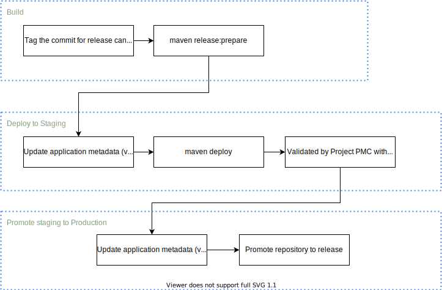

<!--

Licensed to the Apache Software Foundation (ASF) under one or more
contributor license agreements.  See the NOTICE file distributed with
this work for additional information regarding copyright ownership.
The ASF licenses this file to you under the Apache License, Version 2.0
(the "License"); you may not use this file except in compliance with
the License.  You may obtain a copy of the License at

http://www.apache.org/licenses/LICENSE-2.0

Unless required by applicable law or agreed to in writing, software
distributed under the License is distributed on an "AS IS" BASIS,
WITHOUT WARRANTIES OR CONDITIONS OF ANY KIND, either express or implied.
See the License for the specific language governing permissions and
limitations under the License.

-->

### Requirements

**Software:**

1. OS: Linux based OS
2. Apache Maven 3.8+
3. [gpg](https://www.gnupg.org)

**Credentials:**

1. Publish release manager's gpg key to [`release dist repo`](https://dist.apache.org/repos/dist/release/systemds/KEYS)
2. GitHub PAT ([`Personal Access Token`](https://docs.github.com/en/authentication/keeping-your-account-and-data-secure/creating-a-personal-access-token))
3. Apache credentials (Make sure your id is at [`SystemDS committers`](https://people.apache.org/committers-by-project.html#systemds))
4. Confirm access to Nexus repo at https://repository.apache.org/#stagingProfiles;1486a6e8f50cdf

### Usage

Set gpg home as

```bash
export GNUPGHOME="$HOME/.gnupg"
```

Dry run:

```sh
./dev/release/do-release.sh -n
```

Release: (irreversible operation)

```sh
./dev/release/do-release.sh
```

### Architecture of the release pipeline

The following diagram illustrates the steps building and publishing release.



