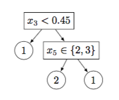

<!--

Licensed to the Apache Software Foundation (ASF) under one or more
contributor license agreements.  See the NOTICE file distributed with
this work for additional information regarding copyright ownership.
The ASF licenses this file to you under the Apache License, Version 2.0
(the "License"); you may not use this file except in compliance with
the License.  You may obtain a copy of the License at

http://www.apache.org/licenses/LICENSE-2.0

Unless required by applicable law or agreed to in writing, software
distributed under the License is distributed on an "AS IS" BASIS,
WITHOUT WARRANTIES OR CONDITIONS OF ANY KIND, either express or implied.
See the License for the specific language governing permissions and
limitations under the License.

-->

# 2. Classification

## 2.1. Multinomial Logistic Regression

### Description

The `MultiLogReg.dml` script performs both binomial and multinomial
logistic regression. The script is given a dataset $(X, Y)$ where matrix
$X$ has $m$ columns and matrix $Y$ has one column; both $X$ and $Y$ have
$n$ rows. The rows of $X$ and $Y$ are viewed as a collection of records:
$(X, Y) = (x_i, y_i)_{i=1}^n$ where $x_i$ is a numerical vector of
explanatory (feature) variables and $y_i$ is a categorical response
variable. Each row $x_i$ in $X$ has size $\dim x_i = m$, while its corresponding $y_i$
is an integer that represents the observed response value for
record $i$.

The goal of logistic regression is to learn a linear model over the
feature vector $x_i$ that can be used to predict how likely each
categorical label is expected to be observed as the actual $y_i$. Note
that logistic regression predicts more than a label: it predicts the
probability for every possible label. The binomial case allows only two
possible labels, the multinomial case has no such restriction.

Just as linear regression estimates the mean value $\mu_i$ of a
numerical response variable, logistic regression does the same for
category label probabilities. In linear regression, the mean of $y_i$ is
estimated as a linear combination of the features:
$$\mu_i = \beta_0 + \beta_1 x_{i,1} + \ldots + \beta_m x_{i,m} = \beta_0 + x_i\beta_{1:m}$$.
In logistic regression, the label probability has to lie between 0
and 1, so a link function is applied to connect it to
$\beta_0 + x_i\beta_{1:m}$. If there are just two possible category
labels, for example 0 and 1, the logistic link looks as follows:

$$Prob[y_i\,{=}\,1\mid x_i; \beta] \,=\, 
\frac{e^{\,\beta_0 + x_i\beta_{1:m}}}{1 + e^{\,\beta_0 + x_i\beta_{1:m}}};
\quad
Prob[y_i\,{=}\,0\mid x_i; \beta] \,=\, 
\frac{1}{1 + e^{\,\beta_0 + x_i\beta_{1:m}}}$$

Here category label 0
serves as the *baseline*, and function $$\exp(\beta_0 + x_i\beta_{1:m})$$
shows how likely we expect to see "$y_i = 1$" in comparison to the
baseline. Like in a loaded coin, the predicted odds of seeing 1 versus 0
are $$\exp(\beta_0 + x_i\beta_{1:m})$$ to 1, with each feature $$x_{i,j}$$
multiplying its own factor $\exp(\beta_j x_{i,j})$ to the odds. Given a
large collection of pairs $(x_i, y_i)$, $i=1\ldots n$, logistic
regression seeks to find the $\beta_j$’s that maximize the product of
probabilities $Prob[y_i\mid x_i; \beta]$
for actually observed $y_i$-labels (assuming no
regularization).

Multinomial logistic regression [[Agresti2002]](algorithms-bibliography.html)
extends this link to
$k \geq 3$ possible categories. Again we identify one category as the
baseline, for example the $k$-th category. Instead of a coin, here we
have a loaded multisided die, one side per category. Each non-baseline
category $l = 1\ldots k\,{-}\,1$ has its own vector
$$(\beta_{0,l}, \beta_{1,l}, \ldots, \beta_{m,l})$$ of regression
parameters with the intercept, making up a matrix $B$ of size
$(m\,{+}\,1)\times(k\,{-}\,1)$. The predicted odds of seeing
non-baseline category $l$ versus the baseline $k$ are
$$\exp\big(\beta_{0,l} + \sum\nolimits_{j=1}^m x_{i,j}\beta_{j,l}\big)$$
to 1, and the predicted probabilities are: 

$$
\begin{equation}
l < k: Prob [y_i {=} l \mid x_i; B] \,\,\,{=}\,\,\,
\frac{\exp\big(\beta_{0,l} + \sum\nolimits_{j=1}^m x_{i,j}\beta_{j,l}\big)}{1 \,+\, \sum_{l'=1}^{k-1}\exp\big(\beta_{0,l'} + \sum\nolimits_{j=1}^m x_{i,j}\beta_{j,l'}\big)};
\end{equation}
$$

$$
\begin{equation}
Prob [y_i {=} k \mid x_i; B] \,\,\,{=}\,\,\,
\frac{1}{1 \,+\, \sum_{l'=1}^{k-1}\exp\big(\beta_{0,l'} + \sum\nolimits_{j=1}^m x_{i,j}\beta_{j,l'}\big)}.
\end{equation}
$$

The goal of the regression
is to estimate the parameter matrix $B$ from the provided dataset
$(X, Y) = (x_i, y_i)_{i=1}^n$ by maximizing the product of $$Prob[y_i\mid x_i; B]$$ over the
observed labels $y_i$. Taking its logarithm, negating, and adding a
regularization term gives us a minimization objective:

$$
\begin{equation}
f(B; X, Y) \,\,=\,\,
-\sum_{i=1}^n \,\log Prob[y_i\mid x_i; B] \,+\,
\frac{\lambda}{2} \sum_{j=1}^m \sum_{l=1}^{k-1} |\beta_{j,l}|^2
\,\,\to\,\,\min
\end{equation}
$$

The optional regularization term is added to
mitigate overfitting and degeneracy in the data; to reduce bias, the
intercepts $$\beta_{0,l}$$ are not regularized. Once the $\beta_{j,l}$’s
are accurately estimated, we can make predictions about the category
label $y$ for a new feature vector $x$ using
Eqs. (1) and (2).

### Usage


from SystemML.mllearn import LogisticRegression
# C = 1/reg
logistic = LogisticRegression(sqlCtx, fit_intercept=True, max_iter=100, max_inner_iter=0, tol=0.000001, C=1.0)
# X_train, y_train and X_test can be NumPy matrices or Pandas DataFrame or SciPy Sparse Matrix
y_test = logistic.fit(X_train, y_train).predict(X_test)
# df_train is DataFrame that contains two columns: "features" (of type Vector) and "label". df_test is a DataFrame that contains the column "features"
y_test = logistic.fit(df_train).transform(df_test)



import org.apache.sysml.api.ml.LogisticRegression
val lr = new LogisticRegression("logReg", sc).setIcpt(0).setMaxOuterIter(100).setMaxInnerIter(0).setRegParam(0.000001).setTol(0.000001)
val model = lr.fit(X_train_df)
val prediction = model.transform(X_test_df)


    hadoop jar SystemML.jar -f MultiLogReg.dml
                            -nvargs X=<file>
                                    Y=<file>
                                    B=<file>
                                    Log=[file]
                                    icpt=[int]
                                    reg=[double]
                                    tol=[double]
                                    moi=[int]
                                    mii=[int]
                                    fmt=[format]

    $SPARK_HOME/bin/spark-submit --master yarn-cluster
                                 --conf spark.driver.maxResultSize=0
                                 --conf spark.akka.frameSize=128
                                 SystemML.jar
                                 -f MultiLogReg.dml
                                 -config=SystemML-config.xml
                                 -exec hybrid_spark
                                 -nvargs X=<file>
                                         Y=<file>
                                         B=<file>
                                         Log=[file]
                                         icpt=[int]
                                         reg=[double]
                                         tol=[double]
                                         moi=[int]
                                         mii=[int]
                                         fmt=[format]

### Arguments

**X**: Location (on HDFS) to read the input matrix of feature vectors; each row
constitutes one feature vector.

**Y**: Location to read the input one-column matrix of category labels that
correspond to feature vectors in X. Note the following:

  * Each non-baseline category label must be a positive integer.
  * If all labels are positive, the largest represents the baseline
category.
  * If non-positive labels such as $-1$ or $0$ are present, then they
represent the (same) baseline category and are converted to label
$\max(\texttt{Y})\,{+}\,1$.

**B**: Location to store the matrix of estimated regression parameters (the
$$\beta_{j, l}$$’s), with the intercept parameters $\beta_{0, l}$ at
position B\[$m\,{+}\,1$, $l$\] if available.
The size of B is $(m\,{+}\,1)\times (k\,{-}\,1)$ with the
intercepts or $m \times (k\,{-}\,1)$ without the intercepts, one column
per non-baseline category and one row per feature.

**Log**: (default: `" "`) Location to store iteration-specific variables for monitoring
and debugging purposes, see 
[**Table 5**](algorithms-classification.html#table5)
for details.

**icpt**: (default: `0`) Intercept and shifting/rescaling of the features in $X$:

  * 0 = no intercept (hence no $\beta_0$), no
shifting/rescaling of the features;
  * 1 = add intercept, but do not shift/rescale the features
in $X$;
  * 2 = add intercept, shift/rescale the features in $X$ to
mean 0, variance 1

**reg**: (default: `0.0`) L2-regularization parameter (lambda)

**tol**: (default: `0.000001`) Tolerance ($\epsilon$) used in the convergence criterion

**moi**: (default: `100`) Maximum number of outer (Fisher scoring) iterations

**mii**: (default: `0`) Maximum number of inner (conjugate gradient) iterations, or 0
if no maximum limit provided

**fmt**: (default: `"text"`) Matrix file output format, such as `text`,
`mm`, or `csv`; see read/write functions in
SystemML Language Reference for details.

### Examples


# Scikit-learn way
from sklearn import datasets, neighbors
from SystemML.mllearn import LogisticRegression
from pyspark.sql import SQLContext
sqlCtx = SQLContext(sc)
digits = datasets.load_digits()
X_digits = digits.data
y_digits = digits.target + 1
n_samples = len(X_digits)
X_train = X_digits[:.9 * n_samples]
y_train = y_digits[:.9 * n_samples]
X_test = X_digits[.9 * n_samples:]
y_test = y_digits[.9 * n_samples:]
logistic = LogisticRegression(sqlCtx)
print('LogisticRegression score: %f' % logistic.fit(X_train, y_train).score(X_test, y_test))

# MLPipeline way
from pyspark.ml import Pipeline
from SystemML.mllearn import LogisticRegression
from pyspark.ml.feature import HashingTF, Tokenizer
from pyspark.sql import SQLContext
sqlCtx = SQLContext(sc)
training = sqlCtx.createDataFrame([
    (0L, "a b c d e spark", 1.0),
    (1L, "b d", 2.0),
    (2L, "spark f g h", 1.0),
    (3L, "hadoop mapreduce", 2.0),
    (4L, "b spark who", 1.0),
    (5L, "g d a y", 2.0),
    (6L, "spark fly", 1.0),
    (7L, "was mapreduce", 2.0),
    (8L, "e spark program", 1.0),
    (9L, "a e c l", 2.0),
    (10L, "spark compile", 1.0),
    (11L, "hadoop software", 2.0)
], ["id", "text", "label"])
tokenizer = Tokenizer(inputCol="text", outputCol="words")
hashingTF = HashingTF(inputCol="words", outputCol="features", numFeatures=20)
lr = LogisticRegression(sqlCtx)
pipeline = Pipeline(stages=[tokenizer, hashingTF, lr])
model = pipeline.fit(training)
test = sqlCtx.createDataFrame([
    (12L, "spark i j k"),
    (13L, "l m n"),
    (14L, "mapreduce spark"),
    (15L, "apache hadoop")], ["id", "text"])
prediction = model.transform(test)
prediction.show()



import org.apache.spark.ml.feature.{HashingTF, Tokenizer}
import org.apache.sysml.api.ml.LogisticRegression
import org.apache.spark.ml.Pipeline
val training = sqlContext.createDataFrame(Seq(
    ("a b c d e spark", 1.0),
    ("b d", 2.0),
    ("spark f g h", 1.0),
    ("hadoop mapreduce", 2.0),
    ("b spark who", 1.0),
    ("g d a y", 2.0),
    ("spark fly", 1.0),
    ("was mapreduce", 2.0),
    ("e spark program", 1.0),
    ("a e c l", 2.0),
    ("spark compile", 1.0),
    ("hadoop software", 2.0))).toDF("text", "label")
val tokenizer = new Tokenizer().setInputCol("text").setOutputCol("words")
val hashingTF = new HashingTF().setNumFeatures(20).setInputCol(tokenizer.getOutputCol).setOutputCol("features")
val lr = new LogisticRegression("logReg", sc)
val pipeline = new Pipeline().setStages(Array(tokenizer, hashingTF, lr))
val model = pipeline.fit(training)
val test = sqlContext.createDataFrame(Seq(
    ("spark i j k", 1.0),
    ("l m n", 2.0),
    ("mapreduce spark", 1.0),
    ("apache hadoop", 2.0))).toDF("text", "trueLabel")
val prediction = model.transform(test)
prediction.show()


    hadoop jar SystemML.jar -f MultiLogReg.dml
                            -nvargs X=/user/ml/X.mtx
                                    Y=/user/ml/Y.mtx
                                    B=/user/ml/B.mtx
                                    fmt=csv
                                    icpt=2
                                    reg=1.0
                                    tol=0.0001
                                    moi=100
                                    mii=10
                                    Log=/user/ml/log.csv

    $SPARK_HOME/bin/spark-submit --master yarn-cluster
                                 --conf spark.driver.maxResultSize=0
                                 --conf spark.akka.frameSize=128
                                 SystemML.jar
                                 -f MultiLogReg.dml
                                 -config=SystemML-config.xml
                                 -exec hybrid_spark
                                 -nvargs X=/user/ml/X.mtx
                                         Y=/user/ml/Y.mtx
                                         B=/user/ml/B.mtx
                                         fmt=csv
                                         icpt=2
                                         reg=1.0
                                         tol=0.0001
                                         moi=100
                                         mii=10
                                         Log=/user/ml/log.csv

* * *

<a name="table5" />
**Table 5**: The `Log` file for multinomial logistic regression
contains the following iteration variables in `CSV` format, each line
containing triple (`Name`, `Iteration#`, `Value`) with `Iteration#` being 0
for initial values.
  

| Name                | Meaning          |
| ------------------- | -------------------------- |
| LINEAR\_TERM\_MIN   | The minimum value of $X$ %*% $B$, used to check for overflows |
| LINEAR\_TERM\_MAX   | The maximum value of $X$ %*% $B$, used to check for overflows |
| NUM\_CG\_ITERS      | Number of inner (Conj. Gradient) iterations in this outer iteration |
| IS\_TRUST\_REACHED  | $1 = {}$trust region boundary was reached, $0 = {}$otherwise |
| POINT\_STEP\_NORM   | L2-norm of iteration step from old point (matrix $B$) to new point |
| OBJECTIVE           | The loss function we minimize (negative regularized log-likelihood) |
| OBJ\_DROP\_REAL     | Reduction in the objective during this iteration, actual value |
| OBJ\_DROP\_PRED     | Reduction in the objective predicted by a quadratic approximation |
| OBJ\_DROP\_RATIO    | Actual-to-predicted reduction ratio, used to update the trust region |
| IS\_POINT\_UPDATED  | $1 = {}$new point accepted; $0 = {}$new point rejected, old point restored |
| GRADIENT\_NORM      | L2-norm of the loss function gradient (omitted if point is rejected) |
| RUST\_DELTA         | Updated trust region size, the "delta" |

* * *

### Details

We estimate the logistic regression parameters via L2-regularized
negative log-likelihood minimization (3). The
optimization method used in the script closely follows the trust region
Newton method for logistic regression described in [[Lin2008]](algorithms-bibliography.html).
For convenience, let us make some changes in notation:

  * Convert the input vector of observed category labels into an indicator
matrix $Y$ of size $n \times k$ such that $$Y_{i, l} = 1$$ if the $i$-th
category label is $l$ and $Y_{i, l} = 0$ otherwise.
  * Append an extra column of all ones, i.e. $(1, 1, \ldots, 1)^T$, as the
$m\,{+}\,1$-st column to the feature matrix $X$ to represent the
intercept.
  * Append an all-zero column as the $k$-th column to $B$, the matrix of
regression parameters, to represent the baseline category.
  * Convert the regularization constant $\lambda$ into matrix $\Lambda$ of
the same size as $B$, placing 0’s into the $m\,{+}\,1$-st row to disable
intercept regularization, and placing $\lambda$’s everywhere else.

Now the ($n\,{\times}\,k$)-matrix of predicted probabilities given by
(1) and (2) and the
objective function $f$ in (3) have the matrix form

$$\begin{aligned}
P \,\,&=\,\, \exp(XB) \,\,/\,\, \big(\exp(XB)\,1_{k\times k}\big)\\
f \,\,&=\,\, - \,\,{\textstyle\sum} \,\,Y \cdot (X B)\, + \,
{\textstyle\sum}\,\log\big(\exp(XB)\,1_{k\times 1}\big) \,+ \,
(1/2)\,\, {\textstyle\sum} \,\,\Lambda \cdot B \cdot B\end{aligned}$$

where operations $\cdot\,$, `/`, `exp`, and `log` are applied
cellwise, and $\textstyle\sum$ denotes the sum of all cells in a matrix.
The gradient of $f$ with respect to $B$ can be represented as a matrix
too:

$$\nabla f \,\,=\,\, X^T (P - Y) \,+\, \Lambda \cdot B$$

The Hessian $\mathcal{H}$ of $f$ is a tensor, but, fortunately, the
conjugate gradient inner loop of the trust region algorithm
in [[Lin2008]](algorithms-bibliography.html)
does not need to instantiate it. We only need to
multiply $\mathcal{H}$ by ordinary matrices of the same size as $B$ and
$\nabla f$, and this can be done in matrix form:

$$\mathcal{H}V \,\,=\,\, X^T \big( Q \,-\, P \cdot (Q\,1_{k\times k}) \big) \,+\,
\Lambda \cdot V, \,\,\,\,\textrm{where}\,\,\,\,Q \,=\, P \cdot (XV)$$

At each Newton iteration (the *outer* iteration) the minimization algorithm
approximates the difference
$\varDelta f(S; B) = f(B + S; X, Y) \,-\, f(B; X, Y)$ attained in the
objective function after a step $B \mapsto B\,{+}\,S$ by a second-degree
formula

$$\varDelta f(S; B) \,\,\,\approx\,\,\, (1/2)\,\,{\textstyle\sum}\,\,S \cdot \mathcal{H}S
 \,+\, {\textstyle\sum}\,\,S\cdot \nabla f$$
 
This approximation is then
minimized by trust-region conjugate gradient iterations (the *inner*
iterations) subject to the constraint
$\|S\|_2 \leq \delta$
. The trust
region size $\delta$ is initialized as
$0.5\sqrt{m}\,/ \max_i \|x_i\|_2$
and updated as described
in [[Lin2008]](algorithms-bibliography.html).
Users can specify the maximum number of the outer
and the inner iterations with input parameters `moi` and
`mii`, respectively. The iterative minimizer terminates
successfully if
$$\|\nabla f\|_2 < \varepsilon \|\nabla f_{B=0} \|_2$$
, where ${\varepsilon}> 0$ is a tolerance supplied by the user via input
parameter `tol`.

### Returns

The estimated regression parameters (the
$$\hat{\beta}_{j, l}$$)
are
populated into a matrix and written to an HDFS file whose path/name was
provided as the `B` input argument. Only the non-baseline
categories ($1\leq l \leq k\,{-}\,1$) have their 
$$\hat{\beta}_{j, l}$$
in the output; to add the baseline category, just append a column of zeros.
If `icpt=0` in the input command line, no intercepts are used
and `B` has size 
$m\times (k\,{-}\,1)$; otherwise
`B` has size 
$(m\,{+}\,1)\times (k\,{-}\,1)$
and the
intercepts are in the 
$m\,{+}\,1$-st row. If icpt=2, then
initially the feature columns in $X$ are shifted to mean${} = 0$ and
rescaled to variance${} = 1$. After the iterations converge, the
$\hat{\beta}_{j, l}$’s are rescaled and shifted to work with the
original features.

* * *

## 2.2 Support Vector Machines

### 2.2.1 Binary-Class Support Vector Machines

#### Description

Support Vector Machines are used to model the relationship between a
categorical dependent variable `y` and one or more explanatory variables
denoted `X`. This implementation learns (and predicts with) a binary class
support vector machine (`y` with domain size `2`).

#### Usage

**Binary-Class Support Vector Machines**:


from SystemML.mllearn import SVM
# C = 1/reg
svm = SVM(sqlCtx, fit_intercept=True, max_iter=100, tol=0.000001, C=1.0, is_multi_class=False)
# X_train, y_train and X_test can be NumPy matrices or Pandas DataFrame or SciPy Sparse Matrix
y_test = svm.fit(X_train, y_train)
# df_train is DataFrame that contains two columns: "features" (of type Vector) and "label". df_test is a DataFrame that contains the column "features"
y_test = svm.fit(df_train)



import org.apache.sysml.api.ml.SVM
val svm = new SVM("svm", sc, isMultiClass=false).setIcpt(0).setMaxIter(100).setRegParam(0.000001).setTol(0.000001)
val model = svm.fit(X_train_df)


    hadoop jar SystemML.jar -f l2-svm.dml
                            -nvargs X=<file>
                                    Y=<file>
                                    icpt=[int]
                                    tol=[double]
                                    reg=[double]
                                    maxiter=[int]
                                    model=<file>
                                    Log=<file>
                                    fmt=[format]

    $SPARK_HOME/bin/spark-submit --master yarn-cluster
                                 --conf spark.driver.maxResultSize=0
                                 --conf spark.akka.frameSize=128
                                 SystemML.jar
                                 -f l2-svm.dml
                                 -config=SystemML-config.xml
                                 -exec hybrid_spark
                                 -nvargs X=<file>
                                         Y=<file>
                                         icpt=[int]
                                         tol=[double]
                                         reg=[double]
                                         maxiter=[int]
                                         model=<file>
                                         Log=<file>
                                         fmt=[format]

**Binary-Class Support Vector Machines Prediction**:


# X_test can be NumPy matrices or Pandas DataFrame or SciPy Sparse Matrix
y_test = svm.predict(X_test)
# df_test is a DataFrame that contains the column "features" of type Vector
y_test = svm.transform(df_test)



val prediction = model.transform(X_test_df)


    hadoop jar SystemML.jar -f l2-svm-predict.dml
                            -nvargs X=<file>
                                    Y=[file]
                                    icpt=[int]
                                    model=<file>
                                    scores=[file]
                                    accuracy=[file]
                                    confusion=[file]
                                    fmt=[format]

    $SPARK_HOME/bin/spark-submit --master yarn-cluster
                                 --conf spark.driver.maxResultSize=0
                                 --conf spark.akka.frameSize=128
                                 SystemML.jar
                                 -f l2-svm-predict.dml
                                 -config=SystemML-config.xml
                                 -exec hybrid_spark
                                 -nvargs X=<file>
                                         Y=[file]
                                         icpt=[int]
                                         model=<file>
                                         scores=[file]
                                         accuracy=[file]
                                         confusion=[file]
                                         fmt=[format]

#### Arguments

**X**: Location (on HDFS) to read the matrix of feature vectors; each
row constitutes one feature vector.

**Y**: Location to read the one-column matrix of (categorical) labels
that correspond to feature vectors in `X`. Binary class labels can be
expressed in one of two choices: $\pm 1$ or $1/2$. Note that this
argument is optional for prediction.

**icpt**: (default: `0`) If set to `1` then a constant bias
column is added to `X`.

**tol**: (default: `0.001`) Procedure terminates early if the
reduction in objective function value is less than tolerance times
the initial objective function value.

**reg**: (default: `1`) Regularization constant. See details
to find out where lambda appears in the objective function. If one
were interested in drawing an analogy with the `C` parameter in C-SVM,
then `C = 2/lambda`. Usually, cross validation is employed to
determine the optimum value of lambda.

**maxiter**: (default: `100`) The maximum number
of iterations.

**model**: Location (on HDFS) that contains the learnt weights.

**Log**: Location (on HDFS) to collect various metrics (e.g., objective
function value etc.) that depict progress across iterations
while training.

**fmt**: (default: `"text"`) Matrix file output format, such as `text`,
`mm`, or `csv`; see read/write functions in
SystemML Language Reference for details.

**scores**: Location (on HDFS) to store scores for a held-out test set.
Note that this is an optional argument.

**accuracy**: Location (on HDFS) to store the accuracy computed on a
held-out test set. Note that this is an optional argument.

**confusion**: Location (on HDFS) to store the confusion matrix computed
using a held-out test set. Note that this is an optional argument.

#### Examples

**Binary-Class Support Vector Machines**:

    hadoop jar SystemML.jar -f l2-svm.dml
                            -nvargs X=/user/ml/X.mtx
                                    Y=/user/ml/y.mtx
                                    icpt=0
                                    tol=0.001
                                    fmt=csv
                                    reg=1.0
                                    maxiter=100
                                    model=/user/ml/weights.csv
                                    Log=/user/ml/Log.csv

    $SPARK_HOME/bin/spark-submit --master yarn-cluster
                                 --conf spark.driver.maxResultSize=0
                                 --conf spark.akka.frameSize=128
                                 SystemML.jar
                                 -f l2-svm.dml
                                 -config=SystemML-config.xml
                                 -exec hybrid_spark
                                 -nvargs X=/user/ml/X.mtx
                                         Y=/user/ml/y.mtx
                                         icpt=0
                                         tol=0.001
                                         fmt=csv
                                         reg=1.0
                                         maxiter=100
                                         model=/user/ml/weights.csv
                                         Log=/user/ml/Log.csv

**Binary-Class Support Vector Machines Prediction**:

    hadoop jar SystemML.jar -f l2-svm-predict.dml
                            -nvargs X=/user/ml/X.mtx
                                    Y=/user/ml/y.mtx
                                    icpt=0
                                    fmt=csv
                                    model=/user/ml/weights.csv
                                    scores=/user/ml/scores.csv
                                    accuracy=/user/ml/accuracy.csv
                                    confusion=/user/ml/confusion.csv

    $SPARK_HOME/bin/spark-submit --master yarn-cluster
                                 --conf spark.driver.maxResultSize=0
                                 --conf spark.akka.frameSize=128
                                 SystemML.jar
                                 -f l2-svm-predict.dml
                                 -config=SystemML-config.xml
                                 -exec hybrid_spark
                                 -nvargs X=/user/ml/X.mtx
                                         Y=/user/ml/y.mtx
                                         icpt=0
                                         fmt=csv
                                         model=/user/ml/weights.csv
                                         scores=/user/ml/scores.csv
                                         accuracy=/user/ml/accuracy.csv
                                         confusion=/user/ml/confusion.csv

#### Details

Support vector machines learn a classification function by solving the
following optimization problem ($L_2$-SVM):

$$\begin{aligned}
&\textrm{argmin}_w& \frac{\lambda}{2} ||w||_2^2 + \sum_i \xi_i^2\\
&\textrm{subject to:}& y_i w^{\top} x_i \geq 1 - \xi_i ~ \forall i\end{aligned}$$

where $x_i$ is an example from the training set with its label given by
$y_i$, $w$ is the vector of parameters and $\lambda$ is the
regularization constant specified by the user.

To account for the missing bias term, one may augment the data with a
column of constants which is achieved by setting the intercept argument to `1`
[[Hsieh2008]](algorithms-bibliography.html).

This implementation optimizes the primal directly
[[Chapelle2007]](algorithms-bibliography.html). It
uses nonlinear conjugate gradient descent to minimize the objective
function coupled with choosing step-sizes by performing one-dimensional
Newton minimization in the direction of the gradient.

#### Returns

The learnt weights produced by `l2-svm.dml` are populated into a single
column matrix and written to file on HDFS (see model in section
Arguments). The number of rows in this matrix is `ncol(X)` if intercept
was set to `0` during invocation and `ncol(X) + 1` otherwise. The bias term,
if used, is placed in the last row. Depending on what arguments are
provided during invocation, `l2-svm-predict.dml` may compute one or more
of scores, accuracy and confusion matrix in the output format
specified.

* * *

### 2.2.2 Multi-Class Support Vector Machines

#### Description

Support Vector Machines are used to model the relationship between a
categorical dependent variable `y` and one or more explanatory variables
denoted `X`. This implementation supports dependent variables that have
domain size greater or equal to `2` and hence is not restricted to binary
class labels.

#### Usage

**Multi-Class Support Vector Machines**:


from SystemML.mllearn import SVM
# C = 1/reg
svm = SVM(sqlCtx, fit_intercept=True, max_iter=100, tol=0.000001, C=1.0, is_multi_class=True)
# X_train, y_train and X_test can be NumPy matrices or Pandas DataFrame or SciPy Sparse Matrix
y_test = svm.fit(X_train, y_train)
# df_train is DataFrame that contains two columns: "features" (of type Vector) and "label". df_test is a DataFrame that contains the column "features"
y_test = svm.fit(df_train)



import org.apache.sysml.api.ml.SVM
val svm = new SVM("svm", sc, isMultiClass=true).setIcpt(0).setMaxIter(100).setRegParam(0.000001).setTol(0.000001)
val model = svm.fit(X_train_df)


    hadoop jar SystemML.jar -f m-svm.dml
                            -nvargs X=<file>
                                    Y=<file>
                                    icpt=[int]
                                    tol=[double]
                                    reg=[double]
                                    maxiter=[int]
                                    model=<file>
                                    Log=<file>
                                    fmt=[format]

    $SPARK_HOME/bin/spark-submit --master yarn-cluster
                                 --conf spark.driver.maxResultSize=0
                                 --conf spark.akka.frameSize=128
                                 SystemML.jar
                                 -f m-svm.dml
                                 -config=SystemML-config.xml
                                 -exec hybrid_spark
                                 -nvargs X=<file>
                                         Y=<file>
                                         icpt=[int]
                                         tol=[double]
                                         reg=[double]
                                         maxiter=[int]
                                         model=<file>
                                         Log=<file>
                                         fmt=[format]

**Multi-Class Support Vector Machines Prediction**:


# X_test can be NumPy matrices or Pandas DataFrame or SciPy Sparse Matrix
y_test = svm.predict(X_test)
# df_test is a DataFrame that contains the column "features" of type Vector
y_test = svm.transform(df_test)



val prediction = model.transform(X_test_df)


    hadoop jar SystemML.jar -f m-svm-predict.dml
                            -nvargs X=<file>
                                    Y=[file]
                                    icpt=[int]
                                    model=<file>
                                    scores=[file]
                                    accuracy=[file]
                                    confusion=[file]
                                    fmt=[format]

    $SPARK_HOME/bin/spark-submit --master yarn-cluster
                                 --conf spark.driver.maxResultSize=0
                                 --conf spark.akka.frameSize=128
                                 SystemML.jar
                                 -f m-svm-predict.dml
                                 -config=SystemML-config.xml
                                 -exec hybrid_spark
                                 -nvargs X=<file>
                                         Y=[file]
                                         icpt=[int]
                                         model=<file>
                                         scores=[file]
                                         accuracy=[file]
                                         confusion=[file]
                                         fmt=[format]

#### Arguments

**X**: Location (on HDFS) containing the explanatory variables in
    a matrix. Each row constitutes an example.

**Y**: Location (on HDFS) containing a 1-column matrix specifying the
    categorical dependent variable (label). Labels are assumed to be
    contiguously numbered from 1 $\ldots$ \#classes. Note that this
    argument is optional for prediction.

**icpt**: (default: `0`) If set to `1` then a constant bias
    column is added to `X`.

**tol**: (default: `0.001`) Procedure terminates early if the
    reduction in objective function value is less than tolerance times
    the initial objective function value.

**reg**: (default: `1`) Regularization constant. See details
    to find out where `lambda` appears in the objective function. If one
    were interested in drawing an analogy with C-SVM, then `C = 2/lambda`.
    Usually, cross validation is employed to determine the optimum value
    of `lambda`.

**maxiter**: (default: `100`) The maximum number
    of iterations.

**model**: Location (on HDFS) that contains the learnt weights.

**Log**: Location (on HDFS) to collect various metrics (e.g., objective
    function value etc.) that depict progress across iterations
    while training.

**fmt**: (default: `"text"`) Matrix file output format, such as `text`,
`mm`, or `csv`; see read/write functions in
SystemML Language Reference for details.

**scores**: Location (on HDFS) to store scores for a held-out test set.
    Note that this is an optional argument.

**accuracy**: Location (on HDFS) to store the accuracy computed on a
    held-out test set. Note that this is an optional argument.

**confusion**: Location (on HDFS) to store the confusion matrix computed
    using a held-out test set. Note that this is an optional argument.

#### Examples

**Multi-Class Support Vector Machines**:


# Scikit-learn way
from sklearn import datasets, neighbors
from SystemML.mllearn import SVM
from pyspark.sql import SQLContext
sqlCtx = SQLContext(sc)
digits = datasets.load_digits()
X_digits = digits.data
y_digits = digits.target 
n_samples = len(X_digits)
X_train = X_digits[:.9 * n_samples]
y_train = y_digits[:.9 * n_samples]
X_test = X_digits[.9 * n_samples:]
y_test = y_digits[.9 * n_samples:]
svm = SVM(sqlCtx, is_multi_class=True)
print('LogisticRegression score: %f' % svm.fit(X_train, y_train).score(X_test, y_test))

# MLPipeline way
from pyspark.ml import Pipeline
from SystemML.mllearn import SVM
from pyspark.ml.feature import HashingTF, Tokenizer
from pyspark.sql import SQLContext
sqlCtx = SQLContext(sc)
training = sqlCtx.createDataFrame([
    (0L, "a b c d e spark", 1.0),
    (1L, "b d", 2.0),
    (2L, "spark f g h", 1.0),
    (3L, "hadoop mapreduce", 2.0),
    (4L, "b spark who", 1.0),
    (5L, "g d a y", 2.0),
    (6L, "spark fly", 1.0),
    (7L, "was mapreduce", 2.0),
    (8L, "e spark program", 1.0),
    (9L, "a e c l", 2.0),
    (10L, "spark compile", 1.0),
    (11L, "hadoop software", 2.0)
], ["id", "text", "label"])
tokenizer = Tokenizer(inputCol="text", outputCol="words")
hashingTF = HashingTF(inputCol="words", outputCol="features", numFeatures=20)
svm = SVM(sqlCtx, is_multi_class=True)
pipeline = Pipeline(stages=[tokenizer, hashingTF, svm])
model = pipeline.fit(training)
test = sqlCtx.createDataFrame([
    (12L, "spark i j k"),
    (13L, "l m n"),
    (14L, "mapreduce spark"),
    (15L, "apache hadoop")], ["id", "text"])
prediction = model.transform(test)
prediction.show()



import org.apache.spark.ml.feature.{HashingTF, Tokenizer}
import org.apache.sysml.api.ml.SVM
import org.apache.spark.ml.Pipeline
val training = sqlContext.createDataFrame(Seq(
    ("a b c d e spark", 1.0),
    ("b d", 2.0),
    ("spark f g h", 1.0),
    ("hadoop mapreduce", 2.0),
    ("b spark who", 1.0),
    ("g d a y", 2.0),
    ("spark fly", 1.0),
    ("was mapreduce", 2.0),
    ("e spark program", 1.0),
    ("a e c l", 2.0),
    ("spark compile", 1.0),
    ("hadoop software", 2.0))).toDF("text", "label")
val tokenizer = new Tokenizer().setInputCol("text").setOutputCol("words")
val hashingTF = new HashingTF().setNumFeatures(20).setInputCol(tokenizer.getOutputCol).setOutputCol("features")
val svm = new SVM("svm", sc, isMultiClass=true)
val pipeline = new Pipeline().setStages(Array(tokenizer, hashingTF, svm))
val model = pipeline.fit(training)
val test = sqlContext.createDataFrame(Seq(
    ("spark i j k", 1.0),
    ("l m n", 2.0),
    ("mapreduce spark", 1.0),
    ("apache hadoop", 2.0))).toDF("text", "trueLabel")
val prediction = model.transform(test)
prediction.show()


    hadoop jar SystemML.jar -f m-svm.dml
                            -nvargs X=/user/ml/X.mtx
                                    Y=/user/ml/y.mtx
                                    icpt=0
                                    tol=0.001
                                    reg=1.0
                                    maxiter=100
                                    fmt=csv
                                    model=/user/ml/weights.csv
                                    Log=/user/ml/Log.csv

    $SPARK_HOME/bin/spark-submit --master yarn-cluster
                                 --conf spark.driver.maxResultSize=0
                                 --conf spark.akka.frameSize=128
                                 SystemML.jar
                                 -f m-svm.dml
                                 -config=SystemML-config.xml
                                 -exec hybrid_spark
                                 -nvargs X=/user/ml/X.mtx
                                         Y=/user/ml/y.mtx
                                         icpt=0
                                         tol=0.001
                                         reg=1.0
                                         maxiter=100
                                         fmt=csv
                                         model=/user/ml/weights.csv
                                         Log=/user/ml/Log.csv

**Multi-Class Support Vector Machines Prediction**:

    hadoop jar SystemML.jar -f m-svm-predict.dml
                            -nvargs X=/user/ml/X.mtx
                                    Y=/user/ml/y.mtx
                                    icpt=0
                                    fmt=csv
                                    model=/user/ml/weights.csv
                                    scores=/user/ml/scores.csv
                                    accuracy=/user/ml/accuracy.csv
                                    confusion=/user/ml/confusion.csv

    $SPARK_HOME/bin/spark-submit --master yarn-cluster
                                 --conf spark.driver.maxResultSize=0
                                 --conf spark.akka.frameSize=128
                                 SystemML.jar
                                 -f m-svm-predict.dml
                                 -config=SystemML-config.xml
                                 -exec hybrid_spark
                                 -nvargs X=/user/ml/X.mtx
                                         Y=/user/ml/y.mtx
                                         icpt=0
                                         fmt=csv
                                         model=/user/ml/weights.csv
                                         scores=/user/ml/scores.csv
                                         accuracy=/user/ml/accuracy.csv
                                         confusion=/user/ml/confusion.csv

#### Details

Support vector machines learn a classification function by solving the
following optimization problem ($L_2$-SVM):

$$\begin{aligned}
&\textrm{argmin}_w& \frac{\lambda}{2} ||w||_2^2 + \sum_i \xi_i^2\\
&\textrm{subject to:}& y_i w^{\top} x_i \geq 1 - \xi_i ~ \forall i\end{aligned}$$

where $x_i$ is an example from the training set with its label given by
$y_i$, $w$ is the vector of parameters and $\lambda$ is the
regularization constant specified by the user.

To extend the above formulation (binary class SVM) to the multiclass
setting, one standard approach is to learn one binary class SVM per
class that separates data belonging to that class from the rest of the
training data (one-against-the-rest SVM, see 
[[Scholkopf1995]](algorithms-bibliography.html)).

To account for the missing bias term, one may augment the data with a
column of constants which is achieved by setting intercept argument to 1
[[Hsieh2008]](algorithms-bibliography.html).

This implementation optimizes the primal directly
[[Chapelle2007]](algorithms-bibliography.html). It
uses nonlinear conjugate gradient descent to minimize the objective
function coupled with choosing step-sizes by performing one-dimensional
Newton minimization in the direction of the gradient.

#### Returns

The learnt weights produced by `m-svm.dml` are populated into a matrix
that has as many columns as there are classes in the training data, and
written to file provided on HDFS (see model in section Arguments). The
number of rows in this matrix is `ncol(X)` if intercept was set to `0`
during invocation and `ncol(X) + 1` otherwise. The bias terms, if used,
are placed in the last row. Depending on what arguments are provided
during invocation, `m-svm-predict.dml` may compute one or more of scores,
accuracy and confusion matrix in the output format specified.

* * *

## 2.3 Naive Bayes

### Description

Naive Bayes is very simple generative model used for classifying data.
This implementation learns a multinomial naive Bayes classifier which is
applicable when all features are counts of categorical values.

#### Usage

**Naive Bayes**:


from SystemML.mllearn import NaiveBayes
nb = NaiveBayes(sqlCtx, laplace=1.0)
# X_train, y_train and X_test can be NumPy matrices or Pandas DataFrame or SciPy Sparse Matrix
y_test = nb.fit(X_train, y_train)
# df_train is DataFrame that contains two columns: "features" (of type Vector) and "label". df_test is a DataFrame that contains the column "features"
y_test = nb.fit(df_train)



import org.apache.sysml.api.ml.NaiveBayes
val nb = new NaiveBayes("naiveBayes", sc, isMultiClass=true).setLaplace(1.0)
val model = nb.fit(X_train_df)


    hadoop jar SystemML.jar -f naive-bayes.dml
                            -nvargs X=<file>
                                    Y=<file>
                                    laplace=[double]
                                    prior=<file>
                                    conditionals=<file>
                                    accuracy=<file>
                                    fmt=[format]

    $SPARK_HOME/bin/spark-submit --master yarn-cluster
                                 --conf spark.driver.maxResultSize=0
                                 --conf spark.akka.frameSize=128
                                 SystemML.jar
                                 -f naive-bayes.dml
                                 -config=SystemML-config.xml
                                 -exec hybrid_spark
                                 -nvargs X=<file>
                                         Y=<file>
                                         laplace=[double]
                                         prior=<file>
                                         conditionals=<file>
                                         accuracy=<file>
                                         fmt=[format]

**Naive Bayes Prediction**:


# X_test can be NumPy matrices or Pandas DataFrame or SciPy Sparse Matrix
y_test = nb.predict(X_test)
# df_test is a DataFrame that contains the column "features" of type Vector
y_test = nb.transform(df_test)



val prediction = model.transform(X_test_df)


    hadoop jar SystemML.jar -f naive-bayes-predict.dml
                            -nvargs X=<file>
                                    Y=[file]
                                    prior=<file>
                                    conditionals=<file>
                                    fmt=[format]
                                    accuracy=[file]
                                    confusion=[file]
                                    probabilities=[file]

    $SPARK_HOME/bin/spark-submit --master yarn-cluster
                                 --conf spark.driver.maxResultSize=0
                                 --conf spark.akka.frameSize=128
                                 SystemML.jar
                                 -f naive-bayes-predict.dml
                                 -config=SystemML-config.xml
                                 -exec hybrid_spark
                                 -nvargs X=<file>
                                         Y=[file]
                                         prior=<file>
                                         conditionals=<file>
                                         fmt=[format]
                                         accuracy=[file]
                                         confusion=[file]
                                         probabilities=[file]

### Arguments

**X**: Location (on HDFS) to read the matrix of feature vectors; each
    row constitutes one feature vector.

**Y**: Location (on HDFS) to read the one-column matrix of (categorical)
    labels that correspond to feature vectors in `X`. Classes are assumed
    to be contiguously labeled beginning from `1`. Note that this
    argument is optional for prediction.

**laplace**: (default: `1`) Laplace smoothing specified by
    the user to avoid creation of `0` probabilities.

**prior**: Location (on HDFS) that contains the class
    prior probabilites.

**conditionals**: Location (on HDFS) that contains the class conditional
    feature distributions.

**fmt** (default: `"text"`): Matrix file output format, such as `text`,
`mm`, or `csv`; see read/write functions in
SystemML Language Reference for details.

**probabilities**: Location (on HDFS) to store class membership
    probabilities for a held-out test set. Note that this is an
    optional argument.

**accuracy**: Location (on HDFS) to store the training accuracy during
    learning and testing accuracy from a held-out test set
    during prediction. Note that this is an optional argument
    for prediction.

**confusion**: Location (on HDFS) to store the confusion matrix computed
    using a held-out test set. Note that this is an optional argument.

### Examples

**Naive Bayes**:


from sklearn.datasets import fetch_20newsgroups
from sklearn.feature_extraction.text import TfidfVectorizer
from SystemML.mllearn import NaiveBayes
from sklearn import metrics
from pyspark.sql import SQLContext
sqlCtx = SQLContext(sc)
categories = ['alt.atheism', 'talk.religion.misc', 'comp.graphics', 'sci.space']
newsgroups_train = fetch_20newsgroups(subset='train', categories=categories)
newsgroups_test = fetch_20newsgroups(subset='test', categories=categories)
vectorizer = TfidfVectorizer()
# Both vectors and vectors_test are SciPy CSR matrix
vectors = vectorizer.fit_transform(newsgroups_train.data)
vectors_test = vectorizer.transform(newsgroups_test.data)
nb = NaiveBayes(sqlCtx)
nb.fit(vectors, newsgroups_train.target)
pred = nb.predict(vectors_test)
metrics.f1_score(newsgroups_test.target, pred, average='weighted')


    hadoop jar SystemML.jar -f naive-bayes.dml
                            -nvargs X=/user/ml/X.mtx
                                    Y=/user/ml/y.mtx
                                    laplace=1
                                    fmt=csv
                                    prior=/user/ml/prior.csv
                                    conditionals=/user/ml/conditionals.csv
                                    accuracy=/user/ml/accuracy.csv

    $SPARK_HOME/bin/spark-submit --master yarn-cluster
                                 --conf spark.driver.maxResultSize=0
                                 --conf spark.akka.frameSize=128
                                 SystemML.jar
                                 -f naive-bayes.dml
                                 -config=SystemML-config.xml
                                 -exec hybrid_spark
                                 -nvargs X=/user/ml/X.mtx
                                         Y=/user/ml/y.mtx
                                         laplace=1
                                         fmt=csv
                                         prior=/user/ml/prior.csv
                                         conditionals=/user/ml/conditionals.csv
                                         accuracy=/user/ml/accuracy.csv

**Naive Bayes Prediction**:

    hadoop jar SystemML.jar -f naive-bayes-predict.dml
                            -nvargs X=/user/ml/X.mtx
                                    Y=/user/ml/y.mtx
                                    prior=/user/ml/prior.csv
                                    conditionals=/user/ml/conditionals.csv
                                    fmt=csv
                                    accuracy=/user/ml/accuracy.csv
                                    probabilities=/user/ml/probabilities.csv
                                    confusion=/user/ml/confusion.csv

    $SPARK_HOME/bin/spark-submit --master yarn-cluster
                                 --conf spark.driver.maxResultSize=0
                                 --conf spark.akka.frameSize=128
                                 SystemML.jar
                                 -f naive-bayes-predict.dml
                                 -config=SystemML-config.xml
                                 -exec hybrid_spark
                                 -nvargs X=/user/ml/X.mtx
                                         Y=/user/ml/y.mtx
                                         prior=/user/ml/prior.csv
                                         conditionals=/user/ml/conditionals.csv
                                         fmt=csv
                                         accuracy=/user/ml/accuracy.csv
                                         probabilities=/user/ml/probabilities.csv
                                         confusion=/user/ml/confusion.csv

### Details

Naive Bayes is a very simple generative classification model. It posits
that given the class label, features can be generated independently of
each other. More precisely, the (multinomial) naive Bayes model uses the
following equation to estimate the joint probability of a feature vector
$x$ belonging to class $y$:

$$\text{Prob}(y, x) = \pi_y \prod_{i \in x} \theta_{iy}^{n(i,x)}$$ 

where $\pi_y$ denotes the prior probability of class $y$, $i$ denotes a
feature present in $x$ with $n(i,x)$ denoting its count and
$\theta_{iy}$ denotes the class conditional probability of feature $i$
in class $y$. The usual constraints hold on $\pi$ and $\theta$:

$$\begin{aligned}
&& \pi_y \geq 0, ~ \sum_{y \in \mathcal{C}} \pi_y = 1\\
\forall y \in \mathcal{C}: && \theta_{iy} \geq 0, ~ \sum_i \theta_{iy} = 1\end{aligned}$$

where $\mathcal{C}$ is the set of classes.

Given a fully labeled training dataset, it is possible to learn a naive
Bayes model using simple counting (group-by aggregates). To compute the
class conditional probabilities, it is usually advisable to avoid
setting $\theta_{iy}$ to `0`. One way to achieve this is using additive
smoothing or Laplace smoothing. Some authors have argued that this
should in fact be add-one smoothing. This implementation uses add-one
smoothing by default but lets the user specify her/his own constant, if
required.

This implementation is sometimes referred to as *multinomial* naive
Bayes. Other flavours of naive Bayes are also popular.

### Returns

The learnt model produced by `naive-bayes.dml` is stored in two separate
files. The first file stores the class prior (a single-column matrix).
The second file stores the class conditional probabilities organized
into a matrix with as many rows as there are class labels and as many
columns as there are features. Depending on what arguments are provided
during invocation, `naive-bayes-predict.dml` may compute one or more of
probabilities, accuracy and confusion matrix in the output format
specified.

* * *

## 2.4. Decision Trees

### Description

Decision tree (for classification) is a classifier that is considered
more interpretable than other statistical classifiers. This
implementation is well-suited to handle large-scale data and builds a
(binary) decision tree in parallel.

### Usage

**Decision Tree**:

    hadoop jar SystemML.jar -f decision-tree.dml
                            -nvargs X=<file>
                                    Y=<file>
                                    R=[file]
                                    M=<file>
                                    bins=[int]
                                    depth=[int]
                                    num_leaf=[int]
                                    num_samples=[int]
                                    impurity=[Gini|entropy]
                                    O=[file]
                                    S_map=[file]
                                    C_map=[file]
                                    fmt=[format]

    $SPARK_HOME/bin/spark-submit --master yarn-cluster
                                 --conf spark.driver.maxResultSize=0
                                 --conf spark.akka.frameSize=128
                                 SystemML.jar
                                 -f decision-tree.dml
                                 -config=SystemML-config.xml
                                 -exec hybrid_spark
                                 -nvargs X=<file>
                                         Y=<file>
                                         R=[file]
                                         M=<file>
                                         bins=[int]
                                         depth=[int]
                                         num_leaf=[int]
                                         num_samples=[int]
                                         impurity=[Gini|entropy]
                                         O=[file]
                                         S_map=[file]
                                         C_map=[file]
                                         fmt=[format]

**Decision Tree Prediction**:

    hadoop jar SystemML.jar -f decision-tree-predict.dml
                            -nvargs X=<file>
                                    Y=[file]
                                    R=[file]
                                    M=<file>
                                    P=<file>
                                    A=[file]
                                    CM=[file]
                                    fmt=[format]

    $SPARK_HOME/bin/spark-submit --master yarn-cluster
                                 --conf spark.driver.maxResultSize=0
                                 --conf spark.akka.frameSize=128
                                 SystemML.jar
                                 -f decision-tree-predict.dml
                                 -config=SystemML-config.xml
                                 -exec hybrid_spark
                                 -nvargs X=<file>
                                         Y=[file]
                                         R=[file]
                                         M=<file>
                                         P=<file>
                                         A=[file]
                                         CM=[file]
                                         fmt=[format]

### Arguments

**X**: Location (on HDFS) to read the matrix of feature vectors; each row
constitutes one feature vector. Note that categorical features in $X$
need to be both recoded and dummy coded.

**Y**: Location (on HDFS) to read the matrix of (categorical) labels that
correspond to feature vectors in $X$. Note that class labels are assumed
to be both recoded and dummy coded. This argument is optional for
prediction.

**R**: (default: `" "`) Location (on HDFS) to read matrix $R$ which for each feature
in $X$ contains column-ids (first column), start indices (second
column), and end indices (third column). If $R$ is not provided by
default all features are assumed to be continuous-valued.

**M**: Location (on HDFS) to write matrix $M$ containing the learned decision
tree (see below for the schema)

**bins**: (default: `20`) Number of thresholds to choose for each continuous-valued
feature (determined by equi-height binning).

**depth**: (default: `25`) Maximum depth of the learned tree

**num_leaf**: (default: `10`) Parameter that controls pruning. The tree is not expanded if
a node receives less than `num_leaf` training examples.

**num_samples**: (default: `3000`) Parameter that decides when to switch to in-memory building
of subtrees. If a node $v$ receives less than `num_samples`
training examples then this implementation switches to an in-memory
subtree building procedure to build the subtree under $v$ in its
entirety.

**impurity**: (default: `"Gini"`) Impurity measure used at internal nodes of the tree for
selecting which features to split on. Possible value are `entropy` or
`Gini`.

**O**: (default: `" "`) Location (on HDFS) to store the training accuracy (%). Note
that this argument is optional.

**A**: (default: `" "`) Location (on HDFS) to store the testing accuracy (%) from a
held-out test set during prediction. Note that this argument is
optional.

**P**: Location (on HDFS) to store predictions for a held-out test set

**CM**: (default: `" "`) Location (on HDFS) to store the confusion matrix computed
using a held-out test set. Note that this argument is optional.

**S_map**: (default: `" "`) Location (on HDFS) to write the mappings from the
continuous-valued feature-ids to the global feature-ids in $X$ (see
below for details). Note that this argument is optional.

**C_map**: (default: `" "`) Location (on HDFS) to write the mappings from the categorical
feature-ids to the global feature-ids in $X$ (see below for details).
Note that this argument is optional.

**fmt**: (default: `"text"`) Matrix file output format, such as `text`,
`mm`, or `csv`; see read/write functions in
SystemML Language Reference for details.

### Examples

**Decision Tree**:

    hadoop jar SystemML.jar -f decision-tree.dml
                            -nvargs X=/user/ml/X.mtx
                                    Y=/user/ml/Y.mtx
                                    R=/user/ml/R.csv
                                    M=/user/ml/model.csv
                                    bins=20
                                    depth=25
                                    num_leaf=10
                                    num_samples=3000
                                    impurity=Gini
                                    fmt=csv

    $SPARK_HOME/bin/spark-submit --master yarn-cluster
                                 --conf spark.driver.maxResultSize=0
                                 --conf spark.akka.frameSize=128
                                 SystemML.jar
                                 -f decision-tree.dml
                                 -config=SystemML-config.xml
                                 -exec hybrid_spark
                                 -nvargs X=/user/ml/X.mtx
                                         Y=/user/ml/Y.mtx
                                         R=/user/ml/R.csv
                                         M=/user/ml/model.csv
                                         bins=20
                                         depth=25
                                         num_leaf=10
                                         num_samples=3000
                                         impurity=Gini
                                         fmt=csv

**Decision Tree Prediction**:

    hadoop jar SystemML.jar -f decision-tree-predict.dml
                            -nvargs X=/user/ml/X.mtx
                                    Y=/user/ml/Y.mtx
                                    R=/user/ml/R.csv
                                    M=/user/ml/model.csv
                                    P=/user/ml/predictions.csv
                                    A=/user/ml/accuracy.csv
                                    CM=/user/ml/confusion.csv
                                    fmt=csv

    $SPARK_HOME/bin/spark-submit --master yarn-cluster
                                 --conf spark.driver.maxResultSize=0
                                 --conf spark.akka.frameSize=128
                                 SystemML.jar
                                 -f decision-tree-predict.dml
                                 -config=SystemML-config.xml
                                 -exec hybrid_spark
                                 -nvargs X=/user/ml/X.mtx
                                         Y=/user/ml/Y.mtx
                                         R=/user/ml/R.csv
                                         M=/user/ml/model.csv
                                         P=/user/ml/predictions.csv
                                         A=/user/ml/accuracy.csv
                                         CM=/user/ml/confusion.csv
                                         fmt=csv

### Details

Decision trees [[BreimanFOS1984]](algorithms-bibliography.html) are simple models of classification
that, due to their structure, are easy to interpret. Given an example
feature vector, each node in the learned tree runs a simple test on it.
Based on the result of the test, the example is either diverted to the
left subtree or to the right subtree. Once the example reaches a leaf,
then the label stored at the leaf is returned as the prediction for the
example.

Building a decision tree from a fully labeled training set entails
choosing appropriate splitting tests for each internal node in the tree
and this is usually performed in a top-down manner. The splitting test
(denoted by $s$) requires first choosing a feature $j$ and depending on
the type of $j$, either a threshold $\sigma$, in case $j$ is
continuous-valued, or a subset of values $S \subseteq \text{Dom}(j)$
where $\text{Dom}(j)$ denotes domain of $j$, in case it is categorical.
For continuous-valued features the test is thus of form $x_j < \sigma$
and for categorical features it is of form $x_j \in S$, where $x_j$
denotes the $j$th feature value of feature vector $x$. One way to
determine which test to include, is to compare impurities of the tree
nodes induced by the test. The *node impurity* measures the
homogeneity of the labels at the node. This implementation supports two
commonly used impurity measures (denoted by $\mathcal{I}$):
*Entropy* $$\mathcal{E}=\sum_{i=1}^{C}-f_i \log f_i$$, as
well as *Gini impurity*
$$\mathcal{G}=\sum_{i=1}^{C}f_i (1-f_i)$$, where $C$ denotes the number of
unique labels and $f_i$ is the frequency of label $i$. Once the impurity
at the tree nodes has been obtained, the *best split* is
chosen from a set of possible splits that maximizes the
*information gain* at the node, i.e.,
$$\arg\max_{s}\mathcal{IG}(X,s)$$, where $\mathcal{IG}(X,s)$ denotes the
information gain when the splitting test $s$ partitions the feature
matrix $X$. Assuming that $s$ partitions $X$ that contains $N$ feature
vectors into $$X_\text{left}$$ and $$X_\text{right}$$ each including
$$N_\text{left}$$ and $$N_\text{right}$$ feature vectors, respectively,
$$\mathcal{IG}(X,s)$$ is given by

$$\mathcal{IG}(X,s)=\mathcal{I}(X)-\frac{N_\text{left}}{N}\mathcal{I}(X_\text{left})-\frac{N_\text{right}}{N}\mathcal{I}(X_\text{right})$$

where $\mathcal{I}\in\{\mathcal{E},\mathcal{G}\}$. In the following we
discuss the implementation details specific to
`decision-tree.dml`.

**Input format.** In general implementations of the decision tree
algorithm do not require categorical features to be dummy coded. For
improved efficiency and reducing the training time, our implementation
however assumes dummy coded categorical features and dummy coded class
labels.

**Tree construction.** Learning a decision tree on large-scale data has
received some attention in the literature. The current implementation
includes logic for choosing tests for multiple nodes that belong to the
same level in the decision tree in parallel (breadth-first expansion)
and for building entire subtrees under multiple nodes in parallel
(depth-first subtree building). Empirically it has been demonstrated
that it is advantageous to perform breadth-first expansion for the nodes
belonging to the top levels of the tree and to perform depth-first
subtree building for nodes belonging to the lower levels of the
tree [[PandaHBB2009]](algorithms-bibliography.html). The parameter `num_samples` controls
when we switch to depth-first subtree building. Any node in the decision
tree that receives $\leq$ `num_samples` training examples,
the subtree under it is built in its entirety in one shot.

**Stopping rule and pruning.** The splitting of data at the internal
nodes stops when at least one the following criteria is satisfied:

  * the depth of the internal node reaches the input parameter
    `depth` controlling the maximum depth of the learned
    tree, or
  * no candidate split achieves information gain.

This implementation also allows for some automated pruning via the
argument `num_leaf`. If a node receives $\leq$
`num_leaf` training examples, then a leaf is built in its
place.

**Continuous-valued features.** For a continuous-valued feature $j$ the
number of candidate thresholds $\sigma$ to choose from is of the order
of the number of examples present in the training set. Since for
large-scale data this can result in a large number of candidate
thresholds, the user can limit this number via the arguments
`bins` which controls the number of candidate thresholds
considered for each continuous-valued feature. For each
continuous-valued feature, the implementation computes an equi-height
histogram to generate one candidate threshold per equi-height bin.

**Categorical features.** In order to determine the best value subset to
split on in the case of categorical features, this implementation
greedily includes values from the feature’s domain until the information
gain stops improving. In particular, for a categorical feature $j$ the
$|Dom(j)|$ feature values are sorted by impurity and the resulting split
candidates $|Dom(j)|-1$ are examined; the sequence of feature values
which results in the maximum information gain is then selected.

**Description of the model.** The learned decision tree is represented
in a matrix $M$ that contains at least 6 rows. Each column in the matrix
contains the parameters relevant to a single node in the tree. Note that
for building the tree model, our implementation splits the feature
matrix $X$ into $$X_\text{cont}$$ containing continuous-valued features
and $$X_\text{cat}$$ containing categorical features. In the following,
the continuous-valued (resp. categorical) feature-ids correspond to the
indices of the features in $$X_\text{cont}$$ (resp. $$X_\text{cat}$$).
Moreover, we refer to an internal node as a continuous-valued
(categorical) node if the feature that this nodes looks at is
continuous-valued (categorical). Below is a description of what each row
in the matrix contains.

  * Row 1: stores the node-ids. These ids correspond to the node-ids in
    a complete binary tree.
  * Row 2: for internal nodes stores the offsets (the number of columns)
    in $M$ to the left child, and otherwise `0`.
  * Row 3: stores the feature index of the feature (id of a
    continuous-valued feature in $$X_\text{cont}$$ if the feature is
    continuous-valued or id of a categorical feature in $$X_\text{cat}$$
    if the feature is categorical) that this node looks at if the node
    is an internal node, otherwise `0`.
  * Row 4: store the type of the feature that this node looks at if the
    node is an internal node: `1` for continuous-valued and `2` for
    categorical features, otherwise the label this leaf node is supposed
    to predict.
  * Row 5: for the internal nodes contains `1` if the feature chosen for
    the node is continuous-valued, or the size of the subset of values
    used for splitting at the node stored in rows 6,7,$\ldots$ if the
    feature chosen for the node is categorical. For the leaf nodes, Row
    5 contains the number of misclassified training examples reaching at
    this node.
  * Row 6,7,$\ldots$: for the internal nodes, row 6 stores the threshold
    to which the example’s feature value is compared if the feature
    chosen for this node is continuous-valued, otherwise if the feature
    chosen for this node is categorical rows 6,7,$\ldots$ store the
    value subset chosen for the node. For the leaf nodes, row 6 contains
    `1` if the node is impure and the number of training examples at the
    node is greater than `num_leaf`, otherwise `0`.

As an example, [**Figure 2**](algorithms-classification.html#figure2) shows a decision tree with $5$ nodes and
its matrix representation.

* * *

<a name="figure2" />

**Figure 2**: (a) An example tree and its (b) matrix representation. $x$ denotes an example and $x_j$ is the value of the $j$th continuous-valued (resp. categorical) feature in $$X_\text{cont}$$ (resp. $$X_\text{cat}$$). In this example all leaf nodes are pure and no training example is misclassified.

(a) 

(b)

|       | Col 1 | Col 2 | Col 3 | Col 4 | Col 5
|-------|-------|-------|-------|-------|-------
| Row 1 |   1   |   2   |   3   |   6   |   7
| Row 2 |   1   |   0   |   1   |   0   |   0
| Row 3 |   3   |   0   |   5   |   0   |   0
| Row 4 |   1   |   1   |   2   |   2   |   1
| Row 5 |   1   |   0   |   2   |   0   |   0
| Row 6 | 0.45  |   0   |   2   |   0   |   0
| Row 7 |       |       |   3   |       |    

* * *

### Returns

The matrix corresponding to the learned model as well as the training
accuracy (if requested) is written to a file in the format specified.
See details where the structure of the model matrix is described. Recall
that in our implementation $X$ is split into $$X_\text{cont}$$ and
$$X_\text{cat}$$. If requested, the mappings of the continuous-valued
feature-ids in $$X_\text{cont}$$ (stored at `S_map`) and the
categorical feature-ids in $$X_\text{cat}$$ (stored at
`C_map`) to the global feature-ids in $X$ will be provided.
Depending on what arguments are provided during invocation, the
`decision-tree-predict.dml` script may compute one or more of
predictions, accuracy and confusion matrix in the requested output
format.

* * *

## 2.5. Random Forests

### Description

Random forest is one of the most successful machine learning methods for
classification and regression. It is an ensemble learning method that
creates a model composed of a set of tree models. This implementation is
well-suited to handle large-scale data and builds a random forest model
for classification in parallel.

### Usage

**Random Forest**:

    hadoop jar SystemML.jar -f random-forest.dml
                            -nvargs X=<file>
                                    Y=<file>
                                    R=[file]
                                    M=<file>
                                    bins=[int]
                                    depth=[int]
                                    num_leaf=[int]
                                    num_samples=[int]
                                    num_trees=[int]
                                    subsamp_rate=[double]
                                    feature_subset=[double]
                                    impurity=[Gini|entropy]
                                    C=[file]
                                    S_map=[file]
                                    C_map=[file]
                                    fmt=[format]

    $SPARK_HOME/bin/spark-submit --master yarn-cluster
                                 --conf spark.driver.maxResultSize=0
                                 --conf spark.akka.frameSize=128
                                 SystemML.jar
                                 -f random-forest.dml
                                 -config=SystemML-config.xml
                                 -exec hybrid_spark
                                 -nvargs X=<file>
                                         Y=<file>
                                         R=[file]
                                         M=<file>
                                         bins=[int]
                                         depth=[int]
                                         num_leaf=[int]
                                         num_samples=[int]
                                         num_trees=[int]
                                         subsamp_rate=[double]
                                         feature_subset=[double]
                                         impurity=[Gini|entropy]
                                         C=[file]
                                         S_map=[file]
                                         C_map=[file]
                                         fmt=[format]

**Random Forest Prediction**:

    hadoop jar SystemML.jar -f random-forest-predict.dml
                            -nvargs X=<file>
                                    Y=[file]
                                    R=[file]
                                    M=<file>
                                    C=[file]
                                    P=<file>
                                    A=[file]
                                    OOB=[file]
                                    CM=[file]
                                    fmt=[format]

    $SPARK_HOME/bin/spark-submit --master yarn-cluster
                                 --conf spark.driver.maxResultSize=0
                                 --conf spark.akka.frameSize=128
                                 SystemML.jar
                                 -f random-forest-predict.dml
                                 -config=SystemML-config.xml
                                 -exec hybrid_spark
                                 -nvargs X=<file>
                                         Y=[file]
                                         R=[file]
                                         M=<file>
                                         C=[file]
                                         P=<file>
                                         A=[file]
                                         OOB=[file]
                                         CM=[file]
                                         fmt=[format]

### Arguments

**X**: Location (on HDFS) to read the matrix of feature vectors; each row
constitutes one feature vector. Note that categorical features in $X$
need to be both recoded and dummy coded.

**Y**: Location (on HDFS) to read the matrix of (categorical) labels that
correspond to feature vectors in $X$. Note that classes are assumed to
be both recoded and dummy coded. This argument is optional for
prediction.

**R**: (default: `" "`) Location (on HDFS) to read matrix $R$ which for each feature
in $X$ contains column-ids (first column), start indices (second
column), and end indices (third column). If $R$ is not provided by
default all features are assumed to be continuous-valued.

**M**: Location (on HDFS) to write matrix $M$ containing the learned random
forest (see [Decision Trees](algorithms-classification.html#decision-trees) and below for the schema)

**bins**: (default: `20`) Number of thresholds to choose for each continuous-valued
feature (determined by equi-height binning).

**depth**: (default: `25`) Maximum depth of the learned trees in the random forest model

**num_leaf**: (default: `10`) Parameter that controls pruning. The tree is not expanded if
a node receives less than `num_leaf` training examples.

**num_samples**: (default: `3000`) Parameter that decides when to switch to in-memory building
of the subtrees in each tree of the random forest model. If a node $v$
receives less than `num_samples` training examples then this
implementation switches to an in-memory subtree building procedure to
build the subtree under $v$ in its entirety.

**num_trees**: (default: `10`) Number of trees to be learned in the random forest model

**subsamp_rate**: (default: `1.0`) Parameter controlling the size of each tree in the random
forest model; samples are selected from a Poisson distribution with
parameter `subsamp_rate`.

**feature_subset**: (default: `0.5`) Parameter that controls the number of feature used as
candidates for splitting at each tree node as a power of the number of
features in the data, i.e., assuming the training set has $D$ features
$$D^{\tt feature\_subset}$$ are used at each tree node.

**impurity**: (default: `"Gini"`) Impurity measure used at internal nodes of the trees in the
random forest model for selecting which features to split on. Possible
value are `entropy` or `Gini`.

**C**: (default: `" "`) Location (on HDFS) to store the number of counts (generated
according to a Poisson distribution with parameter
`subsamp_rate`) for each feature vector. Note that this
argument is optional. If Out-Of-Bag (`OOB`) error estimate needs to be
computed this parameter is passed as input to
`random-forest-predict.dml`.

**A**: (default: `" "`) Location (on HDFS) to store the testing accuracy (%) from a
held-out test set during prediction. Note that this argument is
optional.

**OOB**: (default: `" "`) Location (on HDFS) to store the Out-Of-Bag (`OOB`) error
estimate of the training set. Note that the matrix of sample counts
(stored at `C`) needs to be provided for computing `OOB` error
estimate. Note that this argument is optional.

**P**: Location (on HDFS) to store predictions for a held-out test set

**CM**: (default: `" "`) Location (on HDFS) to store the confusion matrix computed
using a held-out test set. Note that this argument is optional.

**S_map**: (default: `" "`) Location (on HDFS) to write the mappings from the
continuous-valued feature-ids to the global feature-ids in $X$ (see
below for details). Note that this argument is optional.

**C_map**: (default: `" "`) Location (on HDFS) to write the mappings from the categorical
feature-ids to the global feature-ids in $X$ (see below for details).
Note that this argument is optional.

**fmt**: (default: `"text"`) Matrix file output format, such as `text`,
`mm`, or `csv`; see read/write functions in
SystemML Language Reference for details.

### Examples

**Random Forest**:

    hadoop jar SystemML.jar -f random-forest.dml
                            -nvargs X=/user/ml/X.mtx
                                    Y=/user/ml/Y.mtx
                                    R=/user/ml/R.csv
                                    M=/user/ml/model.csv
                                    bins=20
                                    depth=25
                                    num_leaf=10
                                    num_samples=3000
                                    num_trees=10
                                    impurity=Gini
                                    fmt=csv

    $SPARK_HOME/bin/spark-submit --master yarn-cluster
                                 --conf spark.driver.maxResultSize=0
                                 --conf spark.akka.frameSize=128
                                 SystemML.jar
                                 -f random-forest.dml
                                 -config=SystemML-config.xml
                                 -exec hybrid_spark
                                 -nvargs X=/user/ml/X.mtx
                                         Y=/user/ml/Y.mtx
                                         R=/user/ml/R.csv
                                         M=/user/ml/model.csv
                                         bins=20
                                         depth=25
                                         num_leaf=10
                                         num_samples=3000
                                         num_trees=10
                                         impurity=Gini
                                         fmt=csv

**Random Forest Prediction**:

To compute predictions:

    hadoop jar SystemML.jar -f random-forest-predict.dml
                            -nvargs X=/user/ml/X.mtx
                                    Y=/user/ml/Y.mtx
                                    R=/user/ml/R.csv
                                    M=/user/ml/model.csv
                                    P=/user/ml/predictions.csv
                                    A=/user/ml/accuracy.csv
                                    CM=/user/ml/confusion.csv
                                    fmt=csv

    $SPARK_HOME/bin/spark-submit --master yarn-cluster
                                 --conf spark.driver.maxResultSize=0
                                 --conf spark.akka.frameSize=128
                                 SystemML.jar
                                 -f random-forest-predict.dml
                                 -config=SystemML-config.xml
                                 -exec hybrid_spark
                                 -nvargs X=/user/ml/X.mtx
                                         Y=/user/ml/Y.mtx
                                         R=/user/ml/R.csv
                                         M=/user/ml/model.csv
                                         P=/user/ml/predictions.csv
                                         A=/user/ml/accuracy.csv
                                         CM=/user/ml/confusion.csv
                                         fmt=csv

### Details

Random forests [[Breiman2001]](algorithms-bibliography.html)
are learning algorithms for ensembles
of decision trees. The main idea is to build a number of decision trees
on bootstrapped training samples, i.e., by taking repeatedly samples
from a (single) training set. Moreover, instead of considering all the
features when building the trees only a random subset of the
features—typically $\approx \sqrt{D}$, where $D$ is the number of
features—is chosen each time a split test at a tree node is performed.
This procedure *decorrelates* the trees and makes it less
prone to overfitting. To build decision trees we utilize the techniques
discussed in [Decision Trees](algorithms-classification.html#decision-trees) and proposed
in [[PandaHBB2009]](algorithms-bibliography.html); the implementation details are similar to those of
the decision trees script. Below we review some features of our
implementation which differ from `decision-tree.dml`.

**Bootstrapped sampling.** Each decision tree is fitted to a
bootstrapped training set sampled with replacement (WR). To improve
efficiency, we generate $N$ sample counts according to a Poisson
distribution with parameter `subsamp_rate`, where $N$
denotes the total number of training points. These sample counts
approximate WR sampling when $N$ is large enough and are generated
upfront for each decision tree.

**Bagging.** Decision trees suffer from *high variance*
resulting in different models whenever trained on a random subsets of
the data points. *Bagging* is a general-purpose method to
reduce the variance of a statistical learning method like decision
trees. In the context of decision trees (for classification), for a
given test feature vector the prediction is computed by taking a
*majority vote*: the overall prediction is the most
commonly occurring class among all the tree predictions.

**Out-Of-Bag error estimation.** Note that each bagged tree in a random
forest model is trained on a subset (around $\frac{2}{3}$) of the
observations (i.e., feature vectors). The remaining ($\frac{1}{3}$ of
the) observations not used for training is called the
*Out-Of-Bag* (`OOB`) observations. This gives us a
straightforward way to estimate the test error: to predict the class
label of each test observation $i$ we use the trees in which $i$ was
`OOB`. Our `random-forest-predict.dml` script provides the `OOB`
error estimate for a given training set if requested.

**Description of the model.** Similar to decision trees, the learned
random forest model is presented in a matrix $M$ with at least `7` rows.
The information stored in the model is similar to that of decision trees
with the difference that the tree-ids are stored in the second row and
rows $2,3,\ldots$ from the decision tree model are shifted by one. See
[Decision Trees](algorithms-classification.html#decision-trees) for a description of the model.

### Returns

The matrix corresponding to the learned model is written to a file in
the format specified. See [Decision Trees](algorithms-classification.html#decision-trees) where the
details about the structure of the model matrix is described. Similar to
`decision-tree.dml`, $X$ is split into $$X_\text{cont}$$ and
$$X_\text{cat}$$. If requested, the mappings of the continuous feature-ids
in $$X_\text{cont}$$ (stored at `S_map`) as well as the
categorical feature-ids in $$X_\text{cat}$$ (stored at
`C_map`) to the global feature-ids in $X$ will be provided.
The `random-forest-predict.dml` script may compute one or
more of predictions, accuracy, confusion matrix, and `OOB` error estimate
in the requested output format depending on the input arguments used.

