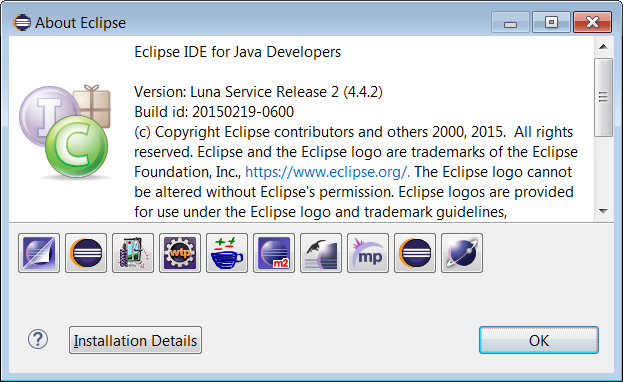
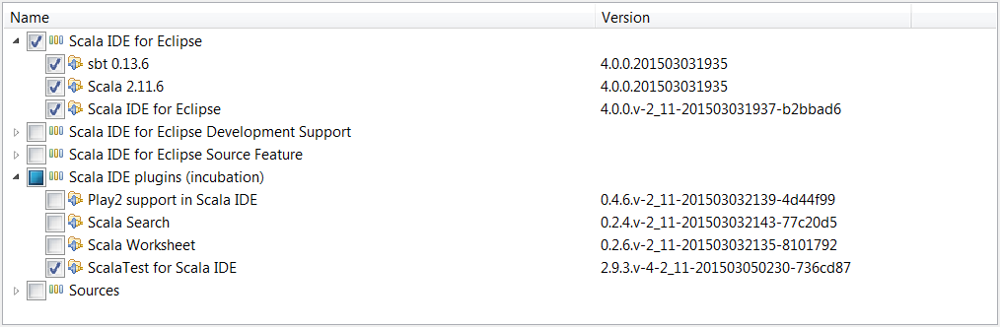
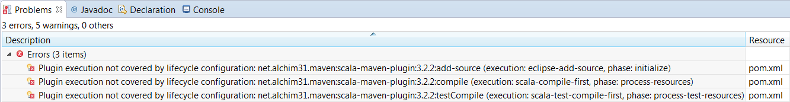
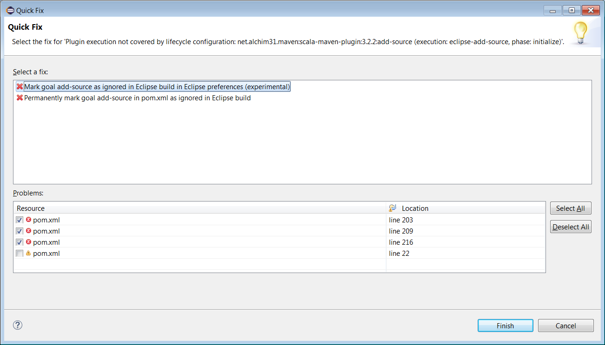

<!--

Licensed to the Apache Software Foundation (ASF) under one or more
contributor license agreements.  See the NOTICE file distributed with
this work for additional information regarding copyright ownership.
The ASF licenses this file to you under the Apache License, Version 2.0
(the "License"); you may not use this file except in compliance with
the License.  You may obtain a copy of the License at

http://www.apache.org/licenses/LICENSE-2.0

Unless required by applicable law or agreed to in writing, software
distributed under the License is distributed on an "AS IS" BASIS,
WITHOUT WARRANTIES OR CONDITIONS OF ANY KIND, either express or implied.
See the License for the specific language governing permissions and
limitations under the License.

-->

Useful Tools for Developing SystemML:

* This will become a table of contents (this text will be scraped).
{:toc}

## IntelliJ

IntelliJ can be used since it provides great support for mixed Java and Scala projects as described [here](https://cwiki.apache.org/confluence/display/SPARK/Useful+Developer+Tools#UsefulDeveloperTools-IntelliJ).

### Import SystemML project to IntelliJ

 1. Download IntelliJ and install the Scala plug-in for IntelliJ.
 2. Go to "File -> Import Project", locate the spark source directory, and select "Maven Project".
 3. In the Import wizard, it's fine to leave settings at their default. However it is usually useful to enable "Import Maven projects automatically", since changes to the project structure will automatically update the IntelliJ project.

## Eclipse

Eclipse [Luna SR2](https://eclipse.org/downloads/packages/release/luna/sr2) can be used for an integrated development development environment with SystemML code.  Maven integration is required which is included in the [Eclipse IDE for Java Developers](https://eclipse.org/downloads/packages/eclipse-ide-java-developers/lunasr2) package.

To get started in Eclipse, import SystemML's pom.xml file as an existing Maven project.  After import is completed, the resulting Eclipse installation should include two maven connectors.

### Eclipse with Scala

An additional Maven connector is required for working with Scala code in Eclipse.  The [Maven Integration for Scala IDE](http://scala-ide.org/docs/tutorials/m2eclipse/) plugin can be installed into Eclipse from [this](http://alchim31.free.fr/m2e-scala/update-site/) update site.  

  
The [Scala IDE 4.0.0 plugin for Eclipse](http://scala-ide.org/download/prev-stable.html) is known to work for mixed Java and Scala development in [Eclipse IDE for Java Developers Luna SR2](https://eclipse.org/downloads/packages/eclipse-ide-java-developers/lunasr2).  <b>Release 4.0.0</b> of the Scala IDE for Eclipse plugin can be downloaded [here](http://download.scala-ide.org/sdk/lithium/e44/scala211/stable/site_assembly-20150305-1905.zip) and then installed through Eclipse's 'Install New Software' menu item.  Only the Scala IDE and ScalaTest components are needed.

Note the corresponding Eclipse project needs to include the Scala nature.  Typically this occurs automatically during project import but also can be invoked directly by right clicking on the systemml project node in the Eclipse Package Explorer view.

### Eclipse Java Only (How to skip Scala)

Since the core SystemML code is written in Java, developers may prefer not to use Eclipse in a mixed Java/Scala environment.  To configure Eclipse to skip the Scala code of SystemML and avoid installing any Scala-related components, Maven lifecycle mappings can be created.  The simplest way to create these mappings is to use Eclipse's quick fix option to resolve the following pom.xml errors which occur if Maven Integration for Scala is not present.

The lifecycle mappings are stored in a workspace metadata file as specified in Eclipse's Maven Lifecycle Mappings Preferences page.  The pom.xml file itself is unchanged which allows the Scala portion to be built outside of Eclipse using mvn command line.

## Troubleshooting

Please see below how to resolve some compilation issues that might occur after importing the SystemML project:

##### `invalid cross-compiled libraries` error
Since Scala IDE bundles the latest versions (2.10.5 and 2.11.6 at this point), you need do add one  in Eclipse Preferences -> Scala -> Installations by pointing to the lib/ directory of your Scala 2.10.4 distribution. Once this is done, select all Spark projects and right-click, choose Scala -> Set Scala Installation and point to the 2.10.4 installation. This should clear all errors about invalid cross-compiled libraries. A clean build should succeed now.

##### `incompatible scala version ` error
Change IDE scala version `project->propertiest->scala compiler -> scala installation`  to  `Fixed scala Installation: 2.10.5`

##### `Not found type * ` error
Run command `mvn package`, and do `project -> refresh`

##### `maketplace not found ` error for Eclipse Luna
Except scala IDE pulgin install, please make sure get update from "http://alchim31.free.fr/m2e-scala/update-site" to update maven connector for scala.
