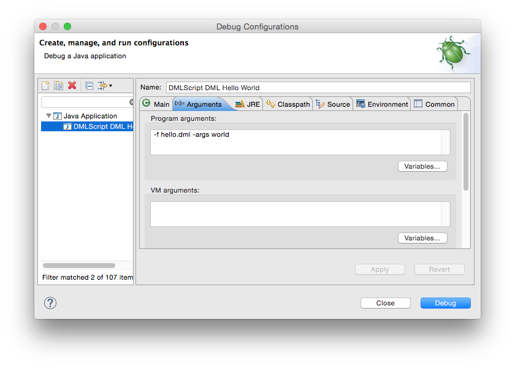

<!--

Licensed to the Apache Software Foundation (ASF) under one or more
contributor license agreements.  See the NOTICE file distributed with
this work for additional information regarding copyright ownership.
The ASF licenses this file to you under the Apache License, Version 2.0
(the "License"); you may not use this file except in compliance with
the License.  You may obtain a copy of the License at

http://www.apache.org/licenses/LICENSE-2.0

Unless required by applicable law or agreed to in writing, software
distributed under the License is distributed on an "AS IS" BASIS,
WITHOUT WARRANTIES OR CONDITIONS OF ANY KIND, either express or implied.
See the License for the specific language governing permissions and
limitations under the License.

-->
* This will become a table of contents (this text will be scraped).
{:toc}

## Building SystemML

SystemML is built using [Apache Maven](http://maven.apache.org/).
SystemML will build on Linux, MacOS, or Windows, and requires Maven 3 and Java 7 (or higher).
To build SystemML, run:

    mvn clean package

To build the SystemML distributions (`.tar.gz`, `.zip`, etc.), run:

    mvn clean package -P distribution

* * *

## Testing SystemML

SystemML features a comprehensive set of integration tests. To perform these tests, run:

    mvn verify

Note: these tests require [R](https://www.r-project.org/) to be installed and available as part of the PATH variable on
the machine on which you are running these tests.

If required, please install the following packages in R:

    install.packages(c("batch", "bitops", "boot", "caTools", "data.table", "doMC", "doSNOW", "ggplot2", "glmnet", "lda", "Matrix", "matrixStats", "moments", "plotrix", "psych", "reshape", "topicmodels", "wordcloud"), dependencies=TRUE)

* * *

## Development Environment

SystemML itself is written in Java and is managed using Maven. As a result, SystemML can readily be
imported into a standard development environment such as Eclipse and IntelliJ IDEA.
The `DMLScript` class serves as the main entrypoint to SystemML. Executing
`DMLScript` with no arguments displays usage information. A script file can be specified using the `-f` argument.

In Eclipse, a Debug Configuration can be created with `DMLScript` as the Main class and any arguments specified as
Program arguments. A PyDML script requires the addition of a `-python` switch.

Suppose that we have a `hello.dml` script containing the following:

	print('hello ' + $1)

This SystemML script can be debugged in Eclipse using a Debug Configuration such as the following:

