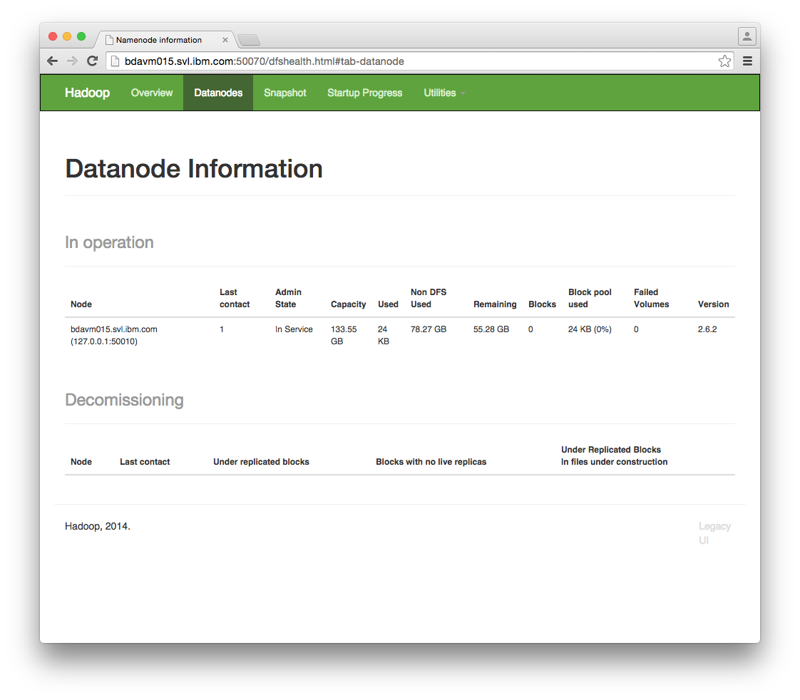
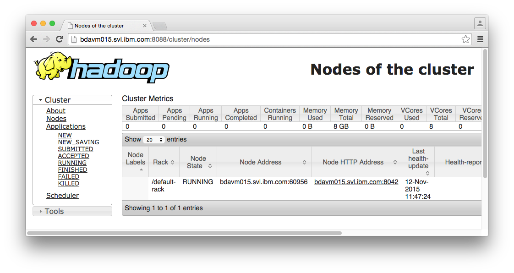
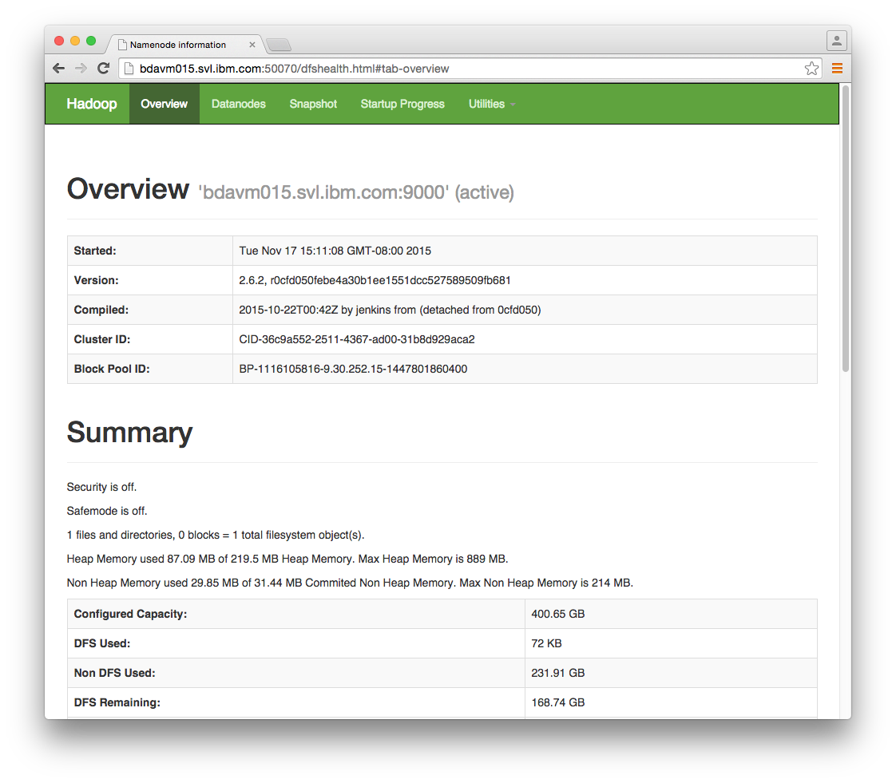
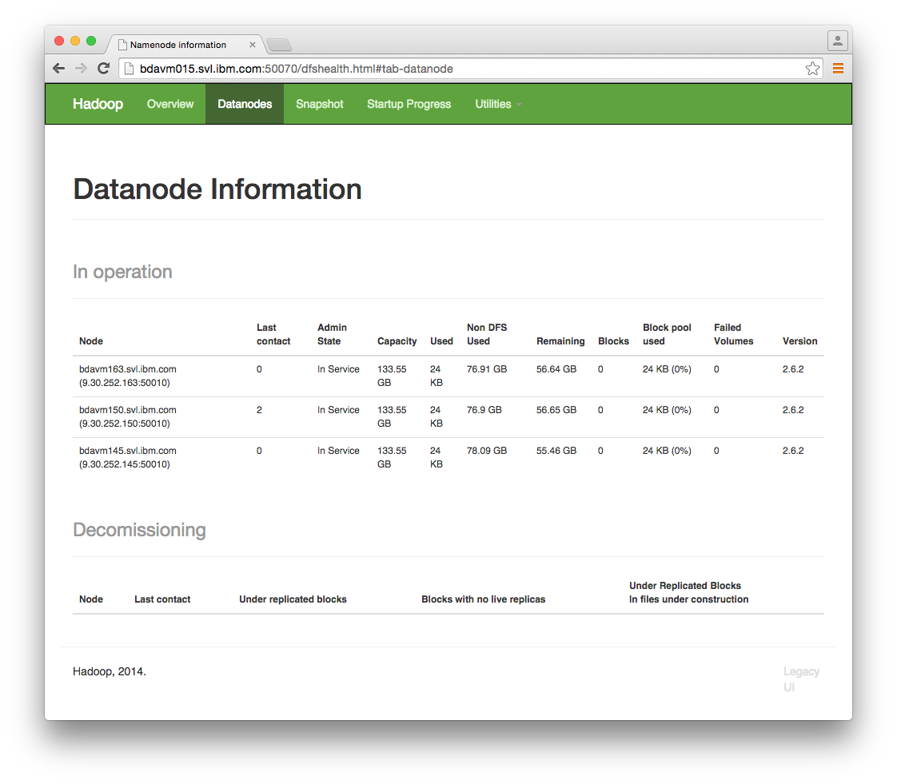
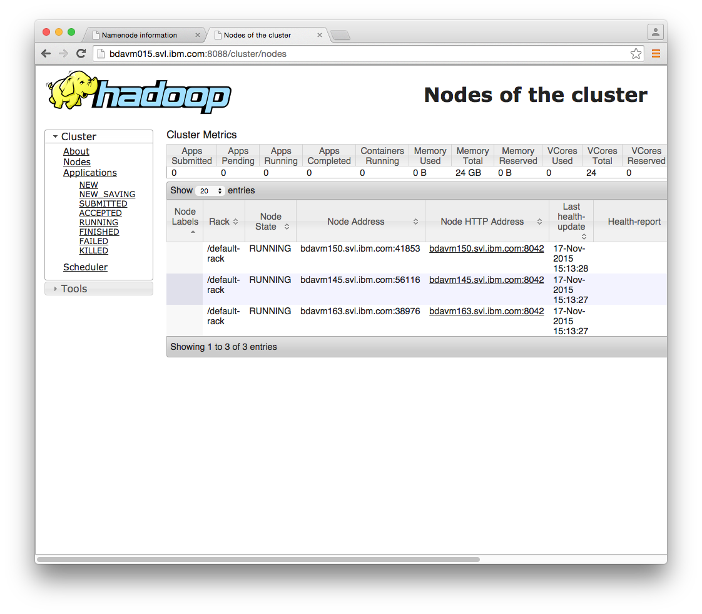

* This will become a table of contents (this text will be scraped).
{:toc}

 

# Overview

Given that a primary purpose of SystemML is to perform machine learning on large distributed data sets,
two of the most important ways to invoke SystemML are Hadoop Batch and Spark Batch modes.
Here, we will look at SystemML's Hadoop Batch mode in more depth.

We will look at running SystemML with Standalone Hadoop, Pseudo-Distributed Hadoop, and Distributed Hadoop. 
We will first run SystemML on a single machine in Hadoop Standalone mode. Next, we'll run SystemML on HDFS
in Hadoop's Pseudo-Distributed mode on a single machine, followed by Pseudo-Distributed mode with YARN.
After that, we'll set up a 4-node Hadoop cluster and run SystemML on Distributed Hadoop with YARN.

Note that this tutorial does not address security. For security considerations with regards to Hadoop, please
refer to the Hadoop documentation.

* * *

# Hadoop Batch Mode Invocation Syntax

As described in the [Invocation of SystemML](dml-language-reference.html#invocation-of-systemml) section
of the [DML Language Reference](dml-language-reference.html), SystemML can be invoked in Hadoop Batch mode using
the following syntax:

    hadoop jar SystemML.jar [-? | -help | -f <filename>] (-config=<config_filename>) ([-args | -nvargs] <args-list>)

The `SystemML.jar` file is specified to Hadoop using the `jar` option.
The DML script to invoke is specified after the `-f` argument. Configuration settings can be passed to SystemML
using the optional `-config=` argument. DML scripts can optionally take named arguments (`-nvargs`) or positional
arguments (`-args`). Named arguments are preferred over positional arguments. Positional arguments are considered
to be deprecated. All the primary algorithm scripts included with SystemML use named arguments.

**Example #1: DML Invocation with Named Arguments**

    hadoop jar system-ml/SystemML.jar -f system-ml/algorithms/Kmeans.dml -nvargs X=X.mtx k=5

**Example #2: DML Invocation with Positional Arguments**

	hadoop jar system-ml/SystemML.jar -f example/test/LinearRegression.dml -args "v" "y" 0.00000001 "w"

In a clustered environment, it is *highly* recommended that SystemML configuration settings are specified
in a `SystemML-config.xml` file. By default, SystemML will look for this file in the current working
directory (`./SystemML-config.xml`). This location can be overridden by the `-config=` argument.

**Example #3: DML Invocation with Configuration File Explicitly Specified and Named Arguments**

	hadoop jar system-ml/SystemML.jar -f system-ml/algorithms/Kmeans.dml -config=/conf/SystemML-config.xml -nvargs X=X.mtx k=5

For recommended SystemML configuration settings in a clustered environment, please see
[Recommended Hadoop Cluster Configuration Settings](hadoop-batch-mode.html#recommended-hadoop-cluster-configuration-settings).

* * *

# SystemML with Standalone Hadoop

In Standalone mode, Hadoop runs on a single machine as a single Java process.

To begin, I connected to my Linux server as root and created a hadoop user.

	$ ssh root@bdavm015.svl.ibm.com
	[root@bdavm015 ~]# useradd hadoop
	[root@bdavm015 ~]# passwd hadoop

Next, I logged on as the hadoop user. I downloaded the version of Hadoop that I wanted to use from an Apache mirror.
A list of Hadoop releases can be found at the [Apache Hadoop Releases](http://hadoop.apache.org/releases.html) website.
After downloading the Hadoop binary release, I unpacked it.

	$ ssh hadoop@bdavm015.svl.ibm.com
	[hadoop@bdavm015 ~]$ wget http://mirror.sdunix.com/apache/hadoop/common/hadoop-2.6.2/hadoop-2.6.2.tar.gz
	[hadoop@bdavm015 ~]$ tar -xvzf hadoop-2.6.2.tar.gz

My Linux server already had a JDK (Java Development Kit) installed. If you haven't done so already, you will need Java
installed in order to use Hadoop.

I updated my `.bash_profile` file to export a `JAVA_HOME` environment variable, which I pointed to my JDK installation
directory. I also exported a `HADOOP_HOME` environment variable, which points to the root directory of the Hadoop release
that I unpacked. I updated the `PATH` variable to include the `JAVA_HOME` `bin` directory, the `HADOOP_HOME` `bin` directory,
and the `HADOOP_HOME` `sbin` directory.

	[hadoop@bdavm145 ~]# vi .bash_profile
	
	...
	export JAVA_HOME=/usr/lib/jvm/java-1.7.0-openjdk.x86_64
	export HADOOP_HOME=/home/hadoop/hadoop-2.6.2
	PATH=$JAVA_HOME/bin:$PATH:$HOME/bin:$HADOOP_HOME/bin:$HADOOP_HOME/sbin
	export PATH
	...
	
	[hadoop@bdavm015 ~]$ source ~/.bash_profile

To verify that Java and Hadoop were on the path, I used the `java -version` and `hadoop version` commands.

	[hadoop@bdavm015 ~]$ java -version
	java version "1.7.0_79"
	OpenJDK Runtime Environment (rhel-2.5.5.1.el6_6-x86_64 u79-b14)
	OpenJDK 64-Bit Server VM (build 24.79-b02, mixed mode)
	[hadoop@bdavm015 ~]$ hadoop version
	Hadoop 2.6.2
	Subversion https://git-wip-us.apache.org/repos/asf/hadoop.git -r 0cfd050febe4a30b1ee1551dcc527589509fb681
	Compiled by jenkins on 2015-10-22T00:42Z
	Compiled with protoc 2.5.0
	From source with checksum f9ebb94bf5bf9bec892825ede28baca
	This command was run using /home/hadoop/hadoop-2.6.2/share/hadoop/common/hadoop-common-2.6.2.jar

Next, I downloaded a SystemML binary release and unpacked it.

	[hadoop@bdavm015 ~]$ wget https://github.com/SparkTC/systemml/releases/download/v0.8/system-ml-0.8.0.tar.gz
	[hadoop@bdavm015 ~]$ tar -xvzf system-ml-0.8.0.tar.gz

I downloaded the `genLinearRegressionData.dml` script that is used in the SystemML README example.

	[hadoop@bdavm015 ~]$ wget https://raw.githubusercontent.com/apache/incubator-systemml/master/scripts/datagen/genLinearRegressionData.dml

Next, I invoked the `genLinearRegressionData.dml` DML script in Hadoop Batch mode.
Hadoop was executed with the `SystemML.jar` file specified by the hadoop `jar` option.
The `genLinearRegressionData.dml` was specified using the `-f` option. Named input
arguments to the DML script were specified following the `-nvargs` option.

	[hadoop@bdavm015 ~]$ hadoop jar system-ml-0.8.0/SystemML.jar -f genLinearRegressionData.dml -nvargs numSamples=1000 numFeatures=50 maxFeatureValue=5 maxWeight=5 addNoise=FALSE b=0 sparsity=0.7 output=linRegData.csv format=csv perc=0.5
	15/11/11 15:56:21 INFO api.DMLScript: BEGIN DML run 11/11/2015 15:56:21
	15/11/11 15:56:21 INFO api.DMLScript: HADOOP_HOME: /home/hadoop/hadoop-2.6.2
	15/11/11 15:56:21 WARN conf.DMLConfig: No default SystemML config file (./SystemML-config.xml) found
	15/11/11 15:56:21 WARN conf.DMLConfig: Using default settings in DMLConfig
	15/11/11 15:56:22 INFO Configuration.deprecation: session.id is deprecated. Instead, use dfs.metrics.session-id
	15/11/11 15:56:22 INFO jvm.JvmMetrics: Initializing JVM Metrics with processName=JobTracker, sessionId=
	15/11/11 15:56:22 INFO Configuration.deprecation: io.sort.mb is deprecated. Instead, use mapreduce.task.io.sort.mb
	15/11/11 15:56:22 INFO Configuration.deprecation: mapred.job.tracker is deprecated. Instead, use mapreduce.jobtracker.address
	15/11/11 15:56:22 WARN hops.OptimizerUtils: Auto-disable multi-threaded text read for 'text' and 'csv' due to thread contention on JRE < 1.8 (java.version=1.7.0_79).
	15/11/11 15:56:22 INFO Configuration.deprecation: mapred.task.tracker.task-controller is deprecated. Instead, use mapreduce.tasktracker.taskcontroller
	15/11/11 15:56:22 INFO Configuration.deprecation: mapred.local.dir is deprecated. Instead, use mapreduce.cluster.local.dir
	15/11/11 15:56:22 INFO Configuration.deprecation: mapred.system.dir is deprecated. Instead, use mapreduce.jobtracker.system.dir
	15/11/11 15:56:22 INFO api.DMLScript: SystemML Statistics:
	Total execution time:		0.288 sec.
	Number of executed MR Jobs:	0.
	
	15/11/11 15:56:22 INFO api.DMLScript: END DML run 11/11/2015 15:56:22

If we examine the contents of the directory, we see that `linRegData.csv` and `perc.csv` were written to the file system,
along with their corresponding metadata files.

	[hadoop@bdavm015 ~]$ ls -l
	total 197500
	-rw-rw-r-- 1 hadoop hadoop      2208 Nov 11 15:45 genLinearRegressionData.dml
	drwxr-xr-x 9 hadoop hadoop      4096 Oct 21 17:53 hadoop-2.6.2
	-rw-rw-r-- 1 hadoop hadoop 195515434 Oct 30 14:04 hadoop-2.6.2.tar.gz
	drwxrwxrwx 2 hadoop hadoop      4096 Nov 11 15:56 linRegData.csv
	-rw-r--r-- 1 hadoop hadoop       214 Nov 11 15:56 linRegData.csv.mtd
	drwxrwxrwx 2 hadoop hadoop      4096 Nov 11 15:56 perc.csv
	-rw-r--r-- 1 hadoop hadoop       206 Nov 11 15:56 perc.csv.mtd
	drwxrwxrwx 2 hadoop hadoop      4096 Nov 11 15:56 scratch_space
	drwxrwxr-x 4 hadoop hadoop      4096 Nov 11 15:42 system-ml-0.8.0
	-rw-rw-r-- 1 hadoop hadoop   6683281 Oct 27 21:13 system-ml-0.8.0.tar.gz

To clean things up, I'll delete the files that were generated.

	[hadoop@bdavm015 ~]$ rm -r *.csv
	[hadoop@bdavm015 ~]$ rm *.csv.mtd
	[hadoop@bdavm015 ~]$ rmdir scratch_space/

* * *

# SystemML with Pseudo-Distributed Hadoop

Next, we'll look at running SystemML with Hadoop in Pseudo-Distributed mode. In Pseudo-Distributed mode, each Hadoop daemon
(such as NameNode and DataNode) runs in a separate Java process on a single machine.

In the previous section about Hadoop Standalone mode, we set up the `JAVA_HOME` and `HADOOP_HOME` environment variables 
and added `JAVA_HOME/bin`, `HADOOP_HOME/bin`, and `HADOOP_HOME/sbin` to the `PATH` in `.bash_profile`.

We also need to set the `JAVA_HOME` value in the `hadoop-env.sh` file in the Hadoop configuration directory (`etc/hadoop`).

	[hadoop@bdavm015 hadoop]$ pwd
	/home/hadoop/hadoop-2.6.2/etc/hadoop
	[hadoop@bdavm015 hadoop]$ vi hadoop-env.sh
	
	...
	export JAVA_HOME=/usr/lib/jvm/java-1.7.0-openjdk.x86_64
	...

We need to be able to passwordlessly `ssh` to localhost. To do so, I'll generate a public key/private key pair and add
the public key to the hadoop user's `authorized_keys`. We can `ssh` to localhost to verify that we can connect without
a password.

	[hadoop@bdavm015 ~]$ ssh-keygen -t rsa -b 4096 -C "hadoop example"
	Your identification has been saved in /home/hadoop/.ssh/id_rsa.
	Your public key has been saved in /home/hadoop/.ssh/id_rsa.pub.
	[hadoop@bdavm015 ~]$ cat ~/.ssh/id_rsa.pub >> ~/.ssh/authorized_keys
	[hadoop@bdavm015 ~]$ chmod 600 ~/.ssh/authorized_keys
	[hadoop@bdavm015 ~]$ ssh localhost
	The authenticity of host 'localhost (::1)' can't be established.
	RSA key fingerprint is 6b:86:78:86:13:0a:49:d4:c7:a7:15:10:d1:27:88:9e.
	Are you sure you want to continue connecting (yes/no)? yes
	Warning: Permanently added 'localhost' (RSA) to the list of known hosts.
	[hadoop@bdavm015 ~]$ exit
	logout
	Connection to localhost closed.
	[hadoop@bdavm015 ~]$ ls -l .ssh
	total 16
	-rw------- 1 hadoop hadoop  736 Nov 11 16:44 authorized_keys
	-rw------- 1 hadoop hadoop 3243 Nov 11 16:41 id_rsa
	-rw-r--r-- 1 hadoop hadoop  736 Nov 11 16:41 id_rsa.pub
	-rw-r--r-- 1 hadoop hadoop  391 Nov 11 16:46 known_hosts

In the Hadoop configuration directory (`etc/hadoop`), in the `core-site.xml` file, we specify the `fs.defaultFS`
property to be `localhost` with port `9000`.

	[hadoop@bdavm015 hadoop]$ vi core-site.xml 
	
	...
	<configuration>
	    <property>
	        <name>fs.defaultFS</name>
	        <value>hdfs://localhost:9000</value>
	    </property>
	</configuration>
	...

By default, HDFS replicates data on three nodes. Since we're running on a single machine, we'll change this to one.
We'll add a `dfs.replication` property to `hdfs-site.xml` and set its value to `1`.

	[hadoop@bdavm015 hadoop]$ vi hdfs-site.xml 
	
	...
	<configuration>
	    <property>
	        <name>dfs.replication</name>
	        <value>1</value>
	    </property>
	</configuration>
	...

Next, we'll format HDFS.

	[hadoop@bdavm015 ~]$ hdfs namenode -format
	15/11/11 17:23:33 INFO namenode.NameNode: STARTUP_MSG: 
	/************************************************************
	STARTUP_MSG: Starting NameNode
	STARTUP_MSG:   host = bdavm015.svl.ibm.com/9.30.252.15
	STARTUP_MSG:   args = [-format]
	STARTUP_MSG:   version = 2.6.2
	...
	STARTUP_MSG:   java = 1.7.0_79
	************************************************************/
	...
	15/11/11 17:23:34 INFO common.Storage: Storage directory /tmp/hadoop-hadoop/dfs/name has been successfully formatted.
	...
	/************************************************************
	SHUTDOWN_MSG: Shutting down NameNode at bdavm015.svl.ibm.com/9.30.252.15
	************************************************************/

We'll start up HDFS using the `start-dfs.sh` script. This starts the NameNode, DataNode, and SecondaryNameNode daemons
on the single machine.

	[hadoop@bdavm015 ~]$ start-dfs.sh
	Starting namenodes on [localhost]
	localhost: starting namenode, logging to /home/hadoop/hadoop-2.6.2/logs/hadoop-hadoop-namenode-bdavm015.out
	localhost: starting datanode, logging to /home/hadoop/hadoop-2.6.2/logs/hadoop-hadoop-datanode-bdavm015.out
	Starting secondary namenodes [0.0.0.0]
	The authenticity of host '0.0.0.0 (0.0.0.0)' can't be established.
	RSA key fingerprint is 6b:86:78:86:13:0a:49:d4:c7:a7:15:10:d1:27:88:9e.
	Are you sure you want to continue connecting (yes/no)? yes
	0.0.0.0: Warning: Permanently added '0.0.0.0' (RSA) to the list of known hosts.
	0.0.0.0: starting secondarynamenode, logging to /home/hadoop/hadoop-2.6.2/logs/hadoop-hadoop-secondarynamenode-bdavm015.out

We can see the running Java processes using the `jps` command.

	[hadoop@bdavm015 ~]$ jps
	36128 Jps
	35844 DataNode
	36007 SecondaryNameNode
	35722 NameNode

Here, we can see detailed information about the Java processes that were started.

	[hadoop@bdavm015 ~]$ ps -C java -f -ww
	UID        PID  PPID  C STIME TTY          TIME CMD
	hadoop  35722     1  5 17:38 ?        00:00:05 /usr/lib/jvm/java-1.7.0-openjdk.x86_64/bin/java -Dproc_namenode -Xmx1000m -Djava.net.preferIPv4Stack=true -Dhadoop.log.dir=/home/hadoop/hadoop-2.6.2/logs -Dhadoop.log.file=hadoop.log -Dhadoop.home.dir=/home/hadoop/hadoop-2.6.2 -Dhadoop.id.str=hadoop -Dhadoop.root.logger=INFO,console -Djava.library.path=/home/hadoop/hadoop-2.6.2/lib/native -Dhadoop.policy.file=hadoop-policy.xml -Djava.net.preferIPv4Stack=true -Djava.net.preferIPv4Stack=true -Djava.net.preferIPv4Stack=true -Dhadoop.log.dir=/home/hadoop/hadoop-2.6.2/logs -Dhadoop.log.file=hadoop-hadoop-namenode-bdavm015.log -Dhadoop.home.dir=/home/hadoop/hadoop-2.6.2 -Dhadoop.id.str=hadoop -Dhadoop.root.logger=INFO,RFA -Djava.library.path=/home/hadoop/hadoop-2.6.2/lib/native -Dhadoop.policy.file=hadoop-policy.xml -Djava.net.preferIPv4Stack=true -Dhadoop.security.logger=INFO,RFAS -Dhdfs.audit.logger=INFO,NullAppender -Dhadoop.security.logger=INFO,RFAS -Dhdfs.audit.logger=INFO,NullAppender -Dhadoop.security.logger=INFO,RFAS -Dhdfs.audit.logger=INFO,NullAppender -Dhadoop.security.logger=INFO,RFAS org.apache.hadoop.hdfs.server.namenode.NameNode
	hadoop  35844     1  4 17:38 ?        00:00:04 /usr/lib/jvm/java-1.7.0-openjdk.x86_64/bin/java -Dproc_datanode -Xmx1000m -Djava.net.preferIPv4Stack=true -Dhadoop.log.dir=/home/hadoop/hadoop-2.6.2/logs -Dhadoop.log.file=hadoop.log -Dhadoop.home.dir=/home/hadoop/hadoop-2.6.2 -Dhadoop.id.str=hadoop -Dhadoop.root.logger=INFO,console -Djava.library.path=/home/hadoop/hadoop-2.6.2/lib/native -Dhadoop.policy.file=hadoop-policy.xml -Djava.net.preferIPv4Stack=true -Djava.net.preferIPv4Stack=true -Djava.net.preferIPv4Stack=true -Dhadoop.log.dir=/home/hadoop/hadoop-2.6.2/logs -Dhadoop.log.file=hadoop-hadoop-datanode-bdavm015.log -Dhadoop.home.dir=/home/hadoop/hadoop-2.6.2 -Dhadoop.id.str=hadoop -Dhadoop.root.logger=INFO,RFA -Djava.library.path=/home/hadoop/hadoop-2.6.2/lib/native -Dhadoop.policy.file=hadoop-policy.xml -Djava.net.preferIPv4Stack=true -server -Dhadoop.security.logger=ERROR,RFAS -Dhadoop.security.logger=ERROR,RFAS -Dhadoop.security.logger=ERROR,RFAS -Dhadoop.security.logger=INFO,RFAS org.apache.hadoop.hdfs.server.datanode.DataNode
	hadoop  36007     1  5 17:38 ?        00:00:04 /usr/lib/jvm/java-1.7.0-openjdk.x86_64/bin/java -Dproc_secondarynamenode -Xmx1000m -Djava.net.preferIPv4Stack=true -Dhadoop.log.dir=/home/hadoop/hadoop-2.6.2/logs -Dhadoop.log.file=hadoop.log -Dhadoop.home.dir=/home/hadoop/hadoop-2.6.2 -Dhadoop.id.str=hadoop -Dhadoop.root.logger=INFO,console -Djava.library.path=/home/hadoop/hadoop-2.6.2/lib/native -Dhadoop.policy.file=hadoop-policy.xml -Djava.net.preferIPv4Stack=true -Djava.net.preferIPv4Stack=true -Djava.net.preferIPv4Stack=true -Dhadoop.log.dir=/home/hadoop/hadoop-2.6.2/logs -Dhadoop.log.file=hadoop-hadoop-secondarynamenode-bdavm015.log -Dhadoop.home.dir=/home/hadoop/hadoop-2.6.2 -Dhadoop.id.str=hadoop -Dhadoop.root.logger=INFO,RFA -Djava.library.path=/home/hadoop/hadoop-2.6.2/lib/native -Dhadoop.policy.file=hadoop-policy.xml -Djava.net.preferIPv4Stack=true -Dhadoop.security.logger=INFO,RFAS -Dhdfs.audit.logger=INFO,NullAppender -Dhadoop.security.logger=INFO,RFAS -Dhdfs.audit.logger=INFO,NullAppender -Dhadoop.security.logger=INFO,RFAS -Dhdfs.audit.logger=INFO,NullAppender -Dhadoop.security.logger=INFO,RFAS org.apache.hadoop.hdfs.server.namenode.SecondaryNameNode

Useful log information is created by default in the hadoop `logs` directory.

If everything worked correctly, we can hit port 50070 in a browser to see Hadoop information. Below, we can see examples
of the Overview tab and the Datanodes tab.

If we look at our HDFS file system, we see that it currently doesn't contain any files.

	[hadoop@bdavm015 ~]$ hdfs dfs -ls
	ls: `.': No such file or directory

Let's go ahead and execute the `genLinearRegressionData.dml` script in Hadoop Pseudo-Distributed mode.

	[hadoop@bdavm015 ~]$ hadoop jar system-ml-0.8.0/SystemML.jar -f genLinearRegressionData.dml -nvargs numSamples=1000 numFeatures=50 maxFeatureValue=5 maxWeight=5 addNoise=FALSE b=0 sparsity=0.7 output=linRegData.csv format=csv perc=0.5
	15/11/11 18:16:33 INFO api.DMLScript: BEGIN DML run 11/11/2015 18:16:33
	15/11/11 18:16:33 INFO api.DMLScript: HADOOP_HOME: /home/hadoop/hadoop-2.6.2
	15/11/11 18:16:33 WARN conf.DMLConfig: No default SystemML config file (./SystemML-config.xml) found
	15/11/11 18:16:33 WARN conf.DMLConfig: Using default settings in DMLConfig
	15/11/11 18:16:33 INFO Configuration.deprecation: session.id is deprecated. Instead, use dfs.metrics.session-id
	15/11/11 18:16:33 INFO jvm.JvmMetrics: Initializing JVM Metrics with processName=JobTracker, sessionId=
	15/11/11 18:16:33 INFO Configuration.deprecation: io.sort.mb is deprecated. Instead, use mapreduce.task.io.sort.mb
	15/11/11 18:16:33 INFO Configuration.deprecation: mapred.job.tracker is deprecated. Instead, use mapreduce.jobtracker.address
	15/11/11 18:16:33 WARN hops.OptimizerUtils: Auto-disable multi-threaded text read for 'text' and 'csv' due to thread contention on JRE < 1.8 (java.version=1.7.0_79).
	15/11/11 18:16:33 INFO Configuration.deprecation: mapred.task.tracker.task-controller is deprecated. Instead, use mapreduce.tasktracker.taskcontroller
	15/11/11 18:16:34 INFO Configuration.deprecation: mapred.local.dir is deprecated. Instead, use mapreduce.cluster.local.dir
	15/11/11 18:16:34 INFO Configuration.deprecation: mapred.system.dir is deprecated. Instead, use mapreduce.jobtracker.system.dir
	15/11/11 18:16:35 INFO api.DMLScript: SystemML Statistics:
	Total execution time:		1.484 sec.
	Number of executed MR Jobs:	0.
	
	15/11/11 18:16:35 INFO api.DMLScript: END DML run 11/11/2015 18:16:35

If we list the contents of the current directory in our regular file system, we see that no files have been written
to the regular file system.

	[hadoop@bdavm015 ~]$ ls
	genLinearRegressionData.dml  hadoop-2.6.2  hadoop-2.6.2.tar.gz  system-ml-0.8.0  system-ml-0.8.0.tar.gz

If we list the contents of the HDFS file system, we see that HDFS contains our data files and the corresponding metadata files.

	[hadoop@bdavm015 ~]$ hdfs dfs -ls
	Found 5 items
	drwxr-xr-x   - hadoop supergroup          0 2015-11-11 18:16 linRegData.csv
	-rw-r--r--   1 hadoop supergroup        214 2015-11-11 18:16 linRegData.csv.mtd
	drwxr-xr-x   - hadoop supergroup          0 2015-11-11 18:16 perc.csv
	-rw-r--r--   1 hadoop supergroup        206 2015-11-11 18:16 perc.csv.mtd
	drwxr-xr-x   - hadoop supergroup          0 2015-11-11 18:16 scratch_space

If we examine the Hadoop web interface mentioned previously, we see that the files, directories, and blocks in HDFS have
increased in number.

Now that we're done with this example, I'll clean things up and delete the generated files from HDFS.

	[hadoop@bdavm015 hadoop]$ hdfs dfs -rm -r *.csv
	[hadoop@bdavm015 hadoop]$ hdfs dfs -rm *.mtd
	[hadoop@bdavm015 hadoop]$ hdfs dfs -rmdir scratch_space

I'll stop HDFS using the `stop-dfs.sh` script and then verify that the Java processes have stopped.

	[hadoop@bdavm015 ~]$ stop-dfs.sh
	Stopping namenodes on [localhost]
	localhost: stopping namenode
	localhost: stopping datanode
	Stopping secondary namenodes [0.0.0.0]
	0.0.0.0: stopping secondarynamenode

	[hadoop@bdavm015 ~]$ jps
	37337 Jps

* * *

# SystemML with Pseudo-Distributed Hadoop and YARN

To add YARN to Pseudo-Distributed Hadoop on the single machine, we need to take our setup from the
previous example and update two configuration
files and start the ResourceManager and NodeManager daemons.

In the `mapred-site.xml` configuration file, we specify the
`mapreduce.framework.name` property as `yarn`.

	[hadoop@bdavm015 hadoop]$ pwd
	/home/hadoop/hadoop-2.6.2/etc/hadoop
	[hadoop@bdavm015 hadoop]$ cp mapred-site.xml.template mapred-site.xml
	[hadoop@bdavm015 hadoop]$ vi mapred-site.xml

	...
	<configuration>
	    <property>
	        <name>mapreduce.framework.name</name>
	        <value>yarn</value>
	    </property>
	</configuration>
	...

In the `yarn-site.xml` configuration file, we specify the `yarn.nodemanager.aux-services` property
to be `mapreduce_shuffle`.

	[hadoop@bdavm015 hadoop]$ vi yarn-site.xml
	
	...
	<configuration>
	    <property>
	        <name>yarn.nodemanager.aux-services</name>
	        <value>mapreduce_shuffle</value>
	    </property>
	</configuration>
	...

Next, we'll start HDFS using the `start-dfs.sh` script.

	[hadoop@bdavm015 hadoop]$ start-dfs.sh
	Starting namenodes on [localhost]
	localhost: starting namenode, logging to /home/hadoop/hadoop-2.6.2/logs/hadoop-hadoop-namenode-bdavm015.out
	localhost: starting datanode, logging to /home/hadoop/hadoop-2.6.2/logs/hadoop-hadoop-datanode-bdavm015.out
	Starting secondary namenodes [0.0.0.0]
	0.0.0.0: starting secondarynamenode, logging to /home/hadoop/hadoop-2.6.2/logs/hadoop-hadoop-secondarynamenode-bdavm015.out

After that, we'll start YARN using the `start-yarn.sh` script.

	[hadoop@bdavm015 hadoop]$ start-yarn.sh
	starting yarn daemons
	starting resourcemanager, logging to /home/hadoop/hadoop-2.6.2/logs/yarn-hadoop-resourcemanager-bdavm015.out
	localhost: starting nodemanager, logging to /home/hadoop/hadoop-2.6.2/logs/yarn-hadoop-nodemanager-bdavm015.out

We can use the `jps` command to verify that the HDFS daemons (NameNode, DataNode, and SecondaryNameNode) and YARN
daemons (ResourceManager and NodeManager) are running.

	[hadoop@bdavm015 hadoop]$ jps
	52046 ResourceManager
	52482 Jps
	52149 NodeManager
	51582 NameNode
	51712 DataNode
	51880 SecondaryNameNode

We can now go to the YARN web interface on port 8088. 

I'll execute the `genLinearRegressionData.dml` example that we've previously considered.

	[hadoop@bdavm015 hadoop]$ cd ~
	[hadoop@bdavm015 ~]$ hadoop jar system-ml-0.8.0/SystemML.jar -f genLinearRegressionData.dml -nvargs numSamples=1000 numFeatures=50 maxFeatureValue=5 maxWeight=5 addNoise=FALSE b=0 sparsity=0.7 output=linRegData.csv format=csv perc=0.5
	15/11/12 11:57:04 INFO api.DMLScript: BEGIN DML run 11/12/2015 11:57:04
	15/11/12 11:57:04 INFO api.DMLScript: HADOOP_HOME: /home/hadoop/hadoop-2.6.2
	15/11/12 11:57:04 WARN conf.DMLConfig: No default SystemML config file (./SystemML-config.xml) found
	15/11/12 11:57:04 WARN conf.DMLConfig: Using default settings in DMLConfig
	15/11/12 11:57:05 INFO client.RMProxy: Connecting to ResourceManager at /0.0.0.0:8032
	15/11/12 11:57:06 INFO Configuration.deprecation: io.sort.mb is deprecated. Instead, use mapreduce.task.io.sort.mb
	15/11/12 11:57:06 INFO Configuration.deprecation: mapred.job.tracker is deprecated. Instead, use mapreduce.jobtracker.address
	15/11/12 11:57:06 WARN hops.OptimizerUtils: Auto-disable multi-threaded text read for 'text' and 'csv' due to thread contention on JRE < 1.8 (java.version=1.7.0_79).
	15/11/12 11:57:06 INFO Configuration.deprecation: mapred.task.tracker.task-controller is deprecated. Instead, use mapreduce.tasktracker.taskcontroller
	15/11/12 11:57:07 INFO api.DMLScript: SystemML Statistics:
	Total execution time:		1.265 sec.
	Number of executed MR Jobs:	0.
	
	15/11/12 11:57:07 INFO api.DMLScript: END DML run 11/12/2015 11:57:07

If we examine the HDFS file system, we see the files generated by the execution of the DML script by SystemML on Hadoop.

	[hadoop@bdavm015 ~]$ hdfs dfs -ls
	Found 5 items
	drwxr-xr-x   - hadoop supergroup          0 2015-11-12 11:57 linRegData.csv
	-rw-r--r--   1 hadoop supergroup        214 2015-11-12 11:57 linRegData.csv.mtd
	drwxr-xr-x   - hadoop supergroup          0 2015-11-12 11:57 perc.csv
	-rw-r--r--   1 hadoop supergroup        206 2015-11-12 11:57 perc.csv.mtd
	drwxr-xr-x   - hadoop supergroup          0 2015-11-12 11:57 scratch_space

I'll go ahead and delete the generated example files from HDFS.

	[hadoop@bdavm015 ~]$ hdfs dfs -rm -r *.csv
	[hadoop@bdavm015 ~]$ hdfs dfs -rm *.mtd
	[hadoop@bdavm015 ~]$ hdfs dfs -rmdir scratch_space

We'll stop the YARN daemons using the `stop-yarn.sh` script.

	[hadoop@bdavm015 ~]$ stop-yarn.sh
	stopping yarn daemons
	stopping resourcemanager
	localhost: stopping nodemanager
	no proxyserver to stop

We can stop HDFS with the `stop-dfs.sh` script.

	[hadoop@bdavm015 ~]$ stop-dfs.sh
	Stopping namenodes on [localhost]
	localhost: stopping namenode
	localhost: stopping datanode
	Stopping secondary namenodes [0.0.0.0]
	0.0.0.0: stopping secondarynamenode

If we list the running Java processes, we see all the YARN daemons and HDFS daemons have stopped.

	[hadoop@bdavm015 ~]$ jps
	53459 Jps

For cleanliness, I'll also delete the `/tmp/hadoop-hadoop` files created by Hadoop before proceeding to
the next example.

* * *

# SystemML with Distributed Hadoop and YARN

In our previous example, we ran SystemML on Hadoop in Pseudo-Distributed mode with YARN on a single machine.
This example will look at Distributed Hadoop with YARN on a 4-node cluster. Each server is running
Red Hat Enterprise Linux Server, release 6.6.

I have 4 nodes: bdavm015, bdavm145, bdavm150, and bdavm163. The bdavm015 node
that we previously set up will act as the master for both HDFS and YARN,
and bdavm145, bd150, and bdavm163 will be slaves. For more information regarding
network configurations, please see the Hadoop documentation.

First, I created a hadoop user on each slave node.

	[root@bdavm015 ~]$ ssh root@bdavm145.svl.ibm.com
	[root@bdavm145 ~]# useradd hadoop
	[root@bdavm145 ~]# passwd hadoop
	[root@bdavm145 ~]# exit
	
	[root@bdavm015 ~]$ ssh root@bdavm150.svl.ibm.com
	[root@bdavm145 ~]# useradd hadoop
	[root@bdavm145 ~]# passwd hadoop
	[root@bdavm145 ~]# exit
	
	[root@bdavm015 ~]$ ssh root@bdavm163.svl.ibm.com
	[root@bdavm145 ~]# useradd hadoop
	[root@bdavm145 ~]# passwd hadoop
	[root@bdavm145 ~]# exit

Next, I set up passwordless login from the hadoop user on the master node (bdavm015)
to each of the slave nodes. The `ssh-copy-id` command copied the master node's hadoop user's
public key value to the ~/.ssh/authorized_keys file of each of the slave nodes. I
tested the passwordless login from the master node to each of the slave nodes for the hadoop
user.

	$ ssh hadoop@bdavm015.svl.ibm.com
	
	[hadoop@bdavm015 ~]$ ssh-copy-id bdavm145.svl.ibm.com
	[hadoop@bdavm015 ~]$ ssh hadoop@bdavm145.svl.ibm.com
	Last login: Thu Nov 12 14:16:21 2015
	[hadoop@bdavm145 ~]$ exit
	
	[hadoop@bdavm015 ~]$ ssh-copy-id bdavm150.svl.ibm.com
	[hadoop@bdavm015 ~]$ ssh hadoop@bdavm150.svl.ibm.com
	Last login: Thu Nov 12 14:16:40 2015
	[hadoop@bdavm150 ~]$ exit
	
	[hadoop@bdavm015 ~]$ ssh-copy-id bdavm163.svl.ibm.com
	[hadoop@bdavm015 ~]$ ssh hadoop@bdavm163.svl.ibm.com
	Last login: Thu Nov 12 14:17:10 2015
	[hadoop@bdavm163 ~]$ exit

On the master node, I specified the slave nodes in the Hadoop `slaves` configuration file.

	[hadoop@bdavm015 hadoop]$ pwd
	/home/hadoop/hadoop-2.6.2/etc/hadoop
	[hadoop@bdavm015 hadoop]$ more slaves
	bdavm145.svl.ibm.com
	bdavm150.svl.ibm.com
	bdavm163.svl.ibm.com

In the `core-site.xml` file, I specified the `fs.defaultFS` property to reference the master node.

	[hadoop@bdavm015 hadoop]$ more core-site.xml
	
	...
	<configuration>
	    <property>
	        <name>fs.defaultFS</name>
	        <value>hdfs://bdavm015.svl.ibm.com:9000</value>
	    </property>
	</configuration>
	...

In the `hdfs-site.xml` configuration file, I removed the previous `dfs.replication` property, since we
will use the default replication value (of 3).

	[hadoop@bdavm015 hadoop]$ more hdfs-site.xml
	
	...
	<configuration>
	</configuration>
	...

We'll be using YARN, so our `mapred-site.xml` will have the `mapreduce.framework.name`
property set to `yarn`, as in the previous example. Additionally, we'll set the `mapreduce.map.java.opts` and
`mapreduce.reduce.java.opts` properties to `-Xmx2g -Xms2g -Xmn200m`. The `-Xmn` parameter fixes the
size of the young generation and typically is set to 10% of the maximum heap, which we have set to 2g.
Furthermore, we'll set `mapreduce.map.memory.mb` and `mapreduce.reduce.memory.mb` to `3072`. Typically these
values are set to at least 1.5 times the value of the maximum heap size.

	[hadoop@bdavm015 hadoop]$ more mapred-site.xml
	
	...
	<configuration>
	    <property>
	        <name>mapreduce.framework.name</name>
	        <value>yarn</value>
	    </property>
	    <property>
	        <name>mapreduce.map.java.opts</name>
	        <value>-Xmx2g -Xms2g -Xmn200m</value>
	    </property>
	    <property>
	        <name>mapreduce.reduce.java.opts</name>
	        <value>-Xmx2g -Xms2g -Xmn200m</value>
	    </property>
	    <property>
	        <name>mapreduce.map.memory.mb</name>
	        <value>3072</value>
	    </property>
	    <property>
	        <name>mapreduce.reduce.memory.mb</name>
	        <value>3072</value>
	    </property>
	</configuration>
	...

In the `yarn-site.xml` configuration file, I added a `yarn.resourcemanager.hostname` property and specified
the master node as the host.

	[hadoop@bdavm015 hadoop]$ more yarn-site.xml
	
	...
	<configuration>
	    <property>
	        <name>yarn.nodemanager.aux-services</name>
	        <value>mapreduce_shuffle</value>
	    </property>
	    <property>
	        <name>yarn.resourcemanager.hostname</name>
	        <value>bdavm015.svl.ibm.com</value>
	    </property>
	</configuration>
	...

In the previous example, we specified the `JAVA_HOME` in the `hadoop-env.sh` configuration script.
We will use that same value.

	[hadoop@bdavm015 hadoop]$ more hadoop-env.sh
	
	...
	export JAVA_HOME=/usr/lib/jvm/java-1.7.0-openjdk.x86_64
	...

Next, I copied my hadoop installation (which includes all of the mentioned configuration settings)
to each slave node.

	[hadoop@bdavm015 ~]$ pwd
	/home/hadoop
	[hadoop@bdavm015 ~]$ scp -r hadoop-2.6.2 hadoop@bdavm145.svl.ibm.com:~/
	[hadoop@bdavm015 ~]$ scp -r hadoop-2.6.2 hadoop@bdavm150.svl.ibm.com:~/
	[hadoop@bdavm015 ~]$ scp -r hadoop-2.6.2 hadoop@bdavm163.svl.ibm.com:~/

My master node `.bash_profile` contains `JAVA_HOME` and `HADOOP_HOME` environment variables
and adds `JAVA_HOME/bin`, `HADOOP_HOME/bin` and `HADOOP_HOME/sbin` to the `PATH`.

	...
	export JAVA_HOME=/usr/lib/jvm/java-1.7.0-openjdk.x86_64
	export HADOOP_HOME=/home/hadoop/hadoop-2.6.2
	PATH=$JAVA_HOME/bin:$PATH:$HOME/bin:$HADOOP_HOME/bin:$HADOOP_HOME/sbin
	export PATH
	...

I copied the `.bash_profile` file to the slave nodes.

	[hadoop@bdavm015 ~]$ pwd
	/home/hadoop
	[hadoop@bdavm015 ~]$ scp .bash_profile hadoop@bdavm145.svl.ibm.com:~/.bash_profile
	[hadoop@bdavm015 ~]$ scp .bash_profile hadoop@bdavm150.svl.ibm.com:~/.bash_profile
	[hadoop@bdavm015 ~]$ scp .bash_profile hadoop@bdavm163.svl.ibm.com:~/.bash_profile

On the master, I formatted HDFS.

	[hadoop@bdavm015 ~]$ hdfs namenode -format

Next, on the master, I started HDFS using `start-dfs.sh`. We can see that the master NameNode
and the slave DataNodes started up.

	[hadoop@bdavm015 ~]$ start-dfs.sh
	Starting namenodes on [bdavm015.svl.ibm.com]
	bdavm015.svl.ibm.com: starting namenode, logging to /home/hadoop/hadoop-2.6.2/logs/hadoop-hadoop-namenode-bdavm015.out
	bdavm163.svl.ibm.com: starting datanode, logging to /home/hadoop/hadoop-2.6.2/logs/hadoop-hadoop-datanode-bdavm163.out
	bdavm145.svl.ibm.com: starting datanode, logging to /home/hadoop/hadoop-2.6.2/logs/hadoop-hadoop-datanode-bdavm145.out
	bdavm150.svl.ibm.com: starting datanode, logging to /home/hadoop/hadoop-2.6.2/logs/hadoop-hadoop-datanode-bdavm150.out
	Starting secondary namenodes [0.0.0.0]
	0.0.0.0: starting secondarynamenode, logging to /home/hadoop/hadoop-2.6.2/logs/hadoop-hadoop-secondarynamenode-bdavm015.out

Next I started YARN using the `start-yarn.sh` script. We see the master ResourceManager and the
slave NodeManagers started up.

	[hadoop@bdavm015 ~]$ start-yarn.sh
	starting yarn daemons
	starting resourcemanager, logging to /home/hadoop/hadoop-2.6.2/logs/yarn-hadoop-resourcemanager-bdavm015.out
	bdavm150.svl.ibm.com: starting nodemanager, logging to /home/hadoop/hadoop-2.6.2/logs/yarn-hadoop-nodemanager-bdavm150.out
	bdavm145.svl.ibm.com: starting nodemanager, logging to /home/hadoop/hadoop-2.6.2/logs/yarn-hadoop-nodemanager-bdavm145.out
	bdavm163.svl.ibm.com: starting nodemanager, logging to /home/hadoop/hadoop-2.6.2/logs/yarn-hadoop-nodemanager-bdavm163.out

On the master, we see that the NameNode, SecondaryNameNode, and ResourceManager daemons are running.

	[hadoop@bdavm015 ~]$ jps
	1563 NameNode
	1775 SecondaryNameNode
	2240 Jps
	1978 ResourceManager

On the slaves, we see that the DataNode and NodeManager daemons are running.

	[hadoop@bdavm145 ~]$ jps
	29096 Jps
	28974 NodeManager
	28821 DataNode

	[hadoop@bdavm150 ~]$ jps
	5950 Jps
	5706 DataNode
	5819 NodeManager

	[hadoop@bdavm163 ~]$ jps
	16388 Jps
	16153 DataNode
	16266 NodeManager

If we look at the Hadoop and YARN web interfaces, we can see information about our running cluster.

* * *

## SystemML with Distributed Hadoop and YARN: Linear Regression Example

Let's go ahead and run the SystemML example from the GitHub README.

	[hadoop@bdavm015 ~]$ hadoop jar system-ml-0.8.0/SystemML.jar -f genLinearRegressionData.dml -nvargs numSamples=1000 numFeatures=50 maxFeatureValue=5 maxWeight=5 addNoise=FALSE b=0 sparsity=0.7 output=linRegData.csv format=csv perc=0.5
	
	[hadoop@bdavm015 ~]$ hadoop jar system-ml-0.8.0/SystemML.jar -f system-ml-0.8.0/algorithms/utils/sample.dml -nvargs X=linRegData.csv sv=perc.csv O=linRegDataParts ofmt=csv
	
	[hadoop@bdavm015 ~]$ hadoop jar system-ml-0.8.0/SystemML.jar -f system-ml-0.8.0/algorithms/utils/splitXY.dml -nvargs X=linRegDataParts/1 y=51 OX=linRegData.train.data.csv OY=linRegData.train.labels.csv ofmt=csv
	
	[hadoop@bdavm015 ~]$ hadoop jar system-ml-0.8.0/SystemML.jar -f system-ml-0.8.0/algorithms/utils/splitXY.dml -nvargs X=linRegDataParts/2 y=51 OX=linRegData.test.data.csv OY=linRegData.test.labels.csv ofmt=csv
	
	[hadoop@bdavm015 ~]$ hadoop jar system-ml-0.8.0/SystemML.jar -f system-ml-0.8.0/algorithms/LinearRegDS.dml -nvargs X=linRegData.train.data.csv Y=linRegData.train.labels.csv B=betas.csv fmt=csv
	...
	BEGIN LINEAR REGRESSION SCRIPT
	Reading X and Y...
	Calling the Direct Solver...
	Computing the statistics...
	AVG_TOT_Y,-0.051722694902638956
	STDEV_TOT_Y,54.132787822718356
	AVG_RES_Y,1.5905895170230406E-10
	STDEV_RES_Y,2.0668015575844624E-8
	DISPERSION,4.262683023432828E-16
	PLAIN_R2,1.0
	ADJUSTED_R2,1.0
	PLAIN_R2_NOBIAS,1.0
	ADJUSTED_R2_NOBIAS,1.0
	PLAIN_R2_VS_0,1.0
	ADJUSTED_R2_VS_0,1.0
	Writing the output matrix...
	END LINEAR REGRESSION SCRIPT
	15/11/17 15:50:34 INFO api.DMLScript: SystemML Statistics:
	Total execution time:		0.480 sec.
	...
	
	[hadoop@bdavm015 ~]$ hadoop jar system-ml-0.8.0/SystemML.jar -f system-ml-0.8.0/algorithms/GLM-predict.dml -nvargs X=linRegData.test.data.csv Y=linRegData.test.labels.csv B=betas.csv fmt=csv
	...
	LOGLHOOD_Z,,FALSE,NaN
	LOGLHOOD_Z_PVAL,,FALSE,NaN
	PEARSON_X2,,FALSE,2.5039962709907123E-13
	PEARSON_X2_BY_DF,,FALSE,5.703863943031236E-16
	PEARSON_X2_PVAL,,FALSE,1.0
	DEVIANCE_G2,,FALSE,0.0
	DEVIANCE_G2_BY_DF,,FALSE,0.0
	DEVIANCE_G2_PVAL,,FALSE,1.0
	LOGLHOOD_Z,,TRUE,NaN
	LOGLHOOD_Z_PVAL,,TRUE,NaN
	PEARSON_X2,,TRUE,2.5039962709907123E-13
	PEARSON_X2_BY_DF,,TRUE,5.703863943031236E-16
	PEARSON_X2_PVAL,,TRUE,1.0
	DEVIANCE_G2,,TRUE,0.0
	DEVIANCE_G2_BY_DF,,TRUE,0.0
	DEVIANCE_G2_PVAL,,TRUE,1.0
	AVG_TOT_Y,1,,0.9381218622147646
	STDEV_TOT_Y,1,,55.6116696631821
	AVG_RES_Y,1,,2.5577864570734575E-10
	STDEV_RES_Y,1,,2.390848397359923E-8
	PRED_STDEV_RES,1,TRUE,1.0
	PLAIN_R2,1,,1.0
	ADJUSTED_R2,1,,1.0
	PLAIN_R2_NOBIAS,1,,1.0
	ADJUSTED_R2_NOBIAS,1,,1.0
	15/11/17 15:51:17 INFO api.DMLScript: SystemML Statistics:
	Total execution time:		0.269 sec.
	...

If we look at HDFS, we can see the files that were generated by the SystemML DML script executions.

	[hadoop@bdavm015 ~]$ hdfs dfs -ls
	Found 16 items
	drwxr-xr-x   - hadoop supergroup          0 2015-11-17 15:50 betas.csv
	-rw-r--r--   3 hadoop supergroup        208 2015-11-17 15:50 betas.csv.mtd
	drwxr-xr-x   - hadoop supergroup          0 2015-11-17 15:21 linRegData.csv
	-rw-r--r--   3 hadoop supergroup        214 2015-11-17 15:21 linRegData.csv.mtd
	drwxr-xr-x   - hadoop supergroup          0 2015-11-17 15:50 linRegData.test.data.csv
	-rw-r--r--   3 hadoop supergroup        213 2015-11-17 15:50 linRegData.test.data.csv.mtd
	drwxr-xr-x   - hadoop supergroup          0 2015-11-17 15:50 linRegData.test.labels.csv
	-rw-r--r--   3 hadoop supergroup        210 2015-11-17 15:50 linRegData.test.labels.csv.mtd
	drwxr-xr-x   - hadoop supergroup          0 2015-11-17 15:49 linRegData.train.data.csv
	-rw-r--r--   3 hadoop supergroup        213 2015-11-17 15:49 linRegData.train.data.csv.mtd
	drwxr-xr-x   - hadoop supergroup          0 2015-11-17 15:49 linRegData.train.labels.csv
	-rw-r--r--   3 hadoop supergroup        210 2015-11-17 15:49 linRegData.train.labels.csv.mtd
	drwxr-xr-x   - hadoop supergroup          0 2015-11-17 15:49 linRegDataParts
	drwxr-xr-x   - hadoop supergroup          0 2015-11-17 15:21 perc.csv
	-rw-r--r--   3 hadoop supergroup        206 2015-11-17 15:21 perc.csv.mtd
	drwxr-xr-x   - hadoop supergroup          0 2015-11-17 15:21 scratch_space

Before the next example, I'll delete the files created in HDFS by this example.

	[hadoop@bdavm015 ~]$ hdfs dfs -rm -r linRegData*
	[hadoop@bdavm015 ~]$ hdfs dfs -rm -r *.csv
	[hadoop@bdavm015 ~]$ hdfs dfs -rm -r *.mtd

* * *

## SystemML with Distributed Hadoop and YARN: K-Means Clustering Example

Our previous example showed SystemML running in Hadoop Batch mode on a 4-node cluster with YARN.
However, the size of the data used was trivial. In this example, we'll generate a slightly larger set
of data and then analyze that data with the `Kmeans.dml` and `Kmeans-predict.dml` scripts.
Information about the SystemML K-means clustering algorithm can be found in the
[K-Means Clustering](algorithms-clustering.html#k-means-clustering) section of the [SystemML
Algorithms Reference](algorithms-reference.html).

I'm going to modify my `SystemML-config.xml` file.
I updated the `numreducers` property to be 6, which is twice my number of data nodes.
The `numreducers` property specifies the number of reduce tasks per MR job.

	<numreducers>6</numreducers>

To begin, I'll download the `genRandData4Kmeans.dml` script that I'll use to generate a set of data.

	[hadoop@bdavm015 ~]$ wget https://raw.githubusercontent.com/apache/incubator-systemml/master/scripts/datagen/genRandData4Kmeans.dml

A description of the named arguments that can be passed in to this script can be found in the comment section at the top of the
`genRandData4Kmeans.dml` file. For data, I'll generate a matrix `X.mtx` consisting of 1 million rows and 100 features. I'll explicitly reference my `SystemML-config.xml` file, since I'm
executing SystemML in Hadoop from my home directory rather than from the SystemML project root directory.

	[hadoop@bdavm015 ~]$ hadoop jar system-ml-0.8.0/SystemML.jar -f genRandData4Kmeans.dml -config=system-ml-0.8.0/SystemML-config.xml -nvargs nr=1000000 nf=100 nc=10 dc=10.0 dr=1.0 fbf=100.0 cbf=100.0 X=X.mtx C=C.mtx Y=Y.mtx YbyC=YbyC.mtx

After the data generation has finished, I'll check HDFS for the amount of space used. The 1M-row matrix `X.mtx` 
requires about 2.8GB of space.

	[hadoop@bdavm015 ~]$ hdfs dfs -df -h
	Filesystem                           Size   Used  Available  Use%
	hdfs://bdavm015.svl.ibm.com:9000  400.7 G  2.8 G    318.7 G    1%

Here we can see the data files that were generated.

	[hadoop@bdavm015 ~]$ hdfs dfs -ls
	Found 9 items
	drwxr-xr-x   - hadoop supergroup          0 2015-11-19 11:53 C.mtx
	-rw-r--r--   3 hadoop supergroup        176 2015-11-19 11:53 C.mtx.mtd
	drwxr-xr-x   - hadoop supergroup          0 2015-11-19 11:56 X.mtx
	-rw-r--r--   3 hadoop supergroup        186 2015-11-19 11:56 X.mtx.mtd
	drwxr-xr-x   - hadoop supergroup          0 2015-11-19 11:53 Y.mtx
	-rw-r--r--   3 hadoop supergroup        182 2015-11-19 11:53 Y.mtx.mtd
	drwxr-xr-x   - hadoop supergroup          0 2015-11-19 11:56 YbyC.mtx
	-rw-r--r--   3 hadoop supergroup        182 2015-11-19 11:56 YbyC.mtx.mtd
	drwxr-xr-x   - hadoop supergroup          0 2015-11-19 11:56 scratch_space

Here we can see the `X.mtx` data files.

	[hadoop@bdavm015 ~]$ hdfs dfs -ls X.mtx
	Found 6 items
	-rw-r--r--   1 hadoop supergroup  484418384 2015-11-19 11:56 X.mtx/2-r-00000
	-rw-r--r--   1 hadoop supergroup  481626112 2015-11-19 11:56 X.mtx/2-r-00001
	-rw-r--r--   1 hadoop supergroup  475834931 2015-11-19 11:56 X.mtx/2-r-00002
	-rw-r--r--   1 hadoop supergroup  478519922 2015-11-19 11:56 X.mtx/2-r-00003
	-rw-r--r--   1 hadoop supergroup  481624723 2015-11-19 11:56 X.mtx/2-r-00004
	-rw-r--r--   1 hadoop supergroup  481624048 2015-11-19 11:56 X.mtx/2-r-00005

Next, I'll run the `Kmeans.dml` algorithm on the 1M-row matrix `X.mtx`. 

	[hadoop@bdavm015 ~]$ hadoop jar system-ml-0.8.0/SystemML.jar -f system-ml-0.8.0/algorithms/Kmeans.dml -config=/system-ml-0.8.0/SystemML-config.xml -nvargs X=X.mtx k=5 C=Centroids.mtx

We can see the `Centroids.mtx` data file has been written to HDFS.

	[hadoop@bdavm015 ~]$ hdfs dfs -ls
	Found 11 items
	drwxr-xr-x   - hadoop supergroup          0 2015-11-19 11:53 C.mtx
	-rw-r--r--   3 hadoop supergroup        176 2015-11-19 11:53 C.mtx.mtd
	drwxr-xr-x   - hadoop supergroup          0 2015-11-19 12:10 Centroids.mtx
	-rw-r--r--   3 hadoop supergroup        174 2015-11-19 12:10 Centroids.mtx.mtd
	drwxr-xr-x   - hadoop supergroup          0 2015-11-19 11:56 X.mtx
	-rw-r--r--   3 hadoop supergroup        186 2015-11-19 11:56 X.mtx.mtd
	drwxr-xr-x   - hadoop supergroup          0 2015-11-19 11:53 Y.mtx
	-rw-r--r--   3 hadoop supergroup        182 2015-11-19 11:53 Y.mtx.mtd
	drwxr-xr-x   - hadoop supergroup          0 2015-11-19 11:56 YbyC.mtx
	-rw-r--r--   3 hadoop supergroup        182 2015-11-19 11:56 YbyC.mtx.mtd
	drwxr-xr-x   - hadoop supergroup          0 2015-11-19 12:10 scratch_space

Now that we have trained our model, next we will test our model. We can do this with
the `Kmeans-predict.dml` script.

	[hadoop@bdavm015 ~]$ hadoop jar system-ml-0.8.0/SystemML.jar -f system-ml-0.8.0/algorithms/Kmeans-predict.dml -config=system-ml-0.8.0/SystemML-config.xml -nvargs X=X.mtx C=Centroids.mtx prY=PredY.mtx O=stats.txt

In the file system, we can see that the `PredY.mtx` matrix was created. 
The `stats.txt` file lists statistics about the results.

	[hadoop@bdavm015 ~]$ hdfs dfs -ls
	Found 15 items
	drwxr-xr-x   - hadoop supergroup          0 2015-11-19 11:53 C.mtx
	-rw-r--r--   3 hadoop supergroup        176 2015-11-19 11:53 C.mtx.mtd
	drwxr-xr-x   - hadoop supergroup          0 2015-11-19 12:10 Centroids.mtx
	-rw-r--r--   3 hadoop supergroup        174 2015-11-19 12:10 Centroids.mtx.mtd
	drwxr-xr-x   - hadoop supergroup          0 2015-11-19 13:20 PredY.mtx
	-rw-r--r--   3 hadoop supergroup        182 2015-11-19 13:20 PredY.mtx.mtd
	drwxr-xr-x   - hadoop supergroup          0 2015-11-19 11:56 X.mtx
	-rw-r--r--   3 hadoop supergroup        186 2015-11-19 11:56 X.mtx.mtd
	drwxr-xr-x   - hadoop supergroup          0 2015-11-19 11:53 Y.mtx
	-rw-r--r--   3 hadoop supergroup        182 2015-11-19 11:53 Y.mtx.mtd
	drwxr-xr-x   - hadoop supergroup          0 2015-11-19 11:56 YbyC.mtx
	-rw-r--r--   3 hadoop supergroup        182 2015-11-19 11:56 YbyC.mtx.mtd
	drwxr-xr-x   - hadoop supergroup          0 2015-11-19 13:21 scratch_space
	-rw-r--r--   3 hadoop supergroup        261 2015-11-19 13:21 stats.txt
	-rw-r--r--   3 hadoop supergroup        127 2015-11-19 13:21 stats.txt.mtd

The `PredY.mtx` matrix consists of a single column of a million rows of doubles, as we can
see in the resulting metadata file.

	[hadoop@bdavm015 ~]$ hdfs dfs -cat PredY.mtx.mtd
	{
	    "data_type": "matrix"
	    ,"value_type": "double"
	    ,"rows": 1000000
	    ,"cols": 1
	    ,"nnz": 1000000
	    ,"format": "text"
	    ,"description": { "author": "SystemML" }
	}

The statistics generated from testing the method are displayed below.

	[hadoop@bdavm015 ~]$ hdfs dfs -cat stats.txt
	TSS,,1.1262427174414966E11
	WCSS_M,,9.77022617396343E10
	WCSS_M_PC,,86.75062686450579
	BCSS_M,,1.4922010004515366E10
	BCSS_M_PC,,13.249373135494215
	WCSS_C,,9.770230517014426E10
	WCSS_C_PC,,86.75066542680617
	BCSS_C,,1.4921964103415842E10
	BCSS_C_PC,,13.249332379537428

# Recommended Hadoop Cluster Configuration Settings

Below are some recommended Hadoop configuration file settings that may be of assistance when running SystemML on Hadoop
in a clustered environment.

<table>
  <thead>
    <tr>
      <th>Configuration File</th>
      <th>Setting</th>
      <th>Value</th>
      <th>Description</th>
    </tr>
  </thead>
  <tbody>
    <tr>
      <td nowrap rowspan="5" style="vertical-align: top; padding-top: 22px;"><code>mapred-site.xml</code></td>
      <td nowrap><code>mapreduce.map.java.opts</code></td>
      <td nowrap><code>-Xmx2g -Xms2g -Xmn200m</code></td>
      <td>Increase memory of child JVMs of Maps, max/min heap size of 2GB, -Xmn specifies young generation which is typically 10% of maximum heap size</td>
    </tr>
    <tr>
      <td nowrap><code>mapreduce.reduce.java.opts</code></td>
      <td nowrap><code>-Xmx2g -Xms2g -Xmn200m</code></td>
      <td>Increase memory of child JVMs of Reduces, max/min heap size of 2GB, -Xmn specifies young generation which is typically 10% of maximum heap size</td>
    </tr>
    <tr>
      <td nowrap><code>mapreduce.map.memory.mb</code></td>
      <td nowrap><code>3072</code></td>
      <td>Set to at least 1.5 times the value of the Map max heap size</td>
    </tr>
    <tr>
      <td nowrap><code>mapreduce.reduce.memory.mb</code></td>
      <td nowrap><code>3072</code></td>
      <td>Set to at least 1.5 times the value of the Reduce max heap size</td>
    </tr>
    <tr>
      <td nowrap><code>io.sort.mb</code> (deprecated) /  <code>mapreduce.task.io.sort.mb</code></td>
      <td nowrap><code>384</code></td>
      <td>Memory limit while sorting data</td>
    </tr>
    <tr>
      <td nowrap><code>yarn-site.xml</code></td>
      <td nowrap><code>yarn.nodemanager.vmem-pmem-ratio</code></td>
      <td nowrap><code>2</code> to <code>5</code></td>
      <td>Maximum ratio of virtual memory to physical memory</td>
    </tr>
  </tbody>
</table>

