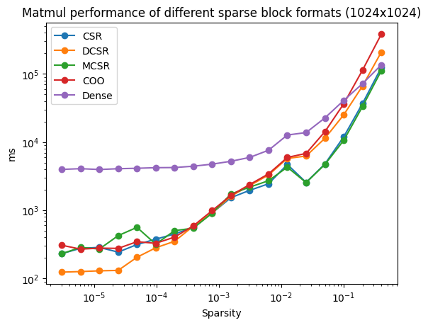
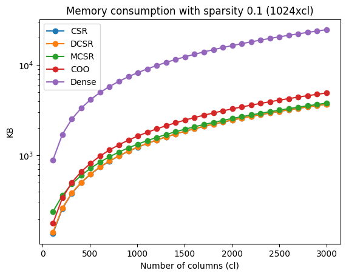
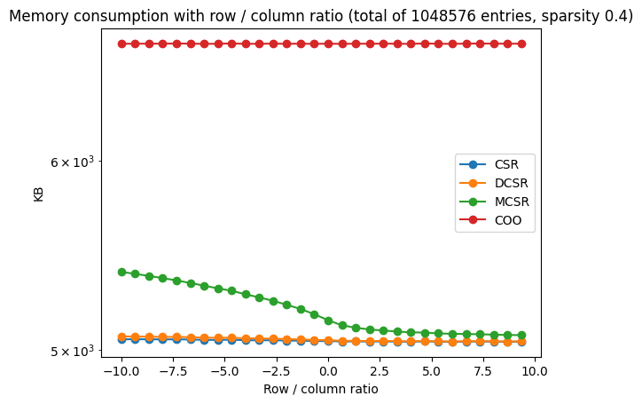
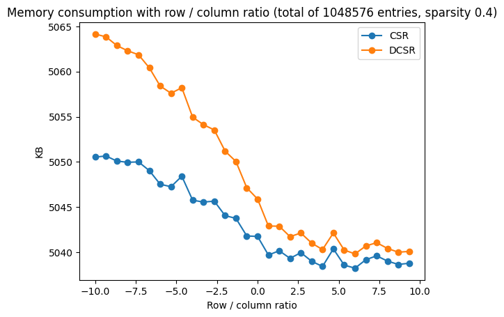

<!--

Licensed to the Apache Software Foundation (ASF) under one or more
contributor license agreements.  See the NOTICE file distributed with
this work for additional information regarding copyright ownership.
The ASF licenses this file to you under the Apache License, Version 2.0
(the "License"); you may not use this file except in compliance with
the License.  You may obtain a copy of the License at

http://www.apache.org/licenses/LICENSE-2.0

Unless required by applicable law or agreed to in writing, software
distributed under the License is distributed on an "AS IS" BASIS,
WITHOUT WARRANTIES OR CONDITIONS OF ANY KIND, either express or implied.
See the License for the specific language governing permissions and
limitations under the License.

-->

# Sparse block performance comparison

This file contains a short evaluation of different sparse blocks. We included one dense block (DenseBlockFP64) as a baseline.

## Execution time
We measured the performance of two matrices being multiplied, both of the corresponding block type.
Before each measurement, we performed `30` warmup runs (performing `30` matrix multiplications to random matrices without measuring).
Then, we measured the delta nanos of the operation below `100` times and took the average.
For this, we selected a block size of `1024x1024`.

```java 
MatrixBlock m3 = m1.aggregateBinaryOperations(m1, m2,
                new MatrixBlock(), InstructionUtils.getMatMultOperator(1));
```



## Storage

The image below shows the memory consumption of each block type for different sparsities. This was evaluated using blocks with 1024 rows and 1024 columns.


We also evaluated on different matrix shapes by fixing the number of rows and manipulating the number of columns.
These tests were repeated for different sparsities.





To get more meaningful results, the next evaluation fixes the number of entries in a matrix to `1024x1024` and adapts the column-to-row `ratio` (and vice versa) accordingly.
We define the ratio as `cl = (1 + ratio) * rl` if `ratio >= 0`, otherwise as `rl = (1 - ratio) * cl`. 
If we have for example a `ratio=1`, this means that there are twice as many columns as rows. If the `ratio=-1`, this means that there are twice as many rows as columns.
Each test with a specific `ratio` was repeated `10` times with different random matrices and we took the average memory consumption.
The images below show our results for different sparsities.





