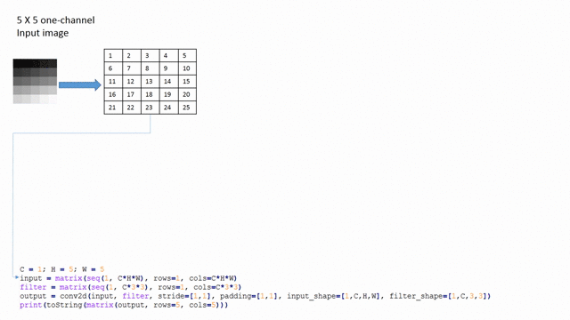
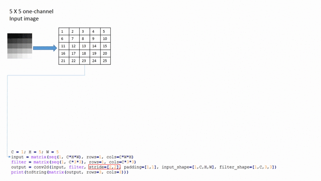

<!--

Licensed to the Apache Software Foundation (ASF) under one or more
contributor license agreements.  See the NOTICE file distributed with
this work for additional information regarding copyright ownership.
The ASF licenses this file to you under the Apache License, Version 2.0
(the "License"); you may not use this file except in compliance with
the License.  You may obtain a copy of the License at

http://www.apache.org/licenses/LICENSE-2.0

Unless required by applicable law or agreed to in writing, software
distributed under the License is distributed on an "AS IS" BASIS,
WITHOUT WARRANTIES OR CONDITIONS OF ANY KIND, either express or implied.
See the License for the specific language governing permissions and
limitations under the License.

-->

### Table of Contents

  * [Introduction](#introduction)
  * [Variables](#variables)
    * [Identifier Names](#identifier-names)
    * [Data Types](#data-types)
    * [Comments](#comments)
  * [Expressions](#expressions)
    * [Operators](#operators)
    * [Matrix-Vector Operations](#matrix-vector-operations)
    * [Matrix Indexing](#matrix-indexing)
  * [Statements](#statements)
    * [Assignment Statement](#assignment-statement)
    * [Control Statements](#control-statements)
      * [While Statement](#while-statement)
      * [If Statement](#if-statement)
      * [For Statement](#for-statement)
      * [ParFor Statement](#parfor-statement)
    * [User-Defined Function (UDF)](#user-defined-function-udf)
  * [Variable Scoping](#variable-scoping)
  * [Command-Line Arguments](#command-line-arguments)
  * [Built-in Functions](#built-in-functions)
    * [Matrix Construction, Manipulation, and Aggregation Built-In Functions](#matrix-construction-manipulation-and-aggregation-built-in-functions)
    * [Matrix and/or Scalar Comparison Built-In Functions](#matrix-andor-scalar-comparison-built-in-functions)
    * [Casting Built-In Functions](#casting-built-in-functions)
    * [Statistical Built-In Functions](#statistical-built-in-functions)
    * [Mathematical and Trigonometric Built-In Functions](#mathematical-and-trigonometric-built-in-functions)
    * [Linear Algebra Built-In Functions](#linear-algebra-built-in-functions)
    * [Read/Write Built-In Functions](#readwrite-built-in-functions)
    * [Data Pre-Processing Built-In Functions](#data-pre-processing-built-in-functions)
    * [Deep Learning Built-In Functions](#deep-learning-built-in-functions)
    * [Parameter Server Built-In Function](#parameter-server-built-in-function)
    * [Other Built-In Functions](#other-built-in-functions)
  * [Frames](#frames)
    * [Creating Frames](#creating-frames)
    * [Appending Frames](#appending-frames)
    * [Indexing Frames](#indexing-frames)
    * [Casting Frames](#casting-frames)
    * [Transforming Frames](#transforming-frames)
    * [Processing Frames](#processing-frames)
  * [Modules](#modules)
  * [Reserved Keywords](#reserved-keywords)


## Introduction

SystemDS compiles scripts written in Declarative Machine Learning (or DML for short) into mixed driver and distributed jobs. DML’s syntax closely follows R, thereby minimizing the learning curve to use SystemDS. Before getting into detail, let’s start with a simple Hello World program in DML. Assuming that Spark is installed on your machine or cluster, place `SystemDS.jar` into your directory. Now, create a text file `hello.dml` containing following code:

    print("Hello World");

To run this program on your machine, use following command:

    spark-submit SystemDS.jar -f hello.dml

The option `-f` in the above command refers to the path to the DML script. A detailed list of the
available options can be found running `spark-submit SystemDS.jar -help`.


## Variables


### Identifier Names

Identifiers are case-sensitive (e.g., `var1`, `Var1`, and `VAR1` are different identifier names), must start with either an upper-case or lower-case letter, and may contain any alphanumeric character including underscore after the first letter. The reserved keywords described later cannot be used as identifier names. Though it is allowed, but not recommended to use built-in functions as an identifier. The only exceptions to this rule are five built-in functions: 'as.scalar', 'as.matrix', 'as.double', 'as.integer' and 'as.logical'.


#### Examples

    A       # valid variable name
    _A      # invalid variable name -- starts with underscore
    1_A     # invalid variable name -- starts with number
    A_1     # valid variable name
    min = 10 # valid but deprecated

Before, proceeding ahead let’s run the Hello World program using variable:

    helloStr = "Hello World"
    print(helloStr)

As seen in above example, there is no formal declaration of a variable. A variable is created when first assigned a value, and its type is inferred.


### Data Types

Three data types (frame, matrix and scalar) and four value types (double, integer, string, and boolean) are supported. Matrices are 2-dimensional, and support the double value type (i.e., the cells in a matrix are of type double). The frame data type denotes the tabular data, potentially containing columns of value type numeric, string, and boolean.  Frame functions are described in [Frames](#frames) and  [Data Pre-Processing Built-In Functions](#data-pre-processing-built-in-functions).  SystemDS supports type polymorphism for both data type (primarily, matrix and scalar types) and value type during evaluation. For example:

    # Spoiler alert: matrix() is a built-in function to
    # create matrix, which will be discussed later
    A = matrix(0, rows=10, cols=10)
    B = 10
    C = B + sum(A)
    print( "B:" + B + ", C:" + C + ", A[1,1]:" + as.scalar(A[1,1]))

In the above script, we create three variables: `A`, `B` and `C` of type `matrix`, `scalar integer` and `scalar double` respectively. Since `A` is a `matrix`, it has to be converted to scalar using a built-in function `as.scalar`. In the above script the operator `+` used inside `print()` function, performs string concatenation. Hence, the output of above script is as follows:

    B:10, C:10.0, A[1,1]:0.0

If instead of `as.scalar(A[1,1])` we would have used `A[1,1]`, then we will get an compilation error `print statement can only print scalars`.


### Comments

Two forms of commenting are supported: line and block comments. A line comment is indicated using a hash (`#`), and everything to the right of the hash is commented out. A block comment is indicated using "`/*`" to start the comment block and "`*/`" to end it.


#### Examples

    # this is an example of a line comment
    /* this is an example of a
    multi-line block comment
    */


* * *

## Expressions

Now that we have familiarized ourselves with variables and data type, let’s understand how to use them in expressions.


### Operators

SystemDS follows same associativity and precedence order as R as described in below table. The dimensions of the input matrices need to match the operator semantics, otherwise an exception will be raised at compile time. When one of the operands is a matrix and the other operand is a scalar value, the operation is performed cell-wise on the matrix using the scalar operand.

**Table 1**: Operators

| Operator | Input | Output | Details
| :------: | ----- | ------ | --------
| ^ | Matrix or Scalar | Matrix or Scalar<sup>1, 2</sup> | Exponentiation (right associativity) – Highest precedence
| - + | Matrix or Scalar | Matrix or Scalar<sup>1</sup> | Unary plus, minus
| %*% | Matrix | Matrix | Matrix multiplication
| %/% %% | Matrix or Scalar | Matrix or Scalar<sup>1, 2</sup> | Integer division and Modulus operator
| / * | Matrix or Scalar | Matrix or Scalar<sup>1, 2</sup> | Multiplication and Division
| + - | Matrix or Scalar | Matrix or Scalar<sup>1, 2</sup> | Addition (or string concatenation) and Subtraction
| < > == != <= >= | Matrix or Scalar (any value type) | Matrix or Scalar<sup>1, 2</sup> (boolean type) | Relational operators
| & \| ! | Matrix or Scalar | Matrix or Scalar | Boolean operators (Note: operators && and \|\| are not supported)
| = | - | - | Assignment (Lowest precendence). Note: associativity of assignment "a = b = 3" is not supported

1 If one of the operands is a matrix, output is matrix; otherwise it is scalar.

2 Support for Matrix-vector operations


#### Example

    A = matrix(1, rows=2,cols=2)
    B = matrix(3, rows=2,cols=2)
    C = 10
    D = A %*% B + C * 2.1
    print( "D[1,1]:" + as.scalar(D[1,1]))

Since matrix multiplication has higher precedence than scalar multiplication, which in turns has higher precedence than addition, the first cell of matrix `D` is evaluated as `((1*3)+(1*3))+(10*2.1) = 27.0`.


### Matrix-Vector Operations

Arithmetic and relational operations described in above table support matrix-vector operations. This allows efficient cell-wise operations with either row or a column vector.


#### Syntax

    Input_Matrix operation Input_Vector


#### Example

    M + V or M > V, where M is a matrix and V is either row matrix or a column matrix.


Matrix-Vector operation avoids need for creating replicated matrix for certain subset of operations. For example: to compute class conditional probabilities in Naïve-Bayes, without support for matrix-vector operations, one might write below given inefficient script that creates unnecessary and possibly huge replicatedClassSums.

    ones = matrix(1, rows=1, cols=numFeatures)
    repClassSums = classSums %*% ones
    class_conditionals = (classFeatureCounts + laplace_correction) / repClassSums

With support of matrix-vector operations, the above script becomes much more efficient as well as concise:

    class_conditionals = (classFeatureCounts + laplace_correction) / classSums


### Matrix Indexing

Each matrix has a specified number of rows and columns. A 1x1 matrix is not equivalent to a scalar double. The first index for both row and columns in a matrix is 1. For example, a matrix with 10 rows and 10 columns would have rows numbered 1 to 10, and columns numbered 1 to 10.

The elements of the matrix can be accessed by matrix indexing, with both row and column indices required. The indices must either be an expression evaluating to a positive numeric (integer or double) scalar value, or blank. To select the entire row or column of a matrix, leave the appropriate index blank. If a double value is used for indexing, the index value is implicitly cast to an integer with floor (value+eps) in order to account for double inaccuracy (see IEEE754, double precision, eps=pow(2,-53)).


#### Examples

    X[1,4] # access cell in row 1, column 4 of matrix X
    X[i,j] # access cell in row i, column j of X.
    X[1,]  # access the 1st row of X 
    X[,2]  # access the 2nd column of X
    X[,]   # access all rows and columns of X

Range indexing is supported to access a contiguous block of rows and columns in the matrix. The grammar for range-based indexing is below. The constraint is that lower-row < upper-row, and lower-column < upper-column.

    [Matrix name][lower-row : upper-row],[lower-column : upper-column]

#### Examples

    X[1:4, 1:4] # access the 4 x 4 submatrix comprising columns 1 – 4 of rows 1 – 4 of X
    X[1:4, ]    # select the first 4 rows of X
    X[1:, ]     # incorrect format


* * *

## Statements

A script is a sequence of statements with the default computation semantics being sequential evaluation of the individual statements. The use of a semi-colon at the end of a statement is optional. The types of statements supported are

  * assignment,
  * control structures (while, if, for), and
  * user-defined function declaration.


### Assignment Statement

An assignment statement consists of an expression, the result of which is assigned to a variable. The variable gets the appropriate data type (matrix or scalar) and value type (double, int, string, boolean) depending on the type of the variable output by the expression.


#### Examples

    # max_iteration is of type integer
    max_iteration = 3;
    # V has data type matrix and value type double.
    V = W %*% H;


### Control Statements


#### While Statement

The syntax for a while statement is as follows:

    while (predicate) {
        statement1
        statement2
        ...
    }

The statements in the while statement body are evaluated repeatedly until the predicate evaluates to TRUE. The while statement body must be surrounded by braces, even if the body only has a single statement.
The predicate in the while statement consist of operations on scalar variables and literals. The body of a while statement may contain any sequence of statements.


##### Example

    while ((i < 20) & (!converge)) {
        H = H * (t(W) %*% V) / (t(W) %*% W %*% H);
        W = W * (V %*% t(H)) / (W %*% H %*% t(H));
        i = i + 1;
    }


#### If Statement

The syntax for an if statement is as follows:

    if (predicate1) {
        statement1
        statement2
        ...
    } [ else if (predicate2) {
        statement1
        statement2
        ...
    } ] [ else {
        statement1
        statement2
        ...
    } ]


The If statement has three bodies: the `if` body (evaluated if predicate1 evaluates to TRUE), the optional `else if` body (evaluated if predicate2 evaluates to TRUE) and the optional `else` body (evaluated otherwise). There can be multiple `else if` bodies with different predicates but at most one `else` body. The bodies may contain any sequence of statements. If only a single statement is enclosed in a body, the braces surrounding the statement can be omitted.


##### Examples

    # example of if statement
    if (i < 20) {
        converge = FALSE;
    } else {
        converge = TRUE;
    }
    # example of nested control structures
    while (!converge) {
        H = H * (t(W) %*% V) / (t(W) %*% W %*% H);
        W = W * (V %*% t(H)) / (W %*% H %*% t(H));
        i = i + 1;
        zerror = sum(z - W %*% H);
        if (zerror < maxError) {
            converge = TRUE;
        } else {
            converge = FALSE;
        }
    }


#### For Statement

The syntax for a for statement is as follows.

    for (var in <for_predicate> ) {
        <statement>*
    }
    <for_predicate> ::= [lower]:[upper] | seq ([lower], [upper], [increment])

var is an integer scalar variable. lower, upper, and increment are integer expressions.

[lower]:[upper] defines a sequence of numbers with increment 1: {lower, lower + 1, lower + 2, …, upper – 1, upper}.

Similarly, `seq([lower],[upper],[increment])` defines a sequence of numbers: {lower, lower + increment, lower + 2(increment), … }. For each element in the sequence, var is assigned the value, and statements in the for loop body are executed.

The for loop body may contain any sequence of statements. The statements in the for statement body must be surrounded by braces, even if the body only has a single statement.


##### Example

    # example for statement
    A = 5;
    for (i in 1:20) {
        A = A + 1;
    }


#### ParFor Statement

The syntax and semantics of a `parfor` (parallel `for`) statement are equivalent to a `for` statement except for the different keyword and a list of optional parameters.

	parfor (var in <for_predicate> <parfor_paramslist> ) {
		<statement>*
	}

	<parfor_paramslist> ::= <,<parfor_parameter>>*
	<parfor_parameter> ::
	   = check = <dependency_analysis>
	|| = par = <degree_of_parallelism>
	|| = mode = <execution_mode>
	|| = taskpartitioner = <task_partitioning_algorithm>
	|| = tasksize = <task_size>
	|| = datapartitioner = <data_partitioning_mode>
	|| = resultmerge = <result_merge_mode>
	|| = opt = <optimization_mode>
	|| = log = <log_level>
	|| = profile = <monitor>

	<dependency_analysis>         0 1
	<degree_of_parallelism>       arbitrary integer number
	<execution_mode>              LOCAL REMOTE_SPARK REMOTE_SPARK_DP
	<task_partitioning_algorithm> FIXED NAIVE STATIC FACTORING FACTORING_CMIN FACTORING_CMAX
	<task_size>                   arbitrary integer number
	<data_partitioning_mode>      NONE LOCAL REMOTE_SPARK
	<result_merge_mode>           LOCAL_MEM LOCAL_FILE LOCAL_AUTOMATIC REMOTE_SPARK
	<optimization_mode>           NONE RULEBASED CONSTRAINED HEURISTIC GREEDY FULL_DP
	<log_level>                   ALL TRACE DEBUG INFO WARN ERROR FATAL OFF
	<monitor>                     0 1


If any of these parameters is not specified, the following respective defaults are used:

**Table 2**: Parfor default parameter values

Parameter Name  | Default Value
--------------- | -------------
check           | 1
par             | [number of virtual processors on master node]
mode            | LOCAL
taskpartitioner | FIXED
tasksize        | 1
datapartitioner | NONE
resultmerge     | LOCAL_AUTOMATIC
opt             | RULEBASED
log             | INFO
profile         | 0


Of particular note is the `check` parameter. SystemDS's `parfor` statement by default (`check = 1`) performs dependency analysis in an
attempt to guarantee result correctness for parallel execution. For example, the following `parfor` statement is **incorrect** because
the iterations do not act independently, so they are not parallelizable. The iterations incorrectly try to increment the same `sum` variable.

	sum = 0
	parfor (i in 1:3) {
	    sum = sum + i; # not parallelizable - generates error
	}
	print(sum)

SystemDS's `parfor` dependency analysis can occasionally result in false positives, as in the following example. This example creates a 2x30
matrix. It then utilizes a `parfor` loop to write 10 2x3 matrices into the 2x30 matrix. This `parfor` statement is parallelizable and correct,
but the dependency analysis generates a false positive dependency error for the variable `ms`.

	ms = matrix(0, rows=2, cols=3*10)
	parfor (v in 1:10) { # parallelizable - false positive
	    mv = matrix(v, rows=2, cols=3)
	    ms[,(v-1)*3+1:v*3] = mv
	}

If a false positive arises but you are certain that the `parfor` is parallelizable, the `parfor` dependency check can be disabled via
the `check = 0` option.

	ms = matrix(0, rows=2, cols=3*10)
	parfor (v in 1:10, check=0) { # parallelizable
	    mv = matrix(v, rows=2, cols=3)
	    ms[,(v-1)*3+1:v*3] = mv
	}

While developing DML scripts or debugging, it can be useful to **turn off `parfor` parallelization**. This can be accomplished in the following
three ways:

1. Replace `parfor()` with `for()`. Since `parfor` is derived from `for`, you can always use `for` wherever you can use `parfor`.
2. `parfor(opt = NONE, par = 1, ...)`. This disables optimization, uses defaults, and overwrites the specified parameters.
3. `parfor(opt = CONSTRAINED, par = 1, ...)`. This optimizes using the specified parameters.


### User-Defined Function (UDF)

The UDF function declaration statement provides the function signature, which defines the formal parameters used to call the function and return values for the function. The function definition specifies the function implementation, and can either be a sequence of statements or external packages / libraries. If the UDF is implemented in a SystemDS script, then UDF declaration and definition occur together.

The syntax for the UDF function declaration is given as follows. The function definition is stored as a list of statements in the function body. The explanation of the parameters is given below. Any statement can be placed inside a UDF definition except UDF function declaration statements. The variables specified in the return clause will be returned, and no explicit return statement within the function body is required.

    functionName = function([ <DataType>? <ValueType> <var>, ]* )
        return ([ <DataType>? <ValueType> <var>,]*) {
        # function body definition in DML
        statement1
        statement2
        ...
    }

The syntax for the UDF function declaration for functions defined in external packages/ ibraries is given as follows. The parameters are explained below. The main difference is that a user must specify the appropriate collection of userParam=value pairs for the given external package. Also, one of the userParam should be ’classname’.

    functionName = externalFunction(
        [<DataType>? <ValueType> <var>, ]* )
    return ([<DataType>? <ValueType> <var>,]*)
    implemented in ([userParam=value]*)


**Table 3**: Parameters for UDF Function Definition Statements

Parameter Name | Description | Optional | Permissible Values
-------------- | ----------- | -------- | ------------------
functionName | Name of the function. | No | Any non-keyword string
DataType | The data type of the identifier for a formal parameter or return value. | If the value value is scalar or object, then DataType is optional | matrix, scalar, object (capitalization does not matter)
ValueType | The value type of the identifier for a formal parameter or return value. | No. The value type object can only use used with data type object. | double, integer, string, boolean, object
Var | The identifier for a formal parameter or return value. | No | Any non-keyword sting
userParam=value | User-defined parameter to invoke the package. | Yes | Any non-keyword string


#### Examples

    # example of a UDF defined in DML
    mean = function (matrix[double] A) return (double m) {
        m = sum(A)/nrow(A)
    }

    # example of a UDF defined in DML with multiple return values
    minMax = function( matrix[double] M) return (double minVal, double maxVal) {
        minVal = min(M);
        maxVal = max(M);
    }

    # example of an external UDF
    time = externalFunction(Integer i) return (Double B)
           implemented in (classname="org.apache.sysds.udf.lib.TimeWrapper", exectype="mem");
    t = time(1);
    print("Time: " + t);

A UDF invocation specifies the function identifier, variable identifiers for calling parameters, and the variables to be populated by the returned values from the function. The syntax for function calls is as follows.

    returnVal = functionName(param1, param2, ...)
    [returnVal1, returnVal2, ...] = functionName(param1, param2, ...)


#### Examples

    # DML script with a function call
    B = matrix(0, rows = 10,cols = 10);
    C = matrix(0, rows = 100, cols = 100);
    D = addEach(1, C);
    index = 0;
    while (index < 5) {
        [minD, maxD] = minMax(D);
        index = index + 1
    }


## Variable Scoping

DML supports following two types of scoping:
  1. Default: All the variables are bound to global unbounded scope.
  2. Function scope: Only the variables specified in the function declaration can be accessed inside function.

Note: The command-line parameters are treated as constants which are introduced during parse-time.


### Example of Default Scope

    if(1!=0) {
        A = 1;
    }
    print("A:" + A);

This will result in parser warning, but the program will run to completion. If the expression in the "if" predicate would have evaluated to FALSE, it would have resulted in runtime error. Also, functions need not be defined prior to its call. That is: following code will work without parser warning:

    A = 2;
    C = foo(1, A)
    print("C:" + C);
    foo = function(double A, double B) return (double C) {
        C = A + B;
    }


### Example of Function Scope

    A = 2;
    D = 1;
    foo = function(double A, double B) return (double C) {
        A = 3.0; # value of global A won’t change since it is pass by value

        C = A + B # Note: C = A + D will result in compilation error
    }
    C = foo(A, 1)
    print("C:" + C + " A:" + A);

The above code will output: `C:4.0 A:2`


## Command-Line Arguments

Since most algorithms require arguments to be passed from command line, DML supports command-line arguments. The command line parameters are treated as constants (similar to arguments passed to main function of a java program). The command line parameters can be passed in two ways:

1. As named arguments (recommended):

   `-nvargs param1=7 param2="abc" param3=3.14`

2. As positional arguments (deprecated):

   `-args 7 "abc" 3.14`

The named arguments can be accessed by adding "\\$" before the parameter name, i.e. \\$param1. On the other hand, the positional parameter are accessible by adding "\\$" before their positions (starting from index 1), i.e. \\$1. A string parameter can be passed without quote. For example, `param2=abc` is valid argument, but it is not recommend.

Sometimes the user would want to support default values in case user does not explicitly pass the corresponding command line parameter (in below example: `$nbrRows`). To do so, we use the `ifdef` function which assigns either command line parameter or the default value to the local parameter.

    local_variable = ifdef(command line variable, default value)


### Example: Script in file test.dml

    localVar_nbrRows=ifdef($nbrRows , 10)
    M = rand (rows = localVar_nbrRows, cols = $nbrCols)
    write (M, $fname, format="csv")
    print("Done creating and writing random matrix in " + $fname)

In above script, `ifdef(\$nbrRows, 10)` function is a short-hand for "`ifdef(\$nbrRows) then \$nbrRows else 10`".

Let’s assume that the above script is invoked using following the command line values:

    spark-submit SystemDS.jar -f test.dml -nvargs fname=test.mtx nbrRows=5 nbrCols=5

In this case, the script will create a random matrix M with 5 rows and 5 columns and write it to the file "text.mtx" in csv format. After that it will print the message "Done creating and writing random matrix in test.mtx" on the standard output.

If however, the above script is invoked from the command line using named arguments:

    spark-submit SystemDS.jar -f test.dml -nvargs fname=test.mtx nbrCols=5

Then, the script will instead create a random matrix M with 10 rows (i.e. default value provided in the script) and 5 columns.

It is important to note that the placeholder variables should be treated like constants that are initialized once, either via command line-arguments or via default values at the beginning of the script.

Each argValue passed from the command-line has a scalar data type, and the value type for argValue is inferred using the following logic:

    if (argValue can be cast as Integer)
        Assign argValue integer value type
    else if (argValue can be cast as Double)
        Assign argValue double value type
    else if (argValue can be cast as Boolean)
        Assign argValue boolean value type
    else
        Assign argValue string value type

In above example, the placeholder variable `\$nbrCols` will be treated as integer in the script. If however, the command line arguments were "`nbrCols=5.0`", then it would be treated as a double.

NOTE: argName must be a valid identifier.
NOTE: If argValue contains spaces, it must be enclosed in double-quotes.
NOTE: The values passed from the command-line are passed as literal values which replace the placeholders in the DML script, and are not interpreted as DML.


## Built-In Functions

Built-in functions are categorized in:

  * Matrix Construction, Manipulation, and Aggregation Built-In Functions
  * Matrix and/or Scalar Comparison Built-In Functions
  * Casting Built-In Functions
  * Statistical Built-In Functions
  * Mathematical and Trigonometric Built-In Functions
  * Linear Algebra Built-In Functions
  * Other Built-In Functions

The tables below list the supported built-in functions.
For example, consider the following expressions:

    s = sum(A);
    B = rowSums(A);
    C = colSums(A);
    D = rowSums(C);
    diff = s – as.scalar(D);

The builtin function `sum` operates on a matrix (say A of dimensionality (m x n)) and returns a scalar value corresponding to the sum of all values in the matrix. The built-in functions `rowSums` and `colSums`, on the other hand, aggregate values on a per-row and per-column basis respectively. They output matrices of dimensionality (m x 1) and 1xn, respectively. Therefore, B is a m x 1 matrix and C is a 1 x n matrix. Applying `rowSums` on matrix C, we obtain matrix D as a 1 x 1 matrix. A 1 x 1 matrix is different from a scalar; to treat D as a scalar, an explicit `as.scalar` operation is invoked in the final statement. The difference between s and `as.scalar(D)` should be 0.


### Matrix Construction, Manipulation, and Aggregation Built-In Functions

**Table 4**: Matrix Construction, Manipulation, and Aggregation Built-In Functions

Function | Description | Parameters | Example
-------- | ----------- | ---------- | -------
cbind() | Column-wise matrix concatenation (concatenates the second matrix as additional columns to the first matrix). This operation also supports nary inputs, i.e., more than 2 input matrices. | Input: (X &lt;matrix&gt;, Y &lt;matrix&gt;) <br/>Output: &lt;matrix&gt; <br/> X and Y are matrices, where the number of rows in X and the number of rows in Y are the same. | A = matrix(1, rows=2,cols=3) <br/> B = matrix(2, rows=2,cols=3) <br/> C = cbind(A,B) <br/> print("Dimensions of C: " + nrow(C) + " X " + ncol(C)) <br/> Output: <br/> Dimensions of C: 2 X 6
lower.tri() | Selects the lower triangular part of a matrix, configurable to include the diagonal and return values or ones. | Input : (target= X &lt;matrix&gt; \[, diag=FALSE\]\[, values=FALSE\]) <br/> Output : &lt;matrix&gt; | A = lower.tri(target=X, diag=TRUE, values=TRUE)
matrix() | Matrix constructor (assigning all the cells to numeric literals). | Input: (&lt;init&gt;, rows=&lt;value&gt;, cols=&lt;value&gt;) <br/> init: numeric literal; <br/> rows/cols: number of rows/cols (expression) <br/> Output: matrix | # 10x10 matrix initialized to 0 <br/> A = matrix (0, rows=10, cols=10)
 | Matrix constructor (reshaping an existing matrix). | Input: (&lt;existing matrix&gt;, rows=&lt;value&gt;, cols=&lt;value&gt;, byrow=TRUE) <br/> Output: matrix | A = matrix (0, rows=10, cols=10) <br/> B = matrix (A, rows=100, cols=1)
 | Matrix constructor (initializing using string). | Input: (&lt;initialization string&gt;, rows=&lt;value&gt;, cols=&lt;value&gt;) <br/> Output: matrix | A = matrix("4 3 2 5 7 8", rows=3, cols=2) <br/> Creates a matrix: [ [4, 3], [2, 5], [7, 8] ]
min() <br/> max() | Return the minimum/maximum cell value in matrix | Input: matrix <br/> Output: scalar | min(X) <br/> max(Y)
min() <br/> max() | Return the minimum/maximum cell values of two matrices, matrix and scalar, or scalar value of two scalars. | Input: matrices or scalars <br/> Output: matrix or scalar | With x,y, z as scalars, and X, Y, Z as matrices: <br/> Z = min (X, Y) <br/> Z = min (X, y) <br/> z = min(x,y)
nrow(), <br/> ncol(), <br/> length() | Return the number of rows, number of columns, or number of cells in matrix or frame respectively. | Input: matrix or frame <br/> Output: scalar | nrow(X) <br/> ncol(F) <br/> length(X)
prod() | Return the product of all cells in matrix | Input: matrix <br/> Output: scalarj | prod(X)
rand() | Generates a random matrix | Input: (rows=&lt;value&gt;, cols=&lt;value&gt;, min=&lt;value&gt;, max=&lt;value&gt;, sparsity=&lt;value&gt;, pdf=&lt;string&gt;, seed=&lt;value&gt;) <br/> rows/cols: Number of rows/cols (expression) <br/> min/max: Min/max value for cells (either constant value, or variable that evaluates to constant value) <br/> sparsity: fraction of non-zero cells (constant value) <br/> pdf: "uniform" (min, max) distribution, or "normal" (0,1) distribution; or "poisson" (lambda=1) distribution. string; default value is "uniform". Note that, for the Poisson distribution, users can provide the mean/lambda parameter as follows: <br/> rand(rows=1000,cols=1000, pdf="poisson", lambda=2.5). <br/> The default value for lambda is 1. <br/> seed: Every invocation of rand() internally generates a random seed with which the cell values are generated. One can optionally provide a seed when repeatability is desired. If the seed is set to -1 a random seed will still be generated. <br/> Output: matrix | X = rand(rows=10, cols=20, min=0, max=1, pdf="uniform", sparsity=0.2) <br/> The example generates a 10 x 20 matrix, with cell values uniformly chosen at random between 0 and 1, and approximately 20% of cells will have non-zero values.
rbind() | Row-wise matrix concatenation (concatenates the second matrix as additional rows to the first matrix). This operation also supports nary inputs, i.e., more than 2 input matrices. | Input: (X &lt;matrix&gt;, Y &lt;matrix&gt;) <br/>Output: &lt;matrix&gt; <br/> X and Y are matrices, where the number of columns in X and the number of columns in Y are the same. | A = matrix(1, rows=2,cols=3) <br/> B = matrix(2, rows=2,cols=3) <br/> C = rbind(A,B) <br/> print("Dimensions of C: " + nrow(C) + " X " + ncol(C)) <br/> Output: <br/> Dimensions of C: 4 X 3
removeEmpty() | Removes all empty rows or columns from the input matrix target X according to the specified margin. The optional select vector F specifies selected rows or columns; if not provided, the semantics are F=(rowSums(X!=0)&gt;0) and F=(colSums(X!=0)&gt;0) for removeEmpty "rows" and "cols", respectively. The optional empty.return flag indicates if a row or column of zeros should be returned for empty inputs. | Input : (target= X &lt;matrix&gt;, margin="..."\[, select=F\]\[, empty.return=TRUE\]) <br/> Output : &lt;matrix&gt; <br/> Valid values for margin are "rows" or "cols". | A = removeEmpty(target=X, margin="rows", select=F)
replace() | Creates a copy of input matrix X, where all values that are equal to the scalar pattern s1 are replaced with the scalar replacement s2. | Input : (target= X &lt;matrix&gt;, pattern=&lt;scalar&gt;, replacement=&lt;scalar&gt;) <br/> Output : &lt;matrix&gt; <br/> If s1 is NaN, then all NaN values of X are treated as equal and hence replaced with s2. Positive and negative infinity are treated as different values. | A = replace(target=X, pattern=s1, replacement=s2)
rev() | Reverses the rows in a matrix | Input : (&lt;matrix&gt;) <br/> Output : &lt;matrix&gt; | <span style="white-space: nowrap;">A = matrix("1 2 3 4", rows=2, cols=2)</span> <br/> <span style="white-space: nowrap;">B = matrix("1 2 3 4", rows=4, cols=1)</span> <br/> <span style="white-space: nowrap;">C = matrix("1 2 3 4", rows=1, cols=4)</span> <br/> revA = rev(A) <br/> revB = rev(B) <br/> revC = rev(C) <br/> Matrix revA: [[3, 4], [1, 2]]<br/> Matrix revB: [[4], [3], [2], [1]]<br/> Matrix revC: [[1, 2, 3, 4]]<br/>
seq() | Creates a single column vector with values starting from &lt;from&gt;, to &lt;to&gt;, in increments of &lt;increment&gt; | Input: (&lt;from&gt;, &lt;to&gt;, &lt;increment&gt;) <br/> Output: &lt;matrix&gt; | S = seq (10, 200, 10)
sum() | Sum of all cells in matrix | Input: matrix <br/> Output: scalar | sum(X)
upper.tri() | Selects the upper triangular part of a matrix, configurable to include the diagonal and return values or ones. | Input : (target= X &lt;matrix&gt; \[, diag=FALSE\]\[, values=FALSE\]) <br/> Output : &lt;matrix&gt; | A = upper.tri(target=X, diag=TRUE, values=TRUE)

### Matrix and/or Scalar Comparison Built-In Functions

**Table 5**: Matrix and/or Scalar Comparison Built-In Functions

Function | Description | Parameters | Example
-------- | ----------- | ---------- | -------
is.na() | Computes a boolean indicator matrix of the same shape as the input, indicating where NA (not available) values are located. Currently NA is only capturing NaN values. Alternative name: isNA()  | Input: &lt;matrix&gt;,<br/> Output: boolean &lt;matrix&gt; | isNA(X)
is.nan() | Computes a boolean indicator matrix of the same shape as the input, indicating where NaN (not a number) values are located. Alternative name: isNaN() | Input: &lt;matrix&gt;,<br/> Output: boolean &lt;matrix&gt; | isNaN(X)
is.infinite() | Computes a boolean indicator matrix of the same shape as the input, indicating where Inf (positive or negative infinity) values are located. Alternative name: isInf() | Input: &lt;matrix&gt;,<br/> Output: boolean &lt;matrix&gt; | isInf(X)
pmin() <br/> pmax() | "parallel min/max".<br/> Return cell-wise minimum/maximum. If the second input is a scalar then it is compared against all cells in the first input. | Input: (&lt;matrix&gt;, &lt;matrix&gt;), or (&lt;matrix&gt;, &lt;scalar&gt;) <br/> Output: matrix | pmin(X,Y) <br/> pmax(X,y)
rowIndexMax() | Row-wise computation -- for each row, find the max value, and return its column index. | Input: (matrix) <br/> Output: (n x 1) matrix | rowIndexMax(X)
rowIndexMin() | Row-wise computation -- for each row, find the minimum value, and return its column index. | Input: (matrix) <br/> Output: (n x 1) matrix | rowIndexMin(X)
xor() | Boolean XOR operation with the following cell-wise semantics: (X!=0) XOR (Y!=0). | Input: matrices or scalars <br/> Output: matrix or scalar | xor(X, Y)
ppred() | "parallel predicate".<br/> The relational operator specified in the third argument is cell-wise applied to input matrices. If the second argument is a scalar, then it is used against all cells in the first argument. <br/> **NOTE: ppred() has been replaced by the relational operators, so its use is discouraged.**| Input: (&lt;matrix&gt;, &lt;matrix&gt;, &lt;string with relational operator&gt;), or <br/> (&lt;matrix&gt;, &lt;scalar&gt;, &lt;string with relational operator&gt;) <br/> Output: matrix | ppred(X,Y,"&lt;") <br/> ppred(X,y,"&lt;")

### Casting Built-In Functions

**Table 6**: Casting Built-In Functions

Function | Description | Parameters | Example
-------- | ----------- | ---------- | -------
as.scalar(), <br/> as.matrix() | A 1x1 matrix is cast as scalar (value type preserving), and a scalar is cast as 1x1 matrix with value type double | Input: (&lt;matrix&gt;), or (&lt;scalar&gt;) <br/> Output: &lt;scalar&gt;, or &lt;matrix&gt; | as.scalar(X) <br/> as.matrix(x)
as.double(), <br/> as.integer(), <br/> as.logical() | A variable is cast as the respective value type, data type preserving. as.integer() performs a safe cast. For numerical inputs, as.logical() returns FALSE if the input value is 0 or 0.0, and TRUE otherwise. | Input: (&lt;scalar&gt;) <br/> Output: &lt;scalar&gt; | as.double(X) <br/> as.integer(x) <br/> as.logical(y)


### Statistical Built-In Functions

**Table 7**: Statistical Built-In Functions

Function | Description | Parameters | Example
-------- | ----------- | ---------- | -------
mean() <br/> avg() | Return the mean value of all cells in matrix | Input: matrix <br/> Output: scalar | mean(X)
var() <br/> sd() | Return the variance/stdDev value of all cells in matrix. Both use unbiased estimators with (n-1) denominator. | Input: matrix <br/> Output: scalar | var(X) <br/> sd(X)
moment() | Returns the kth central moment of values in a column matrix V, where k = 2, 3, or 4. It can be used to compute statistical measures like Variance, Kurtosis, and Skewness. This function also takes an optional weights parameter W. | Input: (X &lt;(n x 1) matrix&gt;, [W &lt;(n x 1) matrix&gt;),] k &lt;scalar&gt;) <br/> Output: &lt;scalar&gt; | A = rand(rows=100000,cols=1, pdf="normal") <br/> print("Variance from our (standard normal) random generator is approximately " + moment(A,2))
colSums() <br/> colMeans() <br/> colVars() <br/> colSds() <br/> colMaxs() <br/> colMins() | Column-wise computations -- for each column, compute the sum/mean/variance/stdDev/max/min of cell values | Input: matrix <br/> Output: (1 x n) matrix | colSums(X) <br/> colMeans(X) <br/> colVars(X) <br/> colSds(X) <br/> colMaxs(X) <br/>colMins(X)
cov() | Returns the covariance between two 1-dimensional column matrices X and Y. The function takes an optional weights parameter W. All column matrices X, Y, and W (when specified) must have the exact same dimension. | Input: (X &lt;(n x 1) matrix&gt;, Y &lt;(n x 1) matrix&gt; [, W &lt;(n x 1) matrix&gt;)]) <br/> Output: &lt;scalar&gt; | cov(X,Y) <br/> cov(X,Y,W)
contains() | Indicates if the target matrix contains at least one pattern value (with handling of special values like Not-a-Number). | Input: (target=&lt;matrix&gt;,pattern=&lt;scalar&gt;)<br/> Output: &lt;scalar&gt; | hasNaNs = contains(target=X, pattern=NaN)
table() | Returns the contingency table of two vectors A and B. The resulting table F consists of max(A) rows and max(B) columns. <br/> More precisely, F[i,j] = \\|{ k \\| A[k] = i and B[k] = j, 1 ≤ k ≤ n }\\|, where A and B are two n-dimensional vectors. <br/> This function supports multiple other variants, which can be found below, at the end of this Table 7. | Input: (&lt;(n x 1) matrix&gt;, &lt;(n x 1) matrix&gt;), [&lt;(n x 1) matrix&gt;]) <br/> Output: &lt;matrix&gt; | F = table(A, B) <br/> F = table(A, B, C) <br/> And, several other forms (see below Table 7.)
cdf()<br/> pnorm()<br/> pexp()<br/> pchisq()<br/> pf()<br/> pt()<br/> icdf()<br/> qnorm()<br/> qexp()<br/> qchisq()<br/> qf()<br/> qt() | p=cdf(target=q, ...) returns the cumulative probability P[X &lt;= q]. <br/> q=icdf(target=p, ...) returns the inverse cumulative probability i.e., it returns q such that the given target p = P[X&lt;=q]. <br/> For more details, please see the section "Probability Distribution Functions" below Table 7. | Input: (target=&lt;scalar&gt;, dist="...", ...) <br/> Output: &lt;scalar&gt; | p = cdf(target=q, dist="normal", mean=1.5, sd=2); is same as p=pnorm(target=q, mean=1.5, sd=2); <br/> q=icdf(target=p, dist="normal") is same as q=qnorm(target=p, mean=0,sd=1) <br/> More examples can be found in the section "Probability Distribution Functions" below Table 7.
aggregate() | Splits/groups the values from X according to the corresponding values from G, and then applies the function fn on each group. <br/> The result F is a column matrix, in which each row contains the value computed from a distinct group in G. More specifically, F[k,1] = fn( {X[i,1] \\| 1&lt;=i&lt;=n and G[i,1] = k} ), where n = nrow(X) = nrow(G). <br/> Note that the distinct values in G are used as row indexes in the result matrix F. Therefore, nrow(F) = max(G). It is thus recommended that the values in G are consecutive and start from 1. <br/> This function supports multiple other variants, which can be found below, at the end of this Table 7. | Input:<br/> (target = X &lt;(n x 1) matrix, or matrix&gt;,<br/> &nbsp;&nbsp;&nbsp;groups = G &lt;(n x 1) matrix&gt;,<br/> &nbsp;&nbsp;&nbsp;fn= "..." <br/> &nbsp;&nbsp;&nbsp;[,weights= W&lt;(n x 1) matrix&gt;] <br/> &nbsp;&nbsp;&nbsp;[,ngroups=N] )<br/>Output: F &lt;matrix&gt; <br/> Note: X is a (n x 1) matrix unless ngroups is specified with no weights, in which case X is a regular (n x m) matrix.<br/> The parameter fn takes one of the following functions: "count", "sum", "mean", "variance", "centralmoment". In the case of central moment, one must also provide the order of the moment that need to be computed (see example). | F = aggregate(target=X, groups=G, fn= "..." [,weights = W]) <br/> F = aggregate(target=X, groups=G1, fn= "sum"); <br/> F = aggregate(target=Y, groups=G2, fn= "mean", weights=W); <br/> F = aggregate(target=Z, groups=G3, fn= "centralmoment", order= "2"); <br/> And, several other forms (see below Table 7.)
interQuartileMean() | Returns the mean of all x in X such that x&gt;quantile(X, 0.25) and x&lt;=quantile(X, 0.75). X, W are column matrices (vectors) of the same size. W contains the weights for data in X. | Input: (X &lt;(n x 1) matrix&gt; [, W &lt;(n x 1) matrix&gt;)]) <br/> Output: &lt;scalar&gt; | interQuartileMean(X) <br/> interQuartileMean(X, W)
quantile () | The p-quantile for a random variable X is the value x such that Pr[X&lt;x] &lt;= p and Pr[X&lt;= x] &gt;= p <br/> let n=nrow(X), i=ceiling(p*n), quantile() will return X[i]. p is a scalar (0&lt;p&lt;1) that specifies the quantile to be computed. Optionally, a weight vector may be provided for X. | Input: (X &lt;(n x 1) matrix&gt;, [W &lt;(n x 1) matrix&gt;),] p &lt;scalar&gt;) <br/> Output: &lt;scalar&gt; | quantile(X, p) <br/> quantile(X, W, p)
quantile () | Returns a column matrix with list of all quantiles requested in P. | Input: (X &lt;(n x 1) matrix&gt;, [W &lt;(n x 1) matrix&gt;),] P &lt;(q x 1) matrix&gt;) <br/> Output: matrix | quantile(X, P) <br/> quantile(X, W, P)
median() | Computes the median in a given column matrix of values | Input: (X &lt;(n x 1) matrix&gt;, [W &lt;(n x 1) matrix&gt;),]) <br/> Output: &lt;scalar&gt; | median(X) <br/> median(X,W)
rowSums() <br/> rowMeans() <br/> rowVars() <br/> rowSds() <br/> rowMaxs() <br/> rowMins() | Row-wise computations -- for each row, compute the sum/mean/variance/stdDev/max/min of cell value | Input: matrix <br/> Output: (n x 1) matrix | rowSums(X) <br/> rowMeans(X) <br/> rowVars(X) <br/> rowSds(X) <br/> rowMaxs(X) <br/> rowMins(X)
cumsum() | Column prefix-sum (For row-prefix sum, use cumsum(t(X)) | Input: matrix <br/> Output: matrix of the same dimensions | A = matrix("1 2 3 4 5 6", rows=3, cols=2) <br/> B = cumsum(A) <br/> The output matrix B = [[1, 2], [4, 6], [9, 12]]
cumprod() | Column prefix-prod (For row-prefix prod, use cumprod(t(X)) | Input: matrix <br/> Output: matrix of the same dimensions | A = matrix("1 2 3 4 5 6", rows=3, cols=2) <br/> B = cumprod(A) <br/> The output matrix B = [[1, 2], [3, 8], [15, 48]]
cummin() | Column prefix-min (For row-prefix min, use cummin(t(X)) | Input: matrix <br/> Output: matrix of the same dimensions | A = matrix("3 4 1 6 5 2", rows=3, cols=2) <br/> B = cummin(A) <br/> The output matrix B = [[3, 4], [1, 4], [1, 2]]
cummax() | Column prefix-max (For row-prefix min, use cummax(t(X)) | Input: matrix <br/> Output: matrix of the same dimensions | A = matrix("3 4 1 6 5 2", rows=3, cols=2) <br/> B = cummax(A) <br/> The output matrix B = [[3, 4], [3, 6], [5, 6]]
sample(range, size, replacement, seed) | Sample returns a column vector of length size, containing uniform random numbers from [1, range] | Input: <br/> range: integer <br/> size: integer <br/> replacement: boolean (Optional, default: FALSE) <br/> seed: integer (Optional) <br/> Output: Matrix dimensions are size x 1 | sample(100, 5) <br/> sample(100, 5, TRUE) <br/> sample(100, 120, TRUE) <br/> sample(100, 5, 1234) # 1234 is the seed <br/> sample(100, 5, TRUE, 1234)
outer(vector1, vector2, "op") | Applies element wise binary operation "op" (for example: "&lt;", "==", "&gt;=", "*", "min") on the all combination of vector. <br/> Note: Using "*", we get outer product of two vectors. | Input: vectors of same size d, string <br/> Output: matrix of size d X d | A = matrix("1 4", rows = 2, cols = 1) <br/> B = matrix("3 6", rows = 1, cols = 2) <br/> C = outer(A, B, "&lt;") <br/> D = outer(A, B, "*") <br/> The output matrix C = [[1, 1], [0, 1]] <br/> The output matrix D = [[3, 6], [12, 24]]<br/>
toOneHot(X, num_classes)| Converts a vector containing integers to a one-hot-encoded matrix | Input: vector with N integer entries between 1 and num_classes, number of columns (must be >= largest value in X)<br />Output: one-hot-encoded matrix with shape (N, num_classes) | X = round(rand(rows=10, cols=1, min=2, max=10)); <br />num_classes = ​12; <br />Y = toOneHot(X, num_classes); 

#### Alternative forms of table()

The built-in function table() supports different types of input parameters. These variations are described below:

  * Basic form: `F=table(A,B)`
    As described above in Table 7.
  * Weighted form: `F=table(A,B,W)`
    Users can provide an optional third parameter C with the same dimensions as of A and B. In this case, the output F[i,j] = ∑kC[k], where A[k] = i and B[k] = j (1 ≤ k ≤ n).
  * Scalar form
    In basic and weighted forms, both B and W are one dimensional matrices with same number of rows/columns as in A. Instead, one can also pass-in scalar values in the place of B and W. For example, F=table(A,1) is same as the basic form where B is a matrix with all 1’s. Similarly, `F=table(A,B,3)` is identical to the following two DML statements. <br/>
    `m3 = matrix(3,rows=nrow(A),cols=1); ` <br/>
    `F = table(A,B,m3);`
  * Specified Output Size
    In the above forms, the dimensions of the matrix produced this function is known only after its execution is complete. Users can precisely control the size of the output matrix via two additional arguments, odim1 and odim2, as shown below: <br/>
    `F = table(A,B,odim1,odim2);` <br/>
    The output F will have exactly `odim1` rows and `odim2` columns. F may be a truncated or padded (with zeros) version of the output produced by `table(A,B)` -- depending on the values of `max(A)` and `max(B)`. For example, if `max(A) < odim1` then the last (`odim1-max(A)`) rows will have zeros.


#### Alternative forms of aggregate()

The built-in function aggregate() supports different types of input parameters. These variations are described below:

  * Basic form: `F=aggregate(target=X, groups=G, fn="sum")`
    As described above in Table 7.
  * Weighted form: `F=aggregate(target=X, groups=G, weights=W, fn="sum")`
    Users can provide an optional parameter W with the same dimensions as of A and B. In this case, fn computes the weighted statistics over values from X, which are grouped by values from G.
  * Specified Output Size
As noted in Table 7, the number of rows in the output matrix F is equal to the maximum value in the grouping matrix G. Therefore, the dimensions of F are known only after its execution is complete. When needed, users can precisely control the size of the output matrix via an additional argument, `ngroups`, as shown below: <br/>
    `F = aggregate(target=X, groups=G, fn="sum", ngroups=10);` <br/>
The output F will have exactly 10 rows and 1 column. F may be a truncated or padded (with zeros) version of the output produced by `aggregate(target=X, groups=G, fn="sum")` – depending on the values of `ngroups` and `max(G)`. For example, if `max(G) < ngroups` then the last (`ngroups-max(G)`) rows will have zeros.


#### Probability Distribution Functions


```
`p = cdf(target=q, dist=fn, ..., lower.tail=TRUE)`
```

This computes the cumulative probability at the given quantile i.e., P[X&lt;=q], where X is random variable whose distribution is specified via string argument fn.

  * `target`: input quantile at which cumulative probability P[X&lt;=q] is computed, where X is random variable whose distribution is specified via string argument fn. This is a mandatory argument.
  * `dist`: name of the distribution specified as a string. Valid values are "normal" (for Normal or Gaussian distribution), "f" (for F distribution), "t" (for Student t-distribution), "chisq" (for Chi Squared distribution), and "exp" (for Exponential distribution). This is a mandatory argument.
  * `...`: parameters of the distribution
    * For `dist="normal"`, valid parameters are mean and sd that specify the mean and standard deviation of the normal distribution. The default values for mean and sd are 0.0 and 1.0, respectively.
    * For `dist="f"`, valid parameters are df1 and df2 that specify two degrees of freedom. Both these parameters are mandatory.
    * For `dist="t"`, and dist="chisq", valid parameter is df that specifies the degrees of freedom. This parameter is mandatory.
    * For `dist="exp"`, valid parameter is rate that specifies the rate at which events occur. Note that the mean of exponential distribution is 1.0/rate. The default value is 1.0.
  * `Lower.tail`: a Boolean value with default set to TRUE. cdf() computes P[X&lt;=q] when lower.tail=TRUE and it computes P[X&gt;q] when lower.tail=FALSE. In other words, a complement of the cumulative distribution is computed when lower.tail=FALSE.

```
`q = icdf(target=p, dist=fn, ...)`
```

This computes the inverse cumulative probability i.e., it computes a quantile q such that the given probability p = P[X&lt;=q], where X is random variable whose distribution is specified via string argument fn.

  * `target`: a mandatory argument that specifies the input probability.
  * `dist`: name of the distribution specified as a string. Same as that in cdf().
  * `...`: parameters of the distribution. Same as those in cdf().

Alternative to `cdf()` and `icdf()`, users can also use distribution-specific functions. The functions `pnorm()`, `pf()`, `pt()`, `pchisq()`, and `pexp()` computes the cumulative probabilities for Normal, F, t, Chi Squared, and Exponential distributions, respectively. Appropriate distribution parameters must be provided for each function. Similarly, `qnorm()`, `qf()`, `qt()`, `qchisq()`, and `qexp()` compute the inverse cumulative probabilities for Normal, F, t, Chi Squared, and Exponential distributions.

Following pairs of DML statements are equivalent.

`p = cdf(target=q, dist="normal", mean=1.5, sd=2);`
is same as
`p=pnorm(target=q, mean=1.5, sd=2);`

`p = cdf(target=q, dist="exp", rate=5);`
is same as
`pexp(target=q,rate=5);`

`p = cdf(target=q, dist="chisq", df=100);`
is same as
`pchisq(target=q, df=100)`

`p = cdf(target=q, dist="f", df1=100, df2=200);`
is same as
`pf(target=q, df1=100, df2=200);`

`p = cdf(target=q, dist="t", df=100);`
is same as
`pt(target=q, df=100)`

`p = cdf(target=q, dist="normal", lower.tail=FALSE);`
is same as
`p=pnorm(target=q, lower.tail=FALSE);`
is same as
`p=pnorm(target=q, mean=0, sd=1.0, lower.tail=FALSE);`
is same as
`p=pnorm(target=q, sd=1.0, lower.tail=FALSE);`

Examples of icdf():

`q=icdf(target=p, dist="normal");`
is same as
`q=qnorm(target=p, mean=0,sd=1);`

`q=icdf(target=p, dist="exp");`
is same as
`q=qexp(target=p, rate=1);`

`q=icdf(target=p, dist="chisq", df=50);`
is same as
`qchisq(target=p, df=50);`

`q=icdf(target=p, dist="f", df1=50, df2=25);`
is same as
`qf(target=p, , df1=50, df2=25);`

`q=icdf(target=p, dist="t", df=50);`
is same as
`qt(target=p, df=50);`


### Mathematical and Trigonometric Built-In Functions

**Table 8**: Mathematical and Trigonometric Built-In Functions

Function | Description | Parameters | Example
-------- | ----------- | ---------- | -------
exp(), log(), abs(), sqrt(), round(), floor(), ceil(), ceiling() | Apply mathematical function on input (cell wise if input is matrix) | Input: (&lt;matrix&gt;), or (&lt;scalar&gt;) <br/> Output: &lt;matrix&gt;, or &lt;scalar&gt; | sqrt(X) <br/> log(X,y) <br/> round(X) <br/> floor(X) <br/> ceil(X) <br/> ceiling(X)
sin(), cos(), tan(), sinh(), cosh(), tanh(), asin(), acos(), atan() | Apply trigonometric function on input (cell wise if input is matrix) | Input: (&lt;matrix&gt;), or (&lt;scalar&gt;) <br/> Output: &lt;matrix&gt;, or &lt;scalar&gt; | sin(X)
sign() | Returns a matrix representing the signs of the input matrix elements, where 1 represents positive, 0 represents zero, and -1 represents negative | Input : (A &lt;matrix&gt;) <br/> Output : &lt;matrix&gt; | <span style="white-space: nowrap;">A = matrix("-5 0 3 -3",</span> rows=2, cols=2) <br/>signA = sign(A)<br/>Matrix signA: [[-1, 0], [1, -1]]


### Linear Algebra Built-In Functions

**Table 9**: Linear Algebra Built-In Functions

Function | Description | Parameters | Example
-------- | ----------- | ---------- | -------
cholesky() | Computes the Cholesky decomposition of symmetric input matrix A | Input: (A &lt;matrix&gt;) <br/> Output: &lt;matrix&gt; | <span style="white-space: nowrap;">A = matrix("4 12 -16 12 37 -43</span> -16 -43 98", rows=3, cols=3) <br/> B = cholesky(A)<br/> Matrix B: [[2, 0, 0], [6, 1, 0], [-8, 5, 3]]
diag() | Create diagonal matrix from (n x 1) matrix, or take diagonal from square matrix | Input: (n x 1) matrix, or (n x n) matrix <br/> Output: (n x n) matrix, or (n x 1) matrix | D = diag(matrix(1.0, rows=3, cols=1))<br/> E = diag(matrix(1.0, rows=3, cols=3))
eigen() | Computes Eigen decomposition of input matrix A. The Eigen decomposition consists of two matrices V and w such that A = V %\*% diag(w) %\*% t(V). The columns of V are the eigenvectors of the original matrix A. And, the eigen values are given by w. <br/> It is important to note that this function can operate only on small-to-medium sized input matrix that can fit in the main memory. For larger matrices, an out-of-memory exception is raised. | Input : (A &lt;matrix&gt;) <br/> Output : [w &lt;(m x 1) matrix&gt;, V &lt;matrix&gt;] <br/> A is a square symmetric matrix with dimensions (m x m). This function returns two matrices w and V, where w is (m x 1) and V is of size (m x m). | [w, V] = eigen(A)
inv() | Computes the inverse of a squared matrix. Alternative name: inverse() | Input:  &lt;matrix&gt;<br/> Output: &lt;matrix&gt; | B = inv(A)
lu() | Computes Pivoted LU decomposition of input matrix A. The LU decomposition consists of three matrices P, L, and U such that P %\*% A = L %\*% U, where P is a permutation matrix that is used to rearrange the rows in A before the decomposition can be computed. L is a lower-triangular matrix whereas U is an upper-triangular matrix. <br/> It is important to note that this function can operate only on small-to-medium sized input matrix that can fit in the main memory. For larger matrices, an out-of-memory exception is raised. | Input : (A &lt;matrix&gt;) <br/> Output : [&lt;matrix&gt;, &lt;matrix&gt;, &lt;matrix&gt;] <br/> A is a square matrix with dimensions m x m. This function returns three matrices P, L, and U, all of which are of size m x m. | [P, L, U] = lu(A)
qr() | Computes QR decomposition of input matrix A using Householder reflectors. The QR decomposition of A consists of two matrices Q and R such that A = Q%\*%R where Q is an orthogonal matrix (i.e., Q%\*%t(Q) = t(Q)%\*%Q = I, identity matrix) and R is an upper triangular matrix. For efficiency purposes, this function returns the matrix of Householder reflector vectors H instead of Q (which is a large m x m potentially dense matrix). The Q matrix can be explicitly computed from H, if needed. In most applications of QR, one is interested in calculating Q %\*% B or t(Q) %\*% B – and, both can be computed directly using H instead of explicitly constructing the large Q matrix. <br/> It is important to note that this function can operate only on small-to-medium sized input matrix that can fit in the main memory. For larger matrices, an out-of-memory exception is raised. | Input : (A &lt;matrix&gt;) <br/> Output : [&lt;matrix&gt;, &lt;matrix&gt;] <br/> A is a (m x n) matrix, which can either be a square matrix (m=n) or a rectangular matrix (m != n). This function returns two matrices H and R of size (m x n) i.e., same size as of the input matrix A. | [H, R] = qr(A)
solve() | Computes the least squares solution for system of linear equations A %\*% x = b i.e., it finds x such that \|\|A%*%x – b\|\| is minimized. The solution vector x is computed using a QR decomposition of A. <br/> It is important to note that this function can operate only on small-to-medium sized input matrix that can fit in the main memory. For larger matrices, an out-of-memory exception is raised. | Input : (A &lt;(m x n) matrix&gt;, b &lt;(m x 1) matrix&gt;) <br/> Output : &lt;matrix&gt; <br/> A is a matrix of size (m x n) and b is a 1D matrix of size m x 1. This function returns a 1D matrix x of size n x 1. | x = solve(A,b)
svd() | Singular Value Decomposition of a matrix A (of size m x m), which decomposes into three matrices U, V, and S as A = U %*% S %*% t(V), where U is an m x m unitary matrix (i.e., orthogonal), V is an n x n unitary matrix (also orthogonal), and S is an m x n matrix with non-negative real numbers on the diagonal. | Input: matrix A &lt;(m x n)&gt; <br/> Output: matrices U &lt;(m x m)&gt;, S &lt;(m x n)&gt;, and V &lt;(n x n)&gt; | [U, S, V] = svd(A)
t() | Transpose matrix | Input: matrix <br/> Output: matrix | t(X)
trace() | Return the sum of the cells of the main diagonal square matrix | Input: matrix <br/> Output: scalar | trace(X)


### Read/Write Built-In Functions

The `read` and `write` functions support the reading and writing of matrices and scalars from/to the file system
(local or HDFS). Typically, associated with each data file is a JSON-formatted metadata file (MTD) that stores
metadata information about the content of the data file, such as the number of rows and columns.
For data files written by SystemDS, an MTD file will automatically be generated. The name of the
MTD file associated with `<filename>` must be `<filename.mtd>`. In general, it is highly recommended
that users provide MTD files for their own data as well.

*Note: Metadata can also be passed as parameters to `read` and `write` function calls.*


#### File formats and MTD files

SystemDS supports 6 file formats:

  * CSV (delimited)
  * Matrix Market (coordinate)
  * Text (i,j,v)
  * LIBSVM
  * Binary
  * HDF5
  * COG

The CSV format is a standard text-based format where columns are separated by delimiter characters, typically commas, and
rows are represented on separate lines.

SystemDS supports the Matrix Market coordinate format, which is a text-based, space-separated format used to
represent sparse matrices. Additional information about the Matrix Market format can be found at
[http://math.nist.gov/MatrixMarket/formats.html#MMformat](http://math.nist.gov/MatrixMarket/formats.html#MMformat).
SystemDS does not currently support the Matrix Market array format for dense matrices. In the Matrix Market
coordinate format, metadata (the number of rows, the number of columns, and the number of non-zero values) are
included in the data file. Rows and columns index from 1. Matrix Market data must be in a single file, whereas the
(i,j,v) text format can span multiple part files on HDFS. Therefore, for scalability reasons, the use of the (i,j,v) text and
binary formats is encouraged when scaling to big data.

The (i,j,v) format is a text-based sparse format in which the cell values of a matrix are serialized in space-separated triplets
of rowId, columnId, and cellValue, with the rowId and columnId indices being 1-based. This is similar to the Matrix Market
coordinate format, except metadata is stored in a separate file rather than in the data file itself, and the (i,j,v) text format
can span multiple part files.

The binary format can only be read and written by SystemDS.

Hierarchical Data Format (HDF) is a file format designed to store and organize large amounts of data. SystemDS supports 
some features of the HDF5 like two dimension data (Matrix), matrix with FP64 (double) data type, 
single dataset, single group, and contiguous dataset.

Cloud Optimized GeoTIFF (COG) is an image format designed to store large amounts of geospatial data while allowing for
efficient access. This is done by splitting the image into tiles which can then be accessed independently. Currently, SystemDS
only supports reading COG files and can only process the most important metadata that is required for reading the image. Normal
TIFF files that aren't tiled cannot be read by SystemDS. Support for BigTIFF is very limited and not recommended.

The currently supported compression methods are as follows:
- None
- Deflate

Let's look at a matrix and examples of its data represented in the supported formats with corresponding metadata. In the table below, we have
a matrix consisting of 4 rows and 3 columns.

**Table 10**: Matrix

<table>
	<tr>
	  <td class="centerboldcell">1.0</td>
	  <td class="centerboldcell">2.0</td>
	  <td class="centerboldcell">3.0</td>
	</tr>
	<tr>
	  <td class="centerboldcell">0</td>
	  <td class="centerboldcell">0</td>
	  <td class="centerboldcell">0</td>
	</tr>
	<tr>
	  <td class="centerboldcell">7.0</td>
	  <td class="centerboldcell">8.0</td>
	  <td class="centerboldcell">9.0</td>
	</tr>
	<tr>
	  <td class="centerboldcell">0</td>
	  <td class="centerboldcell">0</td>
	  <td class="centerboldcell">0</td>
	</tr>
</table>

Below, we have examples of this matrix in the CSV, Matrix Market, IJV, and Binary formats, along with corresponding metadata.

<div class="codetabs2">

<div data-lang="CSV" markdown="1">
	1.0,2.0,3.0
	0,0,0
	7.0,8.0,9.0
	0,0,0
</div>

<div data-lang="CSV MTD" markdown="1">
	{
	    "data_type": "matrix",
	    "value_type": "double",
	    "rows": 4,
	    "cols": 3,
	    "nnz": 6,
	    "format": "csv",
	    "header": false,
	    "sep": ",",
	    "author": "SystemDS",
	    "created": "2017-01-01 00:00:01 PST"
	}
</div>

<div data-lang="Matrix Market" markdown="1">
	%%MatrixMarket matrix coordinate real general
	4 3 6
	1 1 1.0
	1 2 2.0
	1 3 3.0
	3 1 7.0
	3 2 8.0
	3 3 9.0
</div>

<div data-lang="IJV" markdown="1">
	1 1 1.0
	1 2 2.0
	1 3 3.0
	3 1 7.0
	3 2 8.0
	3 3 9.0
</div>

<div data-lang="IJV MTD" markdown="1">
	{
	    "data_type": "matrix",
	    "value_type": "double",
	    "rows": 4,
	    "cols": 3,
	    "nnz": 6,
	    "format": "text",
	    "author": "SystemDS",
	    "created": "2017-01-01 00:00:01 PST"
	}
</div>

<div data-lang="Binary" markdown="1">
	Binary is not a text-based format.
</div>

<div data-lang="Binary MTD" markdown="1">
	{
	    "data_type": "matrix",
	    "value_type": "double",
	    "rows": 4,
	    "cols": 3,
	    "rows_in_block": 1000,
	    "cols_in_block": 1000,
	    "nnz": 6,
	    "format": "binary",
	    "author": "SystemDS",
	    "created": "2017-01-01 00:00:01 PST"
	}
</div>

<div data-lang="HDF5" markdown="1">
	HDF5 is not a text-based format.
</div>

<div data-lang="HDF5 MTD" markdown="1">
	{
	    "data_type": "matrix",
	    "value_type": "double",
	    "rows": 4,
	    "cols": 3,
	    "nnz": 6,
	    "dataset": "systemds",
	    "format": "hdf5",
	    "author": "SystemDS",
	    "created": "2021-06-11 13:36:15 CET"
	}
</div>

</div>

As another example, here we see the content of the MTD file `scalar.mtd` associated with a scalar data file `scalar`
that contains the scalar value 2.0.

	{
	    "data_type": "scalar",
	    "value_type": "double",
	    "format": "text",
	    "author": "SystemDS",
	    "created": "2017-01-01 00:00:01 PST"
	}


Metadata is represented as an MTD file that contains a single JSON object with the attributes described below.


**Table 11**: MTD attributes

Parameter Name | Description | Optional | Permissible values | Data type valid for
-------------- | ----------- | -------- | ------------------ | -------------------
`data_type` | Indicates the data type of the data | Yes. Default value is `matrix` if not specified | `matrix`, `scalar` | `matrix`, `scalar`
`value_type` | Indicates the value type of the data | Yes. Default value is `double` if not specified | `double`, `int`, `string`, `boolean`. Must be `double` when `data_type` is `matrix` | `matrix`, `scalar`
`rows` | Number of rows in `matrix` | Yes – only when `format` is `csv` | any integer &gt; `0` | `matrix`
`cols` | Number of columns in `matrix` | Yes – only when `format` is `csv` | any integer &gt; `0` | `matrix`
`rows_in_block`, `cols_in_block` | Valid only for `binary` format. Indicates dimensions of blocks | No. Only valid if `matrix` is in `binary` format | any integer &gt; `0` | `matrix` in `binary` format. Valid only when `binary` format
`nnz` | Number of non-zero values | Yes | any integer &gt; `0` | `matrix`
`format` | Data file format | Yes. Default value is `text` | `csv`, `mm`, `text`, `binary` | `matrix`, `scalar`. Formats `csv` and `mm` are applicable only to matrices
`description` | Description of the data | Yes | Any valid JSON string or object | `matrix`, `scalar`
`author` | User that created the metadata file, defaults to `SystemDS` | N/A | N/A | N/A
`created` | Date/time when metadata file was written | N/A | N/A | N/A


In addition, when reading or writing CSV files, the metadata may contain one or more of the following five attributes.
Note that this metadata can be specified as parameters to the `read` and `write` function calls.


**Table 12**: Additional MTD attributes when reading/writing CSV files

Parameter Name | Description | Optional | Permissible values | Data type valid for
-------------- | ----------- | -------- | ------------------ | -------------------
`header` | Specifies whether the data file has a header. If the header exists, it must be the first line in the file. | Yes, default value is `false`. | `true`/`false` (`TRUE`/`FALSE` in DML) | `matrix`
`sep` | Specifies the separator (delimiter) used in the data file. Note that using a delimiter composed of just numeric values or a period (decimal point) can be ambiguous and may lead to unexpected results. | Yes, default value is "`,`" (comma) | string | `matrix`
`fill` | Only valid when reading CSV files. It specifies whether or not to fill the empty fields in the input file. Empty fields are denoted by consecutive separators (delimiters). If `fill` is `true` then every empty field is filled with the value specified by the "default" attribute. An exception is raised if `fill` is `false` and the input file has one or more empty fields. | Yes, default is `true`. | `true`/`false` (`TRUE`/`FALSE` in DML) | `matrix`
`default` | Only valid when reading CSV files and `fill` is `true`. It specifies the special value with which all empty values are filled while reading the input matrix. | Yes, default value is `0` | any double | `matrix`
`sparse` | Only valid when writing CSV files. It specifies whether or not to explicitly output zero (`0`) values. Zero values are written out only when `sparse=FALSE`. | Yes, default value is `FALSE`. | `TRUE`/`FALSE` in DML | `matrix`

Furthermore, the following additional notes apply when reading and writing CSV files.

  * Every line in the input file must have the same number of fields or values.
  * The input file can only contain numeric values separated by the delimiter (as specified by `sep`).
  * While writing CSV files, if `header=TRUE` is specified as a parameter to the `write` function, then the header line is formed as a concatenated string of column names separated by delimiters. Columns are of the form `C<column_id>`. For a matrix with 5 columns, the header line would look like: `C1,C2,C3,C4,C5` (assuming `sep=","`).

#### Read Built-In Function

The syntax of the `read` statement is as follows:

    read("inputfile", [additional parameters])

where `"inputfile"` (also known as `iofilename`) is the path to the data file in the file system. The list of parameters is the same as the metadata attributes
provided in MTD files. For the `"inputfile"` parameter, the user can use constant string concatenation to give the full path of the
file, where "+" is used as the concatenation operator. However, the file path must evaluate to a constant string at compile time. For
example, `"/my/dir" + "filename.mtx"` is valid parameter but `"/my/dir" + "filename" + i + ".mtx"` is not (where `i` is a variable).

The user has the option of specifying each parameter value in the MTD file, the `read` function invocation, or in both locations.
**However, parameter values specified in both the `read` invocation and the MTD file must have the same value. Also, if a scalar value is being read,
then `format` cannot be specified.**

The `read` invocation in SystemDS is parameterized as follows during compilation.

  1. Default values are assigned to parameters.
  2. Parameters provided in `read()` either fill in values or override defaults.
  3. SystemDS will look for the MTD file at compile time in the specified location (at the same path as the data file, where the filename of the MTD file is the same name as the data file with the extension `.mtd`).
  4. If all non-optional parameters aren't specified or conflicting values are detected, then an exception is thrown.


##### **Examples**

    # Read a matrix with path "in/v.ijv".
    # Defaults for data_type and value_type are used.
    V = read("in/v.ijv", rows=10, cols=8, format="text");

    # Read a matrix with path "in/v.ijv".
    # The user specifies "in/" as the directory and "v" as
    # the file name and uses constant string concatenation.
    dir = "in/";
    file = "v.ijv";
    V = read(dir + file, rows=10, cols=8, format="text");

    # Read a matrix data file with an MTD file available
    # (MTD file path: in/data.ijv.mtd)
    V = read("in/data.ijv");

    # Read a csv matrix data file with no header, comma as
    # separator, 3 rows, and 3 columns.
    V = read("m.csv", format="csv", header=FALSE, sep=",", rows=3, cols=3);

    # Read a csv matrix data file with an MTD file available
    # (MTD file: m.csv.mtd)
    V = read("m.csv");

    # Read a scalar integer value from file "in/scalar"
    V = read("in/scalar", data_type="scalar", value_type="int");


Additionally, `readMM()` and `read.csv()` are supported and can be used instead of specifying `format="mm"` or `format="csv"` in the `read()` function.


#### Write Built-In Function

The `write` method is used to persist `scalar` and `matrix` data to files in the local file system or HDFS. The syntax of `write` is shown below.
The parameters are described in Table 13. Note that the set of supported parameters for `write` is NOT the same as for `read`.
SystemDS writes an MTD file for the written data.

    write(identifier, "outputfile", [additional parameters])

The user can use constant string concatenation in the `"outputfile"` parameter to give the full path of the file, where `+` is used as the concatenation operator.


**Table 13**: Parameters for `write()` method

Parameter Name | Description | Optional | Permissible Values
-------------- | ----------- | -------- | ------------------
`identifier` | Variable whose data is to be written to a file. Data can be `matrix` or `scalar`. | No | Any variable name
`"outputfile"` | The path to the data file in the file system | No | Any valid filename
`[additional parameters]` | See Tables 11 and 12 | |

##### **Examples**

Write `V` matrix to file `out/file.ijv` in the default `text` format. This also creates the metadata file `out/file.ijv.mtd`.

    write(V, "out/file.ijv");

Example content of `out/file.ijv.mtd`:

    {
        "data_type": "matrix",
        "value_type": "double",
        "rows": 10,
        "cols": 8,
        "nnz": 4,
        "format": "text",
        "author": "SystemDS",
        "created": "2017-01-01 00:00:01 PST"
    }

Write `V` to `out/file` in `binary` format:

    write(V, "out/file", format="binary");

Example content of `out/file.mtd`:

    {
        "data_type": "matrix",
        "value_type": "double",
        "rows": 10,
        "cols": 8,
        "nnz": 4,
        "rows_in_block": 1000,
        "cols_in_block": 1000,
        "format": "binary",
        "author": "SystemDS",
        "created": "2017-01-01 00:00:01 PST"
    }

Write `V` to `n.csv` in `csv` format with column headers, `";"` as delimiter, and zero values are not written.

    write(V, "n.csv", format="csv", header=TRUE, sep=";", sparse=TRUE);

Example content of `n.csv.mtd`:

    {
        "data_type": "matrix",
        "value_type": "double",
        "rows": 3,
        "cols": 3,
        "nnz": 9,
        "format": "csv",
        "header": true,
        "sep": ";",
        "author": "SystemDS",
        "created": "2017-01-01 00:00:01 PST"
    }

Write `x` integer value to file `out/scalar_i`

    write(x, "out/scalar_i");

Example content of `out/scalar_i.mtd`:

    {
        "data_type": "scalar",
        "value_type": "int",
        "format": "text",
        "author": "SystemDS",
        "created": "2017-01-01 00:00:01 PST"
    }

Unlike `read`, the `write` function does not need a constant string expression, so the following example will work:

    A = rand(rows=10, cols=2);
    dir = "tmp/";
    i = 1;
    file = "A" + i + ".mtx";
    write(A, dir + file, format="csv");

The `description` parameter can be used to attach a description to the metadata:

	A = matrix("1 2 3 4", rows=2, cols=2)
	write(A, "mymatrix.csv", format="csv", description="my matrix")

This will generate the following `mymatrix.csv.mtd` metadata file:

	{
	    "data_type": "matrix",
	    "value_type": "double",
	    "rows": 2,
	    "cols": 2,
	    "nnz": 4,
	    "format": "csv",
	    "header": false,
	    "sep": ",",
	    "description": "my matrix",
	    "author": "SystemDS",
	    "created": "2017-01-01 00:00:01 PST"
	}

### Data Pre-Processing Built-In Functions

The data pre-processing built-in `transform()` function is used to transform a given tabular input data set (with data type `frame`) in CSV format into a `matrix`. The `transform()` function supports the following six column-level data transformations:

  * *Omitting*: Given a list of columns, this transformation removes all rows which contain missing values for at least one of the specified columns.
  * *Missing Value Imputation*: This replaces missing data in individual columns with valid values, depending on the specific imputation method. There are three supported imputation methods -- `global_mean` that replaces a missing value in a *numeric/scale* column with the mean of all non-missing entries in the column; `global_mode` that replaces a missing value in a *categorical* column with the mode of all non-missing entries in the column; and `constant` that replaces missing values in a *scale/categorical* column with the specified constant.
  * *Recoding*: This is applicable for *categorical* columns. It maps all distinct categories (potentially, strings and booleans) in the column into consecutive numbers, starting from 1. For example, a `direction` column with four distinct values (east, west, north, south) into a column with four numeric values 1.0, 2.0, 3.0, and 4.0.
  * *Binning*: This procedure is used to group a number of continuous values (i.e., discretize) into a small number of *bins*. For example, a column with `age` values can be discretized into a small number of age intervals. The only method that is currently supported is `equi-width` binning.
  * *Dummycoding*: This procedure transforms a categorical column into multiple columns of zeros and ones, which collectively capture the full information about the categorical variable. The number of resulting columns is equal to the number of distinct values in the input column. In the example of the `direction` variable mentioned above, this procedure replaces the original column with four new columns with zeros and ones – `direction_east`, `direction_west`, `direction_north`, and `direction_south`.
  * *Scaling*: This centers and/or scales the values in a given numeric/continuous column. The two supported methods are `mean-subtraction` that centers each value by subtracting the mean, and `z-score` that scales mean subtracted values by dividing them with the respective column-wise standard deviation.

The transformations are specified to operate on individual columns. The set of all required transformations across all the columns in the input data must be provided via a *specification* file in JSON format. Furthermore, the notation indicating missing values must be specified using the `na.strings` property in the `mtd` file associated with the input CSV data, along with other properties such as `header` and `sep` (the delimiter). Note that the delimiter cannot be part of any value. For example, if a "," (comma) is part of any value, then it cannot be used a delimiter. Users must choose a different `sep` value (e.g., a tab "\t").

The following table indicates which transformations can be used simultaneously on a single column.

**Table 14**: Data transformations that can be used simultaneously.

<div style="float:left">
<table>
  <thead>
    <tr>
      <th>&nbsp;</th>
      <th>OMIT</th>
      <th>MVI</th>
      <th>RCD</th>
      <th>BIN</th>
      <th>DCD</th>
      <th>SCL</th>
    </tr>
  </thead>
  <tbody>
    <tr>
      <td class="grayboldcell">OMIT</td>
      <td class="centerboldcell">-</td>
      <td class="centerboldcell lightred">x</td>
      <td class="centerboldcell lightgreen">*</td>
      <td class="centerboldcell lightgreen">*</td>
      <td class="centerboldcell lightgreen">*</td>
      <td class="centerboldcell lightgreen">*</td>
    </tr>
    <tr>
      <td class="grayboldcell">MVI</td>
      <td class="centerboldcell lightred">x</td>
      <td class="centerboldcell">-</td>
      <td class="centerboldcell lightgreen">*</td>
      <td class="centerboldcell lightgreen">*</td>
      <td class="centerboldcell lightgreen">*</td>
      <td class="centerboldcell lightgreen">*</td>
    </tr>
    <tr>
      <td class="grayboldcell">RCD</td>
      <td class="centerboldcell lightgreen">*</td>
      <td class="centerboldcell lightgreen">*</td>
      <td class="centerboldcell">-</td>
      <td class="centerboldcell lightred">x</td>
      <td class="centerboldcell lightgreen">*</td>
      <td class="centerboldcell lightred">x</td>
    </tr>
    <tr>
      <td class="grayboldcell">BIN</td>
      <td class="centerboldcell lightgreen">*</td>
      <td class="centerboldcell lightgreen">*</td>
      <td class="centerboldcell lightred">x</td>
      <td class="centerboldcell">-</td>
      <td class="centerboldcell lightgreen">*</td>
      <td class="centerboldcell lightred">x</td>
    </tr>
    <tr>
      <td class="grayboldcell">DCD</td>
      <td class="centerboldcell lightgreen">*</td>
      <td class="centerboldcell lightgreen">*</td>
      <td class="centerboldcell lightgreen">*</td>
      <td class="centerboldcell lightgreen">*</td>
      <td class="centerboldcell">-</td>
      <td class="centerboldcell lightred">x</td>
    </tr>
    <tr>
      <td class="grayboldcell">SCL</td>
      <td class="centerboldcell lightgreen">*</td>
      <td class="centerboldcell lightgreen">*</td>
      <td class="centerboldcell lightred">x</td>
      <td class="centerboldcell lightred">x</td>
      <td class="centerboldcell lightred">x</td>
      <td class="centerboldcell">-</td>
    </tr>
  </tbody>
</table>

</div>
<div style="float:left; margin-left:5px;">
<table>
  <thead>
    <tr>
      <th>Key</th>
      <th>Meaning</th>
    </tr>
  </thead>
  <tbody>
    <tr><td class="boldcell">OMIT</td><td>Missing value handling by omitting</td></tr>
    <tr><td class="boldcell">MVI</td><td>Missing value handling by imputation</td></tr>
    <tr><td class="boldcell">RCD</td><td>Recoding</td></tr>
    <tr><td class="boldcell">BIN</td><td>Binning</td></tr>
    <tr><td class="boldcell">DCD</td><td>Dummycoding</td></tr>
    <tr><td class="boldcell">SCL</td><td>Scaling</td></tr>
  </tbody>
</table>
</div>
<div style="float:left; margin-left:5px;">
<table>
  <thead>
    <tr>
      <th>Key</th>
      <th>Meaning</th>
    </tr>
  </thead>
  <tbody>
    <tr><td class="centerboldcell lightgreen">*</td><td>Combination is allowed</td></tr>
    <tr><td class="centerboldcell lightred">x</td><td>Combination is invalid</td></tr>
    <tr><td class="centerboldcell">-</td><td>Combination is not applicable</td></tr>
  </tbody>
</table>
</div>

<br style="clear: left;" />
<br/>

The `transform()` function signature is shown here:

	output = transform(target = input,
	                   transformSpec = "/path/to/transformation/specification",
	                   transformPath = "/path/to/transformation/metadata",
	                   applyTransformPath = "/path/to/transformation/metadata")

The `target` parameter points to the input tabular data that needs to be transformed, the `transformSpec` parameter refers to the transformation specification JSON file indicating the list of transformations that must be performed, and `transformPath` denotes the output directory at which all the resulting metadata constructed during the transformation process is stored. Examples of such metadata include the number of distinct values in a categorical column, the list of distinct values and associated *recoded* IDs, the bin definitions (number of bins, bin widths), etc. This metadata can subsequently be utilized to transform new incoming data, for example, the test set in a predictive modeling exercise. The parameter `applyTransformPath` refers to existing transformation metadata which was generated by some earlier invocation of the `transform()` function. Therefore, in any invocation of `transform()`, only `transformSpec` *or* `applyTransformPath` can be specified. The transformation metadata is generated when `transformSpec` is specified, and it is used and applied when `applyTransformPath` is specified. On the other hand, the `transformPath` always refers to a location where the resulting transformation metadata is stored.

The `transform()` function returns the actual transformed data in the form of a matrix, containing only numeric values.

As an example of the `transform()` function, consider the following [`data.csv`](files/dml-language-reference/data.csv) file that represents a sample of homes data.

**Table 15**: The [`data.csv`](files/dml-language-reference/data.csv) homes data set

zipcode | district | sqft | numbedrooms | numbathrooms | floors | view  | saleprice | askingprice
--------|----------|------|-------------|--------------|--------|-------|-----------|------------
95141   | south    | 3002 | 6           | 3            | 2      | FALSE | 929       | 934
NA      | west     | 1373 |             | 1            | 3      | FALSE | 695       | 698
91312   | south    | NA   | 6           | 2            | 2      | FALSE | 902       |
94555   | NA       | 1835 | 3           |              | 3      |       | 888       | 892
95141   | west     | 2770 | 5           | 2.5          |        | TRUE  | 812       | 816
95141   | east     | 2833 | 6           | 2.5          | 2      | TRUE  | 927       |
96334   | NA       | 1339 | 6           | 3            | 1      | FALSE | 672       | 675
96334   | south    | 2742 | 6           | 2.5          | 2      | FALSE | 872       | 876
96334   | north    | 2195 | 5           | 2.5          | 2      | FALSE | 799       | 803

<br/>

Note that the missing values are denoted either by an empty value or as a `String` "NA". This information must be captured via the `na.strings` property in the metadata file associated with the input data. In this example, the data is stored in CSV format with "," as the delimiter (the `sep` property). Recall that the delimiter cannot be part of any value. The metadata file [`data.csv.mtd`](files/dml-language-reference/data.csv.mtd) looks as follows:

	{
	    "data_type": "frame",
	    "format": "csv",
	    "sep": ",",
	    "header": true,
	    "na.strings": [ "NA", "" ]
	}

An example transformation specification file [`data.spec.json`](files/dml-language-reference/data.spec.json) is given below:

	{
	    "omit": [ "zipcode" ]
	   ,"impute":
	    [ { "name": "district"    , "method": "constant", "value": "south" }
	     ,{ "name": "numbedrooms" , "method": "constant", "value": 2 }
	     ,{ "name": "numbathrooms", "method": "constant", "value": 1 }
	     ,{ "name": "floors"      , "method": "constant", "value": 1 }
	     ,{ "name": "view"        , "method": "global_mode" }
	     ,{ "name": "askingprice" , "method": "global_mean" }
	     ,{ "name": "sqft"        , "method": "global_mean" }
	    ]

	    ,"recode":
	    [ "zipcode", "district", "numbedrooms", "numbathrooms", "floors", "view" ]

	    ,"bin":
	    [ { "name": "saleprice"  , "method": "equi-width", "numbins": 3 }
	     ,{ "name": "sqft"       , "method": "equi-width", "numbins": 4 }
	    ]

	    ,"dummycode":
	    [ "district", "numbathrooms", "floors", "view", "saleprice", "sqft" ]

	}

The following DML utilizes the `transform()` function.

	D = read("/user/ml/data.csv");
	tfD = transform(target=D,
	                transformSpec="/user/ml/data.spec.json",
	                transformPath="/user/ml/data-transformation");
	s = sum(tfD);
	print("Sum = " + s);

The transformation specification file can also utilize column numbers rather than than column names by setting
the `ids` property to true.
The following [`data.spec2.json`](files/dml-language-reference/data.spec2.json) specification file is the equivalent of the
aforementioned [`data.spec.json`](files/dml-language-reference/data.spec.json) file but with column numbers
rather than column names.

	{
	    "ids": true
	    ,"omit" : [ 1 ]
	    ,"impute":
	    [ { "id": 2, "method": "constant", "value": "south" }
	     ,{ "id": 4, "method": "constant", "value": 2 }
	     ,{ "id": 5, "method": "constant", "value": 1 }
	     ,{ "id": 6, "method": "constant", "value": 1 }
	     ,{ "id": 7, "method": "global_mode" }
	     ,{ "id": 9, "method": "global_mean" }
	     ,{ "id": 3, "method": "global_mean" }
	    ]

	    ,"recode": [ 1, 2, 4, 5, 6, 7 ]

	    ,"bin":
	    [ { "id": 8, "method": "equi-width", "numbins": 3 }
	     ,{ "id": 3, "method": "equi-width", "numbins": 4 }
	    ]

	    ,"dummycode": [ 2, 5, 6, 7, 8, 3 ]

	}

As a further JSON transformation specification example, the following [`data.spec3.json`](files/dml-language-reference/data.spec3.json) file specifies *scaling* transformations on three columns.

	{
	    "omit": [ "zipcode" ]
	   ,"impute":
	    [ { "name": "district"    , "method": "constant", "value": "south" }
	     ,{ "name": "numbedrooms" , "method": "constant", "value": 2 }
	     ,{ "name": "numbathrooms", "method": "constant", "value": 1 }
	     ,{ "name": "floors"      , "method": "constant", "value": 1 }
	     ,{ "name": "view"        , "method": "global_mode" }
	     ,{ "name": "askingprice" , "method": "global_mean" }
	     ,{ "name": "sqft"        , "method": "global_mean" }
	    ]

	    ,"recode":
	    [ "zipcode", "district", "numbedrooms", "numbathrooms", "floors", "view" ]

	    ,"dummycode":
	    [ "district", "numbathrooms", "floors", "view" ]

	    ,"scale":
	    [ { "name": "sqft", "method": "mean-subtraction" }
	     ,{ "name": "saleprice", "method": "z-score" }
	     ,{ "name": "askingprice", "method": "z-score" }
	    ]
	}

The following code snippet shows an example scenario of transforming a training data set and subsequently testing the data set.

#### Training Phase

    Train = read("/user/ml/trainset.csv");
    trainD = transform(target=Train,
                       transformSpec="/user/ml/tf.spec.json",
                       transformPath="/user/ml/train_tf_metadata");
    # Build a predictive model using trainD
    ...

#### Testing Phase

    Test = read("/user/ml/testset.csv");
    testD = transform(target=Test,
                      transformPath="/user/ml/test_tf_metadata",
                      applyTransformPath="/user/ml/train_tf_metdata");
    # Test the model using testD
    ...

Note that the metadata generated during the training phase (located at `/user/ml/train_tf_metadata`) is used to apply the list of transformations (that were carried out on training data set) on the test data set. Since the second invocation of `transform()` does not really generate any new metadata data, the given metadata (`/user/ml/train_tf_metdata`) is copied to the target location (`/user/ml/test_tf_metdata`). Even though such a behavior creates redundant copies of transformation metadata, it is preferred as it allows the association of every data set with the corresponding transformation metadata.

### Deep Learning Built-In Functions

SystemDS represent a tensor as a matrix stored in a row-major format,
where first dimension of tensor and matrix are exactly the same. For example, a tensor (with all zeros)
of shape [3, 2, 4, 5] can be instantiated by following DML statement:
```sh
A = matrix(0, rows=3, cols=2*4*5) 
```

The images are assumed to be stored NCHW format, where N = batch size, C = #channels, H = height of image and W = width of image. 
Hence, the images are internally represented as a matrix with dimension (N, C * H * W).


| Function name                               | Input matrices           | Dimension of first input matrix                           | Dimension of second input matrix (if applicable)          | Dimension of (first) output matrix                                                          | Input Parameters                                                                                                                                                                              | Notes                                                                                                                                             |
|---------------------------------------------|--------------------------|-----------------------------------------------------------|-----------------------------------------------------------|---------------------------------------------------------------------------------------------|-----------------------------------------------------------------------------------------------------------------------------------------------------------------------------------------------|---------------------------------------------------------------------------------------------------------------------------------------------------|
| conv2d                                      | input, filter            | [batch_size X num_channels* height_image* width_image]    | [num_filters X num_channels* height_filter* width_filter] | [batch_size X num_channels_out* height_out* width_out]                                      | stride=[stride_h, stride_w], padding=[pad_h, pad_w], input_shape=[batch_size, num_channels, height_image, width_image], filter_shape=[num_filters, num_channels, height_filter, width_filter] | Performs 2D convolution operation                                                                                                                 |
| conv2d_backward_filter                      | input, dout              | [batch_size X num_channels* height_image* width_image]    | [batch_size X num_channels_out* height_out* width_out]    | [num_filters X num_channels* height_filter* width_filter]                                   | stride=[stride_h, stride_w], padding=[pad_h, pad_w], input_shape=[batch_size, num_channels, height_image, width_image], filter_shape=[num_filters, num_channels, height_filter, width_filter] | Computes the gradients wrt filter of 2D convolution                                                                                               |
| conv2d_backward_data                        | filter, dout             | [num_filters X num_channels* height_filter* width_filter] | [batch_size X num_channels_out* height_out* width_out]    | [batch_size X num_channels* height_image* width_image]                                      | stride=[stride_h, stride_w], padding=[pad_h, pad_w], input_shape=[batch_size, num_channels, height_image, width_image], filter_shape=[num_filters, num_channels, height_filter, width_filter] | Computes the gradients wrt input of 2D convolution                                                                                                |
| max_pool, avg_pool                          | input                    | [batch_size X num_channels* height_image* width_image]    |                                                           | [batch_size X num_channels* height_out* width_out]                                          | stride=[stride_h, stride_w], padding=[pad_h, pad_w], input_shape=[batch_size, num_channels, height_image, width_image], pool_size=[height_pool, width_pool]                                   | Performs max/average pooling operation                                                                                                            |
| max_pool_backward, avg_pool_backward        | input, dout              | [batch_size X num_channels* height_image* width_image]    | [batch_size X num_channels* height_out* width_out]        | [batch_size X num_channels* height_image* width_image]                                      | stride=[stride_h, stride_w], padding=[pad_h, pad_w], input_shape=[batch_size, num_channels, height_image, width_image], pool_size=[height_pool, width_pool]                                   | Computes the gradients wrt input of 2D max pooling, average pooling                                                                               |
| bias_add                                    | input, bias              | [batch_size X num_channels* height_image* width_image]    | [num_channels X 1]                                        | [batch_size X num_channels* height_image* width_image]                                      |                                                                                                                                                                                               | Adds the bias (row vector of size num_channels) to input with the given num_channels                                                              |
| bias_multiply                               | input, bias              | [batch_size X num_channels* height_image* width_image]    | [num_channels X 1]                                        | [batch_size X num_channels* height_image* width_image]                                      |                                                                                                                                                                                               | Multiplies the bias (row vector of size num_channels) to input with the given num_channels                                                        |
| lstm                                        | X,  W, bias, out0, c0    | [batch_size X seq_length*num_features]                    | [num_features+hidden_size X 4*hidden_size]                | [batch_size X seq_length*hidden_size] if return_sequences else  [batch_size X hidden_size]  | return_sequences                                                                                                                                                                              | Perform computation for single-layer unidirectional LSTM (outputs: out, carryOut)                                                                 |
| batch_norm2d                                | input                    | [batch_size X num_channels* height_image* width_image]    |                                                           | [batch_size X num_channels* height_image* width_image]                                      | scale, shift, exponentialMovingAverage_Mean, exponentialMovingAverage_Variance, mode, epsilon, momentum                                                                                       | Performs batch normalization operation  (outputs: updated exponential moving average mean and variance, cache of the batch mean and variance)     |
| batch_norm2d_backward                       | input, dout              | [batch_size X num_channels* height_image* width_image]    | [batch_size X num_channels* height_image* width_image]    | [batch_size X num_channels* height_image* width_image]                                      | scale, epsilon, cache_mean (from forward), cache_inv_var (from forward)                                                                                                                       | Computed backpropagation error for batch normalization operation                                                                                  |

Note: the builtin functions `batch_norm2d` and `batch_norm2d_backward` are deprecated and will be removed in the next release. The `lstm` builtin function is in experimental phase and is only supported for the GPU backend. 

Examples:

| Function             | Parameters                  | Visualization / Equivalent DML                                                                                                                              |
|----------------------|-----------------------------|-------------------------------------------------------------------------------------------------------------------------------------------------------------|
| conv2d               | stride=[1,1]                |                                                                        |
| conv2d               | stride=[2,2]                |                                                                       |
| conv2d_backward_data | stride=[1,1]                |                              |
| conv2d_backward_data | stride=[2,2]                |                             |
| conv2d_backward_data | stride=[2,2] and 2x2 filter |  |
| bias_add             |                             | `ones = matrix(1, rows=1, cols=height*width); output = input + matrix(bias %*% ones, rows=1, cols=numChannels*height*width)`                                |
| bias_multiply        |                             | `ones = matrix(1, rows=1, cols=height*width); output = input * matrix(bias %*% ones, rows=1, cols=numChannels*height*width)`                                |

### Parameter Server Built-in Function
Apart from data-parallel operations and task-parallel parfor loops, SystemDS also supports a **data-parallel Parameter Server** via a built-in function **paramserv**. Currently both local multi-threaded and spark distributed backend are supported to execute the **paramserv** function. So far we only support a single parameter server with N workers as well as synchronous and asynchronous model updates per batch or epoch. For example, in order to train a model in local backend with update strategy BSP, 10 epochs, 64 batchsize, 10 workers, **paramserv** function should look like this:


    resultModel=paramserv(model=initModel, features=X, labels=Y, 
                          upd="fun1", agg="fun2", epochs=10, k=10, hyperparams=hParams)


**Table**: Inputs of paramserv function

Parameters | Description | Type | Mandatory | Options
-------- | ----------- | ---------- | ---------- | -------
model | All the parameters (e.g., the weight and bias matrices) | list | yes | 
features | Training features | matrix | yes 
labels | Training labels | matrix | yes
val_features | Validation features | matrix | no
val_labels | Validation labels | matrix | no
upd | Physical name of gradient calculation function. The format should be "related path:func name". For example, "./mnist_lenet_paramserv_sgd.dml::gradients". | string | yes
agg | Physical name of gradient aggregation function. The format should be "related path:func name". For example, "./mnist_lenet_paramserv_sgd.dml::aggregation". | string | yes
mode | Execution backend for data partitioning and worker execution | string | no | "LOCAL"(default), "REMOTE_SPARK"
utype | Update strategy | string | no | "ASP"(default), "BSP"
freq | Frequency of model updating | string | no | "EPOCH"(default), "BATCH"
epochs | Number of epochs, where an epoch is a full scan over the data | integer | yes |
batchsize | Size of a mini-batch (number of rows) | integer | no | 64(default)
k | Number of workers | integer | no | Number of vcores(default)
scheme | Scheme of data partition, i.e., how the data is distributed across workers | string | no | "DISJOINT_CONTIGUOUS"(default), "DISJOINT_ROUND_ROBIN", "DISJOINT_RANDOM", "OVERLAP_RESHUFFLE"
hyperparams | Additional hyper parameters, e.g., learning rate, momentum | list | yes | 
checkpointing | Checkpoint strategy, currently not supported | string | no | 

**Table**: Output of paramserv function

Output | Description | Type
-------- | ----------- | ----------
model | Trained model | list

**Update function:**

The update function calculates the gradients for a single mini-batch and the given model (e.g., via a forward and backward pass through a neural network). The implementation of this function should be based on a function signature like this: (i.e., **the input parameter including both type and name should be exactly the same as the below, except that the output name could be different**)

```sh
gradients = function(list[unknown] model, list[unknown] hyperparams,
                     matrix[double] features, matrix[double] labels)
          return (list[unknown] gradients)
          # the output name can be something else than "gradients" but should always return a list
```

**Aggregate function:**

The aggregate function then takes the computed or accrued gradients and updates the model via some optimizer such as Adagrad or Adam. The implementation of this function should be based on a function signature like this: (i.e., **the input parameter including both type and name should be exactly the same as the below, except that the output name could be different**)

```sh
aggregation = function(list[unknown] model, list[unknown] hyperparams,
                       list[unknown] gradients)
         return (list[unknown] modelResult)
         # the output name can be something else than "modelResult" but should always return a list
```

**Update strategy:**

Currently, two types of update strategy, **ASP** and **BSP**, are supported. **ASP**, a.k.a. _Asynchronous Parallel_, means that the model updates will be completed in an asynchronous manner. The parameter server updates the model and broadcasts the updated model immediately with the fresh gradients pushed by the worker and then the worker is able to pull the new updated model. This push-and-pull process is done asynchronously across workers. While **BSP**, a.k.a. _Bulk Synchronous Parallel_, the server will update the global model until having received all the gradients sent by workers in one iteration and then workers could move into the next iteration. Hence, the overall performance is affected by stragglers (i.e., the slowest worker).

**Update frequency:**

When pushing the gradients from workers to server for updating the model, we could determine how often this push-and-pull process will be done. Currently, two types of update frequency, **EPOCH** and **BATCH** are supported. When setting to **EPOCH**, the generated gradients of each mini-batch are accumulated locally in each worker. The accrued gradients are then pushed to the server whenever a worker finished an epoch. While setting to **BATCH**, the generated gradients of each mini-batch are pushed to server immediately to launch the push-and-pull process.

**Data partition schemes:**

Before launching the data-parallel parameter server, the original data will be partitioned across workers according to some schemes. Currently, four types of schemes are supported, Disjoint_Contigous, Disjoint_Round_Robin, Disjoint_Random, Overlap_Reshuffle.

Scheme | Definition
-------- | -----------
Disjoint_Contiguous | For each worker, use a right indexing operation X[beg:end,] to obtain contiguous, non-overlapping partitions of rows
Disjoint_Round_Robin | For each worker, use a permutation multiply or simpler a removeEmpty such as removeEmpty(target=X, margin=rows, select=(seq(1,nrow(X))%%k)==id)
Disjoint_Random | For each worker, use a permutation multiply P[beg:end,] %*% X, where P is constructed for example with P=table(seq(1,nrow(X)),sample(nrow(X), nrow(X))), i.e., sampling without replacement to ensure disjointness
Overlap_Reshuffle | Similar to the above, except to create a new permutation matrix for each worker and without the indexing on P

### Other Built-In Functions

**Table 16**: Other Built-In Functions

Function | Description | Parameters | Example
-------- | ----------- | ---------- | -------
append() | Append a string to another string separated by "\n" <br/> Limitation: The string may grow up to 1 MByte. | Input: (&lt;string&gt;, &lt;string&gt;) <br/> Output: &lt;string&gt; | s = "iter=" + i <br/> i = i + 1 <br/> s = append(s, "iter=" + i) <br/> write(s, "s.out")
toString() | Formats a Matrix or Frame object into a string. <br/> "rows" & "cols" : number of rows and columns to print<br/> "decimal" : number of digits after the decimal<br/>"sparse" : set to TRUE to print Matrix object in sparse format, i.e. _RowIndex_ _ColIndex_ _Value_<br/>"sep" and "linesep" : inter-element separator and the line separator strings| Input : (&lt;matrix&gt; or &lt;frame&gt;,<br/> &nbsp;&nbsp;rows=100,<br/> &nbsp;&nbsp;cols=100,<br/> &nbsp;&nbsp;decimal=3,<br/> &nbsp;&nbsp;sparse=FALSE,<br/> &nbsp;&nbsp;sep=" ",<br/> &nbsp;&nbsp;linesep="\n") <br/> Output: &lt;string&gt; | X = matrix(seq(1, 9), rows=3, cols=3)<br/>str = toString(X, sep=" \| ") <br/><br/>F = as.frame(X)<br/>print(toString(F, rows=2, cols=2))
print() | Prints a scalar variable. The print() function allows printf-style formatting by optionally allowing multiple arguments, where the first argument is the string that specifies the formatting and the additional arguments are the arguments to format. | Input: &lt;scalar&gt;<br/>or<br/>&lt;string, args...&gt; | print("hello") <br/> print("hello" + "world") <br/> print("value of x is " + x ) <br/><br/>a='hello';<br/>b=3;<br/>c=4.5;<br/>d=TRUE;<br/>print('%s %d %f %b', a, b, c, d); <br/><br/>a='hello';<br/>b='goodbye';<br/>c=4;<br/>d=3;<br/>e=3.0;<br/>f=5.0;<br/>g=FALSE;<br/>print('%s %d %f %b', (a+b), (c-d), (e*f), !g);
stop() | Halts the execution of DML program by printing the message that is passed in as the argument. <br/> Note that the use of stop() is not allowed inside a parfor loop. |  Input: (&lt;scalar&gt;) | stop("Inputs to DML program are invalid") <br/> stop("Class labels must be either -1 or +1")
assert() | Halts the execution of DML program if the boolean argument doesnot evaluate to TRUE. <br/> Note that the use of assert() is not allowed inside a parfor loop. |  Input: (&lt;scalar of type boolean&gt;) | assert(1 != 2)
order() | Sort a column of the matrix X in decreasing/increasing order and return either index (index.return=TRUE) or data (index.return=FALSE). | Input: (target=X, by=column, decreasing, index.return) | order(X, by=1, decreasing=FALSE, index.return=FALSE)
ifelse() | Conditional selection of inputs or input cells (if the first input is true or non-zero, select the second otherwise the third input). If all inputs are scalars, the output is a scalar; otherwise a matrix of same size as the input matrices. | Input: three inputs, any combinations of matrices and scalars | ifelse(x, Y, Z) <br/> ifelse(X, Y, -1)


## Frames

The `frame` data type represents tabular data.  In contrast to a `matrix`, whose element values are of type `double`, a `frame` can be associated with a schema to specify additional value types.  Frames can be read from and written to files and support both left and right indexing.    Built-in functions are provided to convert between frames and matrices.  Advanced transform operations can also be applied.  Note that frames are only supported for standalone and spark modes.

### Creating Frames

To create a `frame`, specify <code>data_type="frame"</code> when reading data from a file.  Input formats csv, text, and binary are supported.

    A = read("fileA", data_type="frame", rows=10, cols=8);
    B = read("dataB", data_type="frame", rows=3, cols=3, format="csv");

A schema can be specified when creating a `frame` where the schema is a string containing a value type per column.  The supported value types for a schema are `string`, `double`, `int`, `boolean`.  Note <code>schema=""</code> resolves to a string schema and if no schema is specified, the default is <code>""</code>. 

This example shows creating a frame with <code>schema="string,double,int,boolean"</code> since the data has four columns (one of each supported value type).

    tableSchema = "string,double,int,boolean";
    C = read("tableC", data_type="frame", schema=tableSchema, rows=1600, cols=4, format="csv");

*Note: the header line in frame CSV files is sensitive to white spaces.* <br/>
For example, CSV1 with header <code>ID,FirstName,LastName</code> results in three columns with tokens between separators.  In contrast, CSV2 with header <code>ID, FirstName,LastName</code> also results in three columns but the second column has a space preceding <code> FirstName</code>.  This extra space is significant when referencing the second column by name in transform specifications as described in [Transforming Frames](#transforming-frames).

<div class="codetabs2">

<div data-lang="CSV1" markdown="1">
	ID,FirstName,LastName
	1,FirstName1,LastName1
	2,FirstName2,LastName2
</div>

<div data-lang="CSV2" markdown="1">
	ID, FirstName,LastName
	1,FirstName1,LastName1
	2,FirstName2,LastName2
</div>

<div data-lang="CSV MTD" markdown="1">
	{
	    "data_type": "frame",
	    "format": "csv",
	    "header": true
	}
</div>

</div>

### Appending Frames

Built-In functions <code>cbind()</code> and <code>rbind()</code> are supported for frames to add columns or rows to an existing frame.

**Table F1**: Frame Append Built-In Functions

Function | Description | Parameters | Example
-------- | ----------- | ---------- | -------
cbind() | Column-wise frame concatenation. Concatenates the second frame as additional columns to the first frame. | Input: (X &lt;frame&gt;, Y &lt;frame&gt;) <br/>Output: &lt;frame&gt; <br/> X and Y are frames, where the number of rows in X and the number of rows in Y are the same. | A = read("file1", data_type="frame", rows=2, cols=3, format="binary") <br/> B = read("file2", data_type="frame", rows=2, cols=3, format="binary") <br/> C = cbind(A, B) <br/> # Dimensions of C: 2 X 6
rbind() | Row-wise frame concatenation. Concatenates the second frame as additional rows to the first frame. | Input: (X &lt;fame&gt;, Y &lt;frame&gt;) <br/>Output: &lt;frame&gt; <br/> X and Y are frames, where the number of columns in X and the number of columns in Y are the same. | A = read("file1", data_type="frame", rows=2, cols=3, format="binary") <br/> B = read("file2", data_type="frame", rows=2, cols=3, format="binary") <br/> C = rbind(A, B) <br/> # Dimensions of C: 4 X 3

### Indexing Frames

Similar to matrices, frames support both right and left indexing.  Note for left indexing, the right hand side frame size and selected left hand side frame slice must match.

    # = [right indexing]
    A = read("inputA", data_type="frame", rows=10, cols=10, format="binary")
    B = A[4:5, 6:7]
    C = A[1, ]
    D = A[, 3]
    E = A[, 1:2]

    # [left indexing] =
    F = read("inputF", data_type="frame", rows=10, cols=10, format="binary")
    F[4:5, 6:7] = B
    F[1, ] = C
    F[, 3] = D
    F[, 1:2] = E

### Casting Frames

Frames support converting between matrices and scalars using <code>as.frame(), as.matrix()</code> and <code>as.scalar()</code>.  Casting a frame to a matrix is a best effort operation, which tries to parse doubles.  If there are strings that cannot be parsed, the <code>as.frame()</code> operation produces errors.  For example, a <code>java.lang.NumberFormatException</code> may occur for invalid data since Java's <code>Double.parseDouble()</code> is used internally for parsing.

**Table F2**: Casting Built-In Functions

Function | Description | Parameters | Example
-------- | ----------- | ---------- | -------
as.frame(&lt;matrix&gt;) | Matrix is cast to frame. | Input: (&lt;matrix&gt;) <br/> Output: &lt;frame&gt; | A = read("inputMatrixDataFile") <br/> B = as.frame(A) <br/>write(B, "outputFrameDataFile", format="binary")
as.frame(&lt;scalar&gt;) | Scalar is cast to 1x1 frame. | Input: (&lt;scalar&gt;) <br/> Output: &lt;frame&gt; | A = read("inputScalarData", data_type="scalar", value_type="string") <br/> B = as.frame(A) <br/> write(B, "outputFrameData")
as.matrix(&lt;frame&gt;) | Frame is cast to matrix. | Input: (&lt;frame&gt;) <br/> Output: &lt;matrix&gt; | B = read("inputFrameDataFile") <br/> C = as.matrix(B) <br/>write(C, "outputMatrixDataFile", format="binary")
as.scalar(&lt;frame&gt;) | 1x1 Frame is cast to scalar. | Input: (&lt;frame&gt;) <br/> Output: &lt;scalar&gt; | B = read("inputFrameData", data_type="frame", schema="string", rows=1, cols=1) <br/> C = as.scalar(B) <br/> write(C, "outputScalarData")

*Note: <code>as.frame(matrix)</code> produces a double schema, and <code>as.scalar(frame)</code> produces of scalar of value type given by the frame schema.*

### Transforming Frames

Frames support additional [Data Pre-Processing Built-In Functions](#data-pre-processing-built-in-functions) as shown below.

Function | Description | Parameters | Example
-------- | ----------- | ---------- | -------
transformencode() | Transforms a frame into a matrix using specification. <br/> Builds and applies frame metadata. | Input:<br/> target = &lt;frame&gt; <br/> spec = &lt;json specification&gt; <br/> Outputs: &lt;matrix&gt;, &lt;frame&gt;|[transformencode](#transformencode)
transformdecode() | Transforms a matrix into a frame using specification. <br/> Valid only for specific transformation types. | Input:<br/> target = &lt;matrix&gt; <br/> spec = &lt;json specification&gt; <br/> meta = &lt;frame&gt; <br/> Output: &lt;frame&gt; |[transformdecode](#transformdecode)
transformapply() | Transforms a frame into a matrix using specification. <br/> Applies existing frame metadata. |  Input:<br/> target = &lt;frame&gt; <br/> spec = &lt;json specification&gt; <br/> meta = &lt;frame&gt; <br/> Output: &lt;matrix&gt; | [transformapply](#transformapply)
transformcolmap() | Obtains the column mapping of a transformed frame using the given specification. The input frame is assumed to be the meta data frame returned from a transformencode call. <br/> The output has a row per encoded input attribute, indicating the source column position, as well as the start and end positions in the encode output. | Input:<br/> target = &lt;frame&gt; <br/> spec = &lt;json specification&gt; <br/> Output: &lt;matrix&gt; |[transformcolmap](#transformdecode)

The following table summarizes the supported transformations for <code>transformencode(), transformdecode(), transformapply()</code>.  Note only recoding, dummy coding and pass-through are reversible, i.e., subject to <code>transformdecode()</code>, whereas binning, missing value imputation, and omit are not.

**Table F3**: Frame data transformation types.

<div style="float:left">
<table>
  <thead>
    <tr>
      <th>&nbsp;</th>
      <th>encode</th>
      <th>decode</th>
      <th>apply</th>
    </tr>
  </thead>
  <tbody>
    <tr>
      <td class="grayboldcell">RCD</td>
      <td class="centerboldcell lightgreen">*</td>
      <td class="centerboldcell lightgreen">*</td>
      <td class="centerboldcell lightgreen">*</td>
    </tr>
    <tr>
      <td class="grayboldcell">DCD</td>
      <td class="centerboldcell lightgreen">*</td>
      <td class="centerboldcell lightgreen">*</td>
      <td class="centerboldcell lightgreen">*</td>
    </tr>
    <tr>
      <td class="grayboldcell">BIN</td>
      <td class="centerboldcell lightgreen">*</td>
      <td class="centerboldcell lightred">x</td>
      <td class="centerboldcell lightgreen">*</td>
    </tr>
    <tr>
      <td class="grayboldcell">MVI</td>
      <td class="centerboldcell lightgreen">*</td>
      <td class="centerboldcell lightred">x</td>
      <td class="centerboldcell lightgreen">*</td>
    </tr>
    <tr>
      <td class="grayboldcell">OMIT</td>
      <td class="centerboldcell lightgreen">*</td>
      <td class="centerboldcell lightred">x</td>
      <td class="centerboldcell lightgreen">*</td>
    </tr>
  </tbody>
</table>

</div>
<div style="float:left; margin-left:5px;">
<table>
  <thead>
    <tr>
      <th>Key</th>
      <th>Meaning</th>
    </tr>
  </thead>
  <tbody>
    <tr><td class="boldcell">RCD</td><td>Recoding</td></tr>
    <tr><td class="boldcell">DCD</td><td>Dummycoding</td></tr>
    <tr><td class="boldcell">BIN</td><td>Binning</td></tr>
    <tr><td class="boldcell">MVI</td><td>Missing value handling by imputation</td></tr>
    <tr><td class="boldcell">OMIT</td><td>Missing value handling by omitting</td></tr>
  </tbody>
</table>
</div>
<div style="float:left; margin-left:5px;">
<table>
  <thead>
    <tr>
      <th>Key</th>
      <th>Meaning</th>
    </tr>
  </thead>
  <tbody>
    <tr><td class="centerboldcell lightgreen">*</td><td>Supported</td></tr>
    <tr><td class="centerboldcell lightred">x</td><td>Not supported</td></tr>
  </tbody>
</table>
</div>

<br style="clear: left;" />
<br/>


The following examples use [`homes.csv`](files/dml-language-reference/homes.csv) data set.

**Table F4**: The [`homes.csv`](files/dml-language-reference/homes.csv) data set

zipcode | district | sqft | numbedrooms | numbathrooms | floors | view  | saleprice | askingprice
--------|----------|------|-------------|--------------|--------|-------|-----------|------------
95141   | west     | 1373 | 7           | 1            | 3      | FALSE | 695       | 698
91312   | south    | 3261 | 6           | 2            | 2      | FALSE | 902       | 906
94555   | north    | 1835 | 3           | 3            | 3      | TRUE  | 888       | 892
95141   | east     | 2833 | 6           | 2.5          | 2      | TRUE  | 927       | 932
96334   | south    | 2742 | 6           | 2.5          | 2      | FALSE | 872       | 876
96334   | north    | 2195 | 5           | 2.5          | 2      | FALSE | 799       | 803
98755   | north    | 3469 | 7           | 2.5          | 2      | FALSE | 958       | 963
96334   | west     | 1685 | 7           | 1.5          | 2      | TRUE  | 757       | 760
95141   | west     | 2238 | 4           | 3            | 3      | FALSE | 894       | 899
91312   | west     | 1245 | 4           | 1            | 1      | FALSE | 547       | 549
98755   | south    | 3702 | 7           | 3            | 1      | FALSE | 959       | 964
98755   | north    | 1865 | 7           | 1            | 2      | TRUE  | 742       | 745
94555   | north    | 3837 | 3           | 1            | 1      | FALSE | 839       | 842
91312   | west     | 2139 | 3           | 1            | 3      | TRUE  | 820       | 824
95141   | north    | 3824 | 4           | 3            | 1      | FALSE | 954       | 958
98755   | east     | 2858 | 5           | 1.5          | 1      | FALSE | 759       | 762
91312   | south    | 1827 | 7           | 3            | 1      | FALSE | 735       | 738
91312   | south    | 3557 | 2           | 2.5          | 1      | FALSE | 888       | 892
91312   | south    | 2553 | 2           | 2.5          | 2      | TRUE  | 884       | 889
96334   | west     | 1682 | 3           | 1.5          | 1      | FALSE | 625       | 628


The metadata file [`homes.csv.mtd`](files/dml-language-reference/homes.csv.mtd) looks as follows:

	{
	    "data_type": "frame",
	    "format": "csv",
	    "header": true,
	}

#### transformencode

The <code>transformencode()</code> function takes a frame and outputs a matrix based on defined transformation specification.  In addition, the corresponding metadata is output as a <code>frame</code>.

*Note: the metadata output is simply a frame so all frame operations (including read/write) can also be applied to the metadata.*

This example replaces values in specific columns to create a recoded matrix with associated frame identifying the mapping between original and substituted values.  An example transformation specification file [`homes.tfspec_recode2.json`](files/dml-language-reference/homes.tfspec_recode2.json) is given below:

	{
	     "recode": [ "zipcode", "district", "view" ]
	}

The following DML utilizes the `transformencode()` function.

    F1 = read("/user/ml/homes.csv", data_type="frame", format="csv");
    jspec = read("/user/ml/homes.tfspec_recode2.json", data_type="scalar", value_type="string");
    [X, M] = transformencode(target=F1, spec=jspec);
    print(toString(X));
    while(FALSE){}
    print(toString(M));

The transformed matrix X and output M are as follows.

    1.000 1.000 1373.000 7.000 1.000 3.000 1.000 695.000 698.000
    2.000 2.000 3261.000 6.000 2.000 2.000 1.000 902.000 906.000
    3.000 3.000 1835.000 3.000 3.000 3.000 2.000 888.000 892.000
    1.000 4.000 2833.000 6.000 2.500 2.000 2.000 927.000 932.000
    4.000 2.000 2742.000 6.000 2.500 2.000 1.000 872.000 876.000
    4.000 3.000 2195.000 5.000 2.500 2.000 1.000 799.000 803.000
    5.000 3.000 3469.000 7.000 2.500 2.000 1.000 958.000 963.000
    4.000 1.000 1685.000 7.000 1.500 2.000 2.000 757.000 760.000
    1.000 1.000 2238.000 4.000 3.000 3.000 1.000 894.000 899.000
    2.000 1.000 1245.000 4.000 1.000 1.000 1.000 547.000 549.000
    5.000 2.000 3702.000 7.000 3.000 1.000 1.000 959.000 964.000
    5.000 3.000 1865.000 7.000 1.000 2.000 2.000 742.000 745.000
    3.000 3.000 3837.000 3.000 1.000 1.000 1.000 839.000 842.000
    2.000 1.000 2139.000 3.000 1.000 3.000 2.000 820.000 824.000
    1.000 3.000 3824.000 4.000 3.000 1.000 1.000 954.000 958.000
    5.000 4.000 2858.000 5.000 1.500 1.000 1.000 759.000 762.000
    2.000 2.000 1827.000 7.000 3.000 1.000 1.000 735.000 738.000
    2.000 2.000 3557.000 2.000 2.500 1.000 1.000 888.000 892.000
    2.000 2.000 2553.000 2.000 2.500 2.000 2.000 884.000 889.000
    4.000 1.000 1682.000 3.000 1.500 1.000 1.000 625.000 628.000


    # FRAME: nrow = 5, ncol = 9
    # zipcode district sqft numbedrooms numbathrooms floors view saleprice askingprice
    # STRING STRING STRING STRING STRING STRING STRING STRING STRING
    96334·4 south·2 FALSE·1
    95141·1 east·4 TRUE·2
    98755·5 north·3
    94555·3 west·1
    91312·2

<br/>
As mentioned in [Creating Frames](#creating-frames), the header line in frame CSV files is sensitive to white space.  The tabs below show compatible transform specifications for the given CSV header.  Note the extra (possibly inadvertent) space before the <code> district</code> column in CSV2 impacts the transform specification.  More specifically,  transform spec1 does not match the header in CSV2.  To match, either remove the extra space before <code> district</code> in CSV2 or use spec2 which quotes the <code> district</code> token name to include the extra space.

<div class="codetabs2">

<div data-lang="CSV1" markdown="1">
	zipcode,district,sqft,numbedrooms,numbathrooms,floors,view,saleprice,askingprice
	95141,west,1373,7,1,3,FALSE,695,698
    91312,south,3261,6,2,2,FALSE,902,906
</div>

<div data-lang="CSV2" markdown="1">
	zipcode, district,sqft,numbedrooms,numbathrooms,floors,view,saleprice,askingprice
	95141,west,1373,7,1,3,FALSE,695,698
    91312,south,3261,6,2,2,FALSE,902,906
</div>

<div data-lang="spec1" markdown="1">
	{
	     ids:false, recode: [ zipcode, district, view ]
	}
</div>

<div data-lang="spec2" markdown="1">
	{
	     ids:false, recode: [ zipcode, " district", view ]
	}
</div>

<div data-lang="CSV MTD" markdown="1">
	{
	    "data_type": "frame",
	    "format": "csv",
	    "header": true
	}
</div>

</div>
<br/>

#### transformdecode

The <code>transformdecode()</code> function can be used to transform a <code>matrix</code> back into a <code>frame</code>.  Only recoding, dummy coding and pass-through transformations are reversible and can be used with <code>transformdecode()</code>.  The transformations binning, missing value imputation, and omit are not reversible and cannot be used with <code>transformdecode()</code>.

The next example takes the outputs from the [transformencode](#transformencode) example and reconstructs the original data using the same transformation specification. 

    F1 = read("/user/ml/homes.csv", data_type="frame", format="csv");
    jspec = read("/user/ml/homes.tfspec_recode2.json", data_type="scalar", value_type="string");
    [X, M] = transformencode(target=F1, spec=jspec);
    F2 = transformdecode(target=X, spec=jspec, meta=M);
    print(toString(F2));

    # FRAME: nrow = 20, ncol = 9
    # C1 C2 C3 C4 C5 C6 C7 C8 C9
    # STRING STRING DOUBLE DOUBLE DOUBLE DOUBLE STRING DOUBLE DOUBLE
    95141 west  1373.000 7.000 1.000 3.000 FALSE 695.000 698.000
    91312 south 3261.000 6.000 2.000 2.000 FALSE 902.000 906.000
    94555 north 1835.000 3.000 3.000 3.000 TRUE  888.000 892.000
    95141 east  2833.000 6.000 2.500 2.000 TRUE  927.000 932.000
    96334 south 2742.000 6.000 2.500 2.000 FALSE 872.000 876.000
    96334 north 2195.000 5.000 2.500 2.000 FALSE 799.000 803.000
    98755 north 3469.000 7.000 2.500 2.000 FALSE 958.000 963.000
    96334 west  1685.000 7.000 1.500 2.000 TRUE  757.000 760.000
    95141 west  2238.000 4.000 3.000 3.000 FALSE 894.000 899.000
    91312 west  1245.000 4.000 1.000 1.000 FALSE 547.000 549.000
    98755 south 3702.000 7.000 3.000 1.000 FALSE 959.000 964.000
    98755 north 1865.000 7.000 1.000 2.000 TRUE  742.000 745.000
    94555 north 3837.000 3.000 1.000 1.000 FALSE 839.000 842.000
    91312 west  2139.000 3.000 1.000 3.000 TRUE  820.000 824.000
    95141 north 3824.000 4.000 3.000 1.000 FALSE 954.000 958.000
    98755 east  2858.000 5.000 1.500 1.000 FALSE 759.000 762.000
    91312 south 1827.000 7.000 3.000 1.000 FALSE 735.000 738.000
    91312 south 3557.000 2.000 2.500 1.000 FALSE 888.000 892.000
    91312 south 2553.000 2.000 2.500 2.000 TRUE  884.000 889.000
    96334 west  1682.000 3.000 1.500 1.000 FALSE 625.000 628.000


#### transformapply

In contrast to <code>transformencode()</code>, which creates and applies frame metadata (transformencode := build+apply), <code>transformapply()</code> applies *existing* metadata (transformapply := apply).

The following example uses <code>transformapply()</code> with the input matrix and second output (i.e., existing frame metadata built with <code>transformencode()</code>) from the [transformencode](#transformencode) example for the [`homes.tfspec_bin2.json`](files/dml-language-reference/homes.tfspec_bin2.json) transformation specification.

    {
     "recode": [ zipcode, "district", "view" ], "bin": [
     { "name": "saleprice"  , "method": "equi-width", "numbins": 3 }
     ,{ "name": "sqft", "method": "equi-width", "numbins": 4 }]
    }
    
    F1 = read("/user/ml/homes.csv", data_type="frame", format="csv");
    jspec = read("/user/ml/homes.tfspec_bin2.json", data_type="scalar", value_type="string");
    [X, M] = transformencode(target=F1, spec=jspec);
    X2 = transformapply(target=F1, spec=jspec, meta=M);
    print(toString(X2));
    
    1.000 1.000 1.000 7.000 1.000 3.000 1.000 1.000 698.000
    2.000 2.000 1.000 6.000 2.000 2.000 1.000 1.000 906.000
    3.000 3.000 1.000 3.000 3.000 3.000 2.000 1.000 892.000
    1.000 4.000 1.000 6.000 2.500 2.000 2.000 1.000 932.000
    4.000 2.000 1.000 6.000 2.500 2.000 1.000 1.000 876.000
    4.000 3.000 1.000 5.000 2.500 2.000 1.000 1.000 803.000
    5.000 3.000 1.000 7.000 2.500 2.000 1.000 1.000 963.000
    4.000 1.000 1.000 7.000 1.500 2.000 2.000 1.000 760.000
    1.000 1.000 1.000 4.000 3.000 3.000 1.000 1.000 899.000
    2.000 1.000 1.000 4.000 1.000 1.000 1.000 1.000 549.000
    5.000 2.000 1.000 7.000 3.000 1.000 1.000 1.000 964.000
    5.000 3.000 1.000 7.000 1.000 2.000 2.000 1.000 745.000
    3.000 3.000 1.000 3.000 1.000 1.000 1.000 1.000 842.000
    2.000 1.000 1.000 3.000 1.000 3.000 2.000 1.000 824.000
    1.000 3.000 1.000 4.000 3.000 1.000 1.000 1.000 958.000
    5.000 4.000 1.000 5.000 1.500 1.000 1.000 1.000 762.000
    2.000 2.000 1.000 7.000 3.000 1.000 1.000 1.000 738.000
    2.000 2.000 1.000 2.000 2.500 1.000 1.000 1.000 892.000
    2.000 2.000 1.000 2.000 2.500 2.000 2.000 1.000 889.000
    4.000 1.000 1.000 3.000 1.500 1.000 1.000 1.000 628.000

### Processing Frames

**Table F5**: Frame processing built-in functions

Function | Description | Parameters | Example
-------- | ----------- | ---------- | -------
map() | It will execute the given lambda expression on a frame (cell, row or column wise). | Input: (X &lt;frame&gt;, y &lt;String&gt;, \[margin &lt;int&gt;\]) <br/>Output: &lt;frame&gt;. <br/> X is a frame and <br/>y is a String containing the lambda expression to be executed on frame X. <br/> margin - how to apply the lambda expression (0 indicates each cell, 1 - rows, 2 - columns). Output matrix dimensions are always equal to the input. | [map](#map) 
tokenize() | Transforms a frame to tokenized frame using specification. Tokenization is valid only for string columns. | Input:<br/> target = &lt;frame&gt; <br/> spec = &lt;json specification&gt; <br/> Outputs: &lt;matrix&gt;, &lt;frame&gt; | [tokenize](#tokenize)

#### map

The built-in function <code>map()</code> provides support for the lambda expressions.

Simple example

    X = read("file1", data_type="frame", rows=2, cols=3, format="binary") <br/> y = "lambda expression" <br/> Z = map(X, y) <br/> # Dimensions of Z = Dimensions of X; <br/> example: <br/> <code> Z = map(X, "x -> x.charAt(2)")     </code>

Example with data let X = 

    # FRAME: nrow = 10, ncol = 1
    # C1 
    # STRING 
      west
      south
      north
      east
      south
      north
      north
      west
      west
      east

<code> Z = map(X, "x -> x.toUpperCase()") <br/> 
print(toString(Z)) </code>

    # FRAME: nrow = 10, ncol = 1 
    # C1 
    # STRING 
      WEST
      SOUTH
      NORTH
      EAST
      SOUTH
      NORTH
      NORTH
      WEST
      WEST
      EAST

It is also possible to compute Jaccard similarity matrix of rows of a vector.
<code> dist = map(Xi, "(x, y) -> UtilFunctions.jaccardSim(x, y)") <br/> 
print(toString(dist)) </code>
     
    # FRAME: nrow = 10, ncol = 10 
    # DOUBLE 
    # 0,000 0,286 0,125 0,600 0,286 0,125 0,125 1,000 1,000 0,600 
      0,286 0,000 0,429 0,286 1,000 0,429 0,429 0,286 0,286 0,286 
      0,125 0,429 0,000 0,125 0,429 1,000 1,000 0,125 0,125 0,125 
      0,600 0,286 0,125 0,000 0,286 0,125 0,125 0,600 0,600 1,000 
      0,286 1,000 0,429 0,286 0,000 0,429 0,429 0,286 0,286 0,286 
      0,125 0,429 1,000 0,125 0,429 0,000 1,000 0,125 0,125 0,125 
      0,125 0,429 1,000 0,125 0,429 1,000 0,000 0,125 0,125 0,125 
      1,000 0,286 0,125 0,600 0,286 0,125 0,125 0,000 1,000 0,600 
      1,000 0,286 0,125 0,600 0,286 0,125 0,125 1,000 0,000 0,600 
      0,600 0,286 0,125 1,000 0,286 0,125 0,125 0,600 0,600 0,000
    #
    
#### tokenize

Simple example

    X = read(“file1”, data_type=”frame”, rows=3, cols=2, format=”binary”);
    spec = "{\"algo\": \"whitespace\",\"out\": \"count\",\"id_cols\": [1],\"tokenize_col\": 2}";
    Y = tokenize(target=X, spec=jspec, max_tokens=1000);
    write(Y, "file2");
    
Example spec

    {
      "algo": "split",
      "out": "count",
      "id_cols": [1],
      "tokenize_col": 2
    }

The frame is tokenized along the `tokenize_col` and replicates the `id_cols`.

The output frame can be converted into a matrix with the transform functions. For instance, using `transformencode` with `recode`, followed by `table`.
Alternatively, for certain algorithms by specifying `"format_wide": true` expands the tokens in the columns instead of creating new rows.

**Table F6**: Tokenizer Algorithms for `algo` field

Algorithm | Algo Description | Parameters | Spec Example
-------- | ----------- | ---------- | -------
whitespace | Splits the tokens along whitespace characters. | None | `"{\"algo\": \"whitespace\",\"out\": \"count\",\"out_params\": {\"sort_alpha\": true},\"id_cols\": \[2\],\"tokenize_col\": 3}"`
ngram | Pretokenizes using `whitespace` then splits the tokens into ngrams | `min_gram` and `max_gram` specify the length of the ngrams. | `"{\"algo\": \"ngram\",\"algo_params\": {\"min_gram\": 2,\"max_gram\": 3},\"out\": \"position\",\"id_cols\": \[1,2\],\"tokenize_col\": 3}"`

**Table F7**: Output Representations of Tokens for `out` field

Out Representation | Format Description | Parameters | Format Example
-------- | ----------- | ---------- | -------
count | Outputs the `id_cols`, the `tokens`, and the number of token `occurences` per document. | `sort_alpha` specifies whether the tokens are sorted alphanumerically per document. | `id1,id2,token1,3`
position | Outputs the `id_cols`, the `position` within the document, and the `token`. | None | `id1,id2,1,token1`
hash | Outputs the `id_cols`, the `index` of non-zero hashes, and the `hashes` | `num_features` specifies the number of output features | `id1,id2,2,64`


* * *

## Modules

A module is a collection of UDF declarations. For calling a module, source(...) and setwd(...) are used to read and use a source file.

### Syntax

    setwd(<file-path>);
    source(<DML-filename>) as <namespace-name>;

It is important to note that:

  1. setwd(...) and source(...) do not support \$-parameters. 
  2. Nested namespaces are not supported.
  3. Namespace are required for source(...).
  4. Only UDFs are imported, not the statements.
  5. Path for input/output files is not affected by setwd.
  6. setwd is applicable only for local filesystem not HDFS.
  7. Spaces are not allowed between namespace and function name during call. For example: ns1::foo(...) is correct way to call the function.
  8. Like R, the path of source() is relative to where the calling java program is running.

### Example

Assume the file a.dml contains:

    #source("/home/ml/spark_test/b.dml") as ns1 # will work
    #source("b.dml") as ns1 # will work
    #source("./b.dml") as ns1 # will work
    source("hdfs:/user/ml/nike/b.dml") as ns1
    f1 = function() {
        print("From a.dml's function()");
    }
    setwd("dir1")
    source("c.dml") as ns2
    tmp = ns2::f();
    tmp1 = ns1::f();
    tmp = f1();

The file b.dml contains:

    f = function() {
        print("From b.dml's function()");
    }

The file c.dml contains:

    f = function() {
        print("From c.dml's function()");
    }

The output after running a.dml is as follows:

    From c.dml's function()
    From b.dml's function()
    From a.dml's function()


## Reserved Keywords

Reserved keywords cannot be used as variable names.

All reserved keywords are case-sensitive.

    as
    boolean
    Boolean
    double
    Double
    else
    externalFunction
    for
    function
    FALSE
    if
    ifdef
    implemented
    in
    int
    integer
    Int
    Integer
    parfor
    return
    setwd
    source
    string
    String
    TRUE
    while
