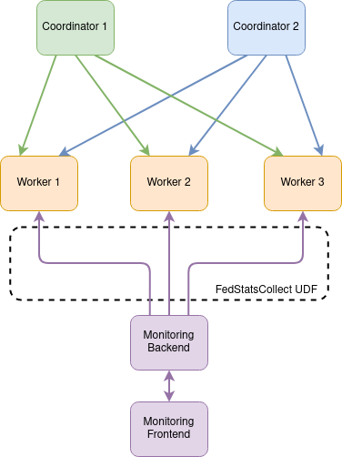

<!--

Licensed to the Apache Software Foundation (ASF) under one or more
contributor license agreements.  See the NOTICE file distributed with
this work for additional information regarding copyright ownership.
The ASF licenses this file to you under the Apache License, Version 2.0
(the "License"); you may not use this file except in compliance with
the License.  You may obtain a copy of the License at

http://www.apache.org/licenses/LICENSE-2.0

Unless required by applicable law or agreed to in writing, software
distributed under the License is distributed on an "AS IS" BASIS,
WITHOUT WARRANTIES OR CONDITIONS OF ANY KIND, either express or implied.
See the License for the specific language governing permissions and
limitations under the License.

-->

## SystemDS Federated Monitoring Software

### Introduction

To monitor the federated infrastructure of SystemDS, a monitoring tool was developed for this purpose.
A general overview of the architecture can be seen in [**Figure 1**](figure-1).
The monitoring tool consists of two separate decoupled modules, the Java-based **monitoring backend** and 
the **monitoring frontend** developed in [Angular](https://angular.io/).

**NOTE:** To work with the monitoring tool both the back- and frontend services must be running!



### Installation & Build

#### 1. Monitoring Backend

The required packages for SystemDS, can be found [here](./install.md).

To install and build the packages for the backend, the usual process for building and installing
SystemDS is sufficient:

```bash
# 1. Go into the directory of systemds
cd /home/ubuntu/systemds
# 2. Compile SystemDS
mvn clean package
```

#### 2. Monitoring Frontend

Since the frontend is in **Angular v13**, a **node version 12/14/16** or later minor version is required.

Example **node and npm** installation for **Ubuntu 20.04**:
```bash
# Installation tutorial:
# https://linuxize.com/post/how-to-install-node-js-on-ubuntu-20-04/

# 1. Download and execute the NodeSource installation script
curl -sL https://deb.nodesource.com/setup_14.x | sudo -E bash -
# 2. Install Node.js and npm
sudo apt install nodejs

# 3. Verify installation ----
node --version
# Output
# v14.2.0

npm --version
# Output
# 6.14.4
# ---------------------------
```

To install the npm packages required for the Angular app to run:

```bash
# 1. Go into the directory of systemds
cd /home/ubuntu/systemds
# 2. Go into the directory with the frontend app
cd scripts/monitoring
# 3. Install all npm packages 
npm install
```
After those steps all the packages needed for running the monitoring tool should be installed.

### Running

Both back- and frontend applications are separate modules of the same tool, they can be independently started and stopped. 
Since they are designed with loose decoupling in mind, the frontend can integrate with different backends, and 
the backend can work with different frontends, provided that the format of the data and the communication protocol is 
preserved.

#### 1. Monitoring Backend

To run the backend, use the `-fedMonitoring` flag followed by a `port`:

```bash
# 1. Go into the directory of systemds
cd /home/ubuntu/systemds
# 2. Go to the target directory
cd target
# 3. Start the backend with the -fedMonitoring flag and a port
java -cp ./lib/*:./SystemDS.jar org.apache.sysds.api.DMLScript -fedMonitoring 8080

# You should see something like this
#[ INFO] Setting up Federated Monitoring Backend on port 8080
#[ INFO] Starting Federated Monitoring Backend server at port: 8080
#[ INFO] Started Federated Monitoring Backend at port: 8080
```
This will start the backend server which will be listening for REST requests on `http://localhost:8080`.

**NOTE:** The backend is polling all registered workers with a given frequency, it can be changed by including 
the `<sysds.federated.monitorFreq>3</sysds.federated.monitorFreq>` in the `SystemDS-config.xml` file, accepting
**doubles**, representing seconds (0.5 can be used for setting the frequency to be half a second). The example shown 
here will start the backend with polling with frequency of **3 seconds**, which is also the default value.

#### 2. Monitoring Frontend

To run the Angular app:

```bash
# 1. Go into the directory of systemds
cd /home/ubuntu/systemds
# 2. Go into the directory with the frontend app
cd scripts/monitoring
# 3. Start the angular app 
npm start
```
After this step the Angular UI should be started on [http://localhost:4200](http://localhost:4200) and can be viewed by opening the 
browser on the same address.

**NOTE:** The address of the backend is hardcoded in the frontend application and can be changed by changing the `BASE_URI` in the `systemds/scripts/monitoring/app/constants.ts` file. **DO NOT** include a trailing slash `/`, at the end of the address.

#### 3. Coordinator self-registration for monitoring

In addition to the manual registration of coordinators for monitoring, the self-registration feature can be used by 
setting the `-fedMonitoringAddress` flag followed by the address of the backend:

```bash
# 1. Go into the directory of systemds
cd /home/ubuntu/systemds
# 2. Go to the target directory
cd target
# 3. Start the coordinator process with the -fedMonitoringAddress flag and the address of the backend
java -cp ./lib/*:./SystemDS.jar org.apache.sysds.api.DMLScript \
-f testFederated.dml -exec singlenode -explain -debug -stats 20 -fedMonitoringAddress http://localhost:8080
```

**NOTE:** The backend service should already be running, otherwise the coordinator will not start.
