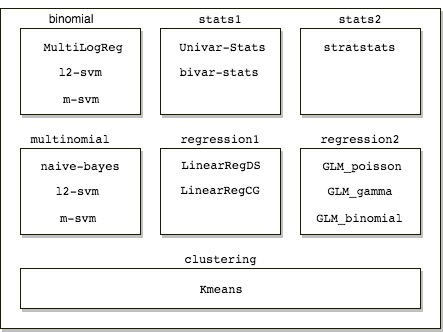

<!--

Licensed to the Apache Software Foundation (ASF) under one or more
contributor license agreements.  See the NOTICE file distributed with
this work for additional information regarding copyright ownership.
The ASF licenses this file to you under the Apache License, Version 2.0
(the "License"); you may not use this file except in compliance with
the License.  You may obtain a copy of the License at

http://www.apache.org/licenses/LICENSE-2.0

Unless required by applicable law or agreed to in writing, software
distributed under the License is distributed on an "AS IS" BASIS,
WITHOUT WARRANTIES OR CONDITIONS OF ANY KIND, either express or implied.
See the License for the specific language governing permissions and
limitations under the License.

-->

* This will become a table of contents (this text will be scraped).
{:toc}

# Performance Testing Algorithms User Manual

This user manual contains details on how to conduct automated performance tests. Work was mostly done in this [PR](https://github.com/apache/systemml/pull/537) and part of [SYSTEMML-1451](https://issues.apache.org/jira/browse/SYSTEMML-1451). Our aim was to move from existing `bash` based performance tests to automatic `python` based automatic performance tests.

## Architecture

Our performance tests suit contains `7` families namely `binomial`, `multinomial`, `stats1`, `stats2`, `regression1`, `regression2`, `clustering`. Within these families we have algorithms grouped under it. Typically a family is a set of algorithms that require the same data generation script.

- Exceptions: `regression1`, `regression2` and `binomial`. We decide to include these algorithms in separate families to keep the architecture simple.

On a very high level use construct a string with arguments required to run each operation. Once this string is constructed we use the subprocess module to execute this string and extract time from the standard out.

We also use `json` module write our configurations to a json file. This ensure that our operations are easy to debug.

We have `7` files in performance test suit:

- Entry File `run_perftest.py`
- Supporting Files `datagen.py`, `train.py`, `predict.py`
- Utility Files `utils_exec.py`, `utils_fs.py`, `utils_misc.py`

`datagen.py`, `train.py` and `predict.py` generate a dictionary. Our key is the name of algorithm being processed and values is a list with path(s) where all the data required is present. We define this dictionary as a configuration packet.

We will describe each of them in detail the following sections below.

`run_perftest.py` at a high level creates `algos_to_run` list. This list is tuple with key as algorithm and value as family to be executed in our performance test.

In `datagen.py` script we have all functions required to generate data. We return the required configuration packet as a result of this script, that contains key as the `data-gen` script to run and values with location to read data-gen json files from.

In `train.py` script we have functions required to generate training output. We return the required configuration packet as a result of this script, that contains key as the algorithm to run and values with location to read training json files from.

The file `predict.py` contains all functions for all algorithms in the performance test that contain predict script. We return the required configuration packet as a result of this script, that contains key as the algorithm to run and values with location to read predict json files from.

In the file(s) `utils_*.py` we have all the helper functions required in our performance test. These functions do operations like write `json` files, extract time from std out etc.

## Adding New Algorithms

While adding a new algorithm we need know if it has to be part of the any pre existing family. If this algorithm depends on a new data generation script we would need to create a new family. Steps below to take below to add a new algorithm.

Following changes to `run_perftest.py`:

- Add the algorithm to `ML_ALGO` dictionary with its respective family.
- Add the name of the data generation script in `ML_GENDATA` dictionary if it does not exist already.
- Add the name of the training script in `ML_TRAIN` dictionary.
- Add the name of the prediction script in `ML_PREDICT` incase the prediction script exists.

Following changes to `datagen.py`:

- Check if the data generation algorithm has the ability to generate dense and sparse data. If it had the ability to generate only dense data add the corresponding family to `FAMILY_NO_MATRIX_TYPE` list.
- Create a function with `familyname + _ + datagen` with same input arguments namely `matrix_dim`, `matrix_type`, `datagen_dir`.
- Constants and arguments for the data generation script should be defined in function.
- Test the perf test with the algorithm with `mode` as `data-gen`.
- Check output folders, json files, output log.
- Check for possible errors if these folders/files do not exist. (See the troubleshooting section).

Following changes to `train.py`:

- Create the function with `familyname + _ + algoname + _ + train`.
- This function needs to have the following arguments `save_folder_name`, `datagen_dir`, `train_dir`.
- Constants and arguments for the training script should be defined in function.
- Make sure that the return type is a list.
- Test the perf test with the algorithm with `mode` as `train`.
- Check output folders, json files, output log.
- Check for possible errors if these folders/files do not exist. (See the troubleshooting section).

Following changes to `predict.py`:

- Create the function with `algoname + _ + predict`.
- This function needs to have the following arguments `save_file_name`, `datagen_dir`, `train_dir`, `predict_dir`.
- Constants and arguments for the training script should be defined in function.
- Test the perf test with the algorithm with `mode` as `predict`.
- Check output folders, json files, output log.
- Check for possible errors if these folders/files do not exist. (Please see the troubleshooting section).
- Note: `predict.py` will not be executed if the current algorithm being executed does not have predict script.

## Current Default Settings

Default setting for our performance test below:

- Matrix size to 10,000 rows and 100 columns.
- Execution mode `singlenode`.
- Operation modes `data-gen`, `train` and `predict` in sequence.
- Matrix type set to `all`. Which will generate `dense`, `sparse` matrices for all relevant algorithms.

## Examples

Some examples of SystemML performance test with arguments shown below:

`./scripts/perftest/python/run_perftest.py --family binomial clustering multinomial regression1 regression2 stats1 stats2
`
Test all algorithms with default parameters.

`./scripts/perftest/python/run_perftest.py --exec-type hybrid_spark --family binomial clustering multinomial regression1 regression2 stats1 stats2
`
Test all algorithms in hybrid spark execution mode.

`./scripts/perftest/python/run_perftest.py --exec-type hybrid_spark --family clustering --mat-shape 10k_5 10k_10 10k_50
`
Test all algorithms in `clustering` family in hybrid spark execution mode, on different matrix size `10k_10` (10,000 rows and 5 columns), `10k_10` and `10k_50`.

`./scripts/perftest/python/run_perftest.py --algo Univar-Stats bivar-stats
`
Run performance test for following algorithms `Univar-Stats` and `bivar-stats`.

`./scripts/perftest/python/run_perftest.py --algo m-svm --family multinomial binomial --mode data-gen train
`
Run performance test for the algorithms `m-svm` with `multinomial` family. Run only data generation and training operations.

`./scripts/perftest/python/run_perftest.py --family regression2 --filename new_log
`
Run performance test for all algorithms under the family `regression2` and log with filename `new_log`.

`./scripts/perftest/python/run_perftest.py --family binomial clustering multinomial regression1 regression2 stats1 stats2 --config-dir /Users/krishna/open-source/systemml/scripts/perftest/temp3 --temp-dir hdfs://localhost:9000/temp3`
Run performance test for all algorithms using HDFS.

## Google sheets API

Steps below to configure google client API:

- Navigate to [Google APIs Console](https://console.developers.google.com/apis/).
- Create a new project.
- Click Enable API. Search for and enable the Google Drive API.
- Create credentials for a Web Server to access Application Data.
- Name the service account and grant it a Project Role of Editor.
- Download the JSON file.
- Copy the JSON file to your code directory and rename it to client_secret.json

Steps below to configure google sheets:

- Create a new spread sheet with google sheets.
- Create seperate sheets for `singlenode` and `hybrid_spark`.
- Find the  client_email inside client_secret.json and save it.
- Back in your spreadsheet, click the Share button in the top right, and paste the client email into the People field to give it edit rights for each sheet.
- Click Send

## Result Consolidation and Plotting
We have two scripts, `stats.py` forpulling results from google docs and `update.py` to updating results to google docs or local file system.

Example of `update.py` would be below
`./scripts/perftest/python/google_docs/update.py --file  ../../temp/perf_test_singlenode.out --exec-type singlenode --tag 2 --append test.csv` 
The arguments being `--file` path of the perf-test output, `--exec-type` execution mode used to generate the perf-test output, `--tag` being the realease version or a unique name, `--append` being an optional argument that would append the a local csv file. If instead of `--append` the `--auth` argument needs the location of the `google api key` file.

Example of `stats.py` below 
`  ./stats.py --auth ../key/client_json.json --exec-type singlenode --plot stats1_data-gen_none_dense_10k_100`
`--plot` argument needs the name of the composite key that you would like to compare results over. If this argument is not specified the results would be grouped by keys.

## Operational Notes

All performance test depend mainly on two scripts for execution `systemml-standalone.py` and `systemml-spark-submit.py`. Incase we need to change standalone or spark parameters we need to manually change these parameters in their respective scripts.

Constants like `DATA_FORMAT` currently set to `csv` and `MATRIX_TYPE_DICT` with `density` set to `0.9` and `sparsity` set to `0.01` are hardcoded in the performance test scripts. They can be changed easily as they are defined at the top of their respective operational scripts.

The logs contain the following information below comma separated.

algorithm | run_type | intercept | matrix_type | data_shape | time_sec
--- | --- | --- | --- | --- | --- |
multinomial|data-gen|0|10k_100|dense| 0.33
MultiLogReg|train|0|10k_100|dense|6.956
MultiLogReg|predict|0|10k_100|dense|4.780

These logs and config `json` files can be found in `temp` folder (`$SYSTEMML_HOME/scripts/perftest/temp`) in-case not overridden by `--config-dir`.

`--temp-dir` by default points to local file system. We can change this to point to a hdfs path by `--temp-dir hdfs://localhost:9000/temp` where all files generated during execution will be saved.

Every time a script executes in `data-gen` mode successfully, we write a `_SUCCESS` file. If this file exists we ensures that re-runs of the same script is not possible. Support for configuration options like `-stats`, `-explain`, `--conf` have also been added.

Results obtained by our performance tests can be automatically uploaded to google docs.

`./update.py --file ../temp/singlenode.out --exec-mode singlenode --auth client_json.json --tag 1.0`

In the example above `--tag` can be a major/minor systemml version and `--auth` points to the `json` key required by `google docs`.

Currently we only support time difference between algorithms in different versions. This can be obtained by running the script below
`./stats.py --auth client_json.json --exec-mode singlenode --tags 1.0 2.0`

We pass different `matrix shapes` using `--mat-shape` argument.

Matrix Shape | Approximate Data Size 
--- | --- |
10k_1k|80MB
100k_1k|800MB
1M_1k|8GB
10M_1k|80GB
100M_1k|800GB

For example the command below runs performance test for all data sizes described above
`run_perftest.py --family binomial clustering multinomial regression1 regression2 stats1 stats2 --mat-shape 10k_1k 100k_1k 1M_1k 10M_1k 100M_1k --master yarn-client  --temp-dir hdfs://localhost:9000/user/systemml`

By default data generated in `hybrid_spark` execution mode is in the current users `hdfs` home directory.

Note: Please use this command `pip3 install -r requirements.txt` before using the perftest scripts.

## Troubleshooting

We can debug the performance test by making changes in the following locations based on

- Please see `utils_exec.py` function `subprocess_exec`.
- Please see `run_perftest.py`. Changing the verbosity level to `0` allows us to log more information while the script runs.
- Eyeballing the json files generated and making sure the configuration arguments are correct.
