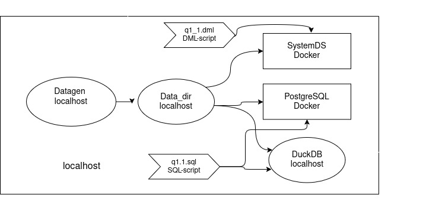

# Star Schema Benchmark (SSB) for SystemDS [SystemDS-3862](https://issues.apache.org/jira/browse/SYSTEMDS-3862) 


## Foundation
- There are [13 queries already written in SQL](https://github.com/apache/doris/tree/master/tools/ssb-tools/ssb-queries).
- There are existing DML relational algebra operations raSelect(), raJoin() and raGroupBy().
- Our task is to implement the DML version of these queries and run them in SystemDS and PostgreSQL.
- There are existing DML query implementations ([Git request](https://github.com/apache/systemds/pull/2280) and [code](https://github.com/apache/systemds/tree/main/scripts/staging/ssb)) of the previous group which are a bit slow and contain errors. They also provided longer scripts to run experiments in SystemDS, PostgreSQL and DuckDB.
## Changes
1. **DML Queries**
- In this project, we improved and fixed errors of some DML queries.
- The major changes are 
  - Switching the join algorithm from `sort-merge` to `hash2`.
  - Using consistently transformencode() and transformdecode() for string comparisions (Before, it was only used in [q4_3](https://github.com/apache/systemds/tree/main/scripts/staging/ssb/queries/q4_3.dml)). It leads to correct results.
2. **Test Script**
- The main purpose of this project test script is to simply run the queries. The focus is less on benchmarking the execution times. The reason is that the queries run very slow in SystemDS which cannot be compared to PostgreSQL and DuckDB. The main bottleneck are the join algorithms.
- Thus the main differences to the last group are:
  - Using the simpler [ssb-dbgen](https://github.com/eyalroz/ssb-dbgen/tree/master) for generating data.
  - Not a full testbench with detailed views for different execution times and database.
  - Running PostgreSQL and SystemDS in Docker containers instead of using it locally. See below.
## Directory structure
```
ssb/
├── docker-compose.yaml             # Compose file for Docker containers (here for PostgreSQL)
├── Dockerfile
├── other                           # Some other files (necessary)
├── README.md                       # This explanation
├── queries/                        # DML queries (q1_1.dml ... q4_3.dml)
│   ├── q1_1.dml - q1_3.dml          
│   ├── q2_1.dml - q2_3.dml          
│   ├── q3_1.dml - q3_4.dml          
│   └── q4_1.dml - q4_3.dml          
├── shell/
│   ├── run_script.sh               # Main script
└── (sql/                           # SQL versions)
## Setup
- First, install [Docker](https://docs.docker.com/get-started/get-docker/), [Docker Compose](https://docs.docker.com/compose/install/) and its necessary libraries. The script does not cover Docker installation.
  
  For Ubuntu, there is the following tutorials [for Docker](https://docs.docker.com/engine/install/ubuntu/#install-using-the-repository) and [Docker Compose](https://docs.docker.com/compose/install/linux/#install-using-the-repository) using apt repository. You can add [Docker Desktop](https://docs.docker.com/desktop/setup/install/linux/ubuntu/), too.
  
The shell script covers the installation of the following points. We use Ubuntu and Debian. For other OS, please look closer at the documentations.
- Docker compose installation for Ubuntu/Debian (For other OS look [here](https://docs.docker.com/compose/install/))
- Docker version of the database system [SystemDS](https://apache.github.io/systemds/site/docker)
- Docker compose version of [PostgreSQL](docker-compose.yaml) based on its [documentation]((https://hub.docker.com/_/postgres)).
- [ssb-dbgen](https://github.com/eyalroz/ssb-dbgen/tree/master) (SSB data set generator `datagen`)
- 

## Structure of the test system

Our script will depict the following structure.
The data is generated by datagen and stored locally (on localhost). 

After that, it is copied into two database containers (SystemDS, PostgreSQL) and a  local DuckDB database where the queries are executed.

## Run the script
### Before running the script
Before running the script, create an .env file to set PostgreSQL environment variables.
```
# in .env file
POSTGRES_USER=[YOUR_USERNAME]
POSTGRES_PASSWORD=[YOUR_USERNAME]
POSTGRES_DB=[YOUR_DB_NAME]
PORT_NUMBER=[YOUR_PORT_NUMBER]
```

Mark the script as executable.
```
$ chmod +x run_script.sh
```
### Run the script
To run the queries, we can execute the following shell script `run_script.sh`  (in ssb directory). It has the three following parameter flags.
1. `-q`: (QUERY_NAME) Name of the query to be executed.
    - `all`: executes all queries
    - **[QUERY_NAME]** like q1_1 or q1.1: Executes the selected query like q1_1. dml. Both formats q1_1 or q1.1 are allowed. It will be automatically translated.
    - Currently, the following queries are available (q1_1, q1_2, q1_3, q2_1, q2_2, q2_3, q3_1, "q3_2,q3_3, q3_4, q4_1, q4_2, q4_3)
    - Default: `q2_1`
2. `-s`: (SCALE) The numerical scale factor like 0.01 or 1 etc.
    - Be careful: Please do not experiment with large scale factor over 0.2 in SystemDS. Its join operation is currently very slow.
    - Default: `0.1`
3. `-d`: (DB_SYSTEM) Name of the database system used.
    - `all`: executes queries in all three databases.
    - `systemds`: SystemDS executes DML scripts with basic output.
    - `systemds_stats`: SystemDS executes DML scripts with extended output (--stats).
    - `postgres`: PostgreSQL executes SQL queries.
    - `duckdb`: DuckDB executes SQL queries.
    - Default: `systemds`
4. `-g`: (GUI_DOCKER): Use GUI docker desktop. No arguments to pass. Set only the flag "-g".
5. `-h`: (HELP) Display the script explanation from ReadMe.md. No arguments to pass. Set only the flag "-h".
The command line could look like this:
```
$ ./run_script.sh -q [YOUR_QUERY_NAME] -s [YOUR_SCALE] -d [YOUR_DB_SYSTEM]
```
Examples
```
$ ./run_script.sh -q all -s 0.1 -d all
$ ./run_script.sh -q q4_3 -s 0.1 -d systemds
$ ./run_script.sh -q all -s 1 -d duckdb
$ ./run_script.sh -q q1.1 -s 1 -d postgres -g
```

# Example output
Here is how the (abridged) script output could like.
The script does the following steps:
- Loading arguments and environment variables
- Installing packages (and asking permissions for it)
- Generating data with datagen (SSB data generator)
- Loading Docker images for SystemDS or PostgreSQL
- Initializing Docker database containers and duckDB database
- Loading the SQL scheme and data into databases
- Running the selected queries
```
user@user1:~/systemds/scripts/staging/ssb$ ./shell/run_script.sh -q q2_3 -s 0.1 -d all -g
=== Test environment for SSB Data ===

g-flag is set. That means, the docker desktop GUI is used.
Arg 0 (SHELL_SCRIPT): ./shell/run_script.sh
Arg 1 (QUERY_NAME): q2_3
Arg 2 (SCALE): 0.1
Arg 3 (DB_SYSTEM): all
==========
Install required packages
Check whether the following packages exist:
If only SystemDS: docker 'docker compose' git gcc cmake make
For PostgreSQL: 'docker compose'
For DuckDB: duckdb
If using g-flag [GUI]: docker desktop
==========
Check for existing data directory and prepare the ssb-dbgen
Can we look for new updates of the datagen repository?. If there are, do you want to pull it? (yes/no)
yes
Your answer is 'no'
==========
Build ssb-dbgen and generate data with a given scale factor
[...]
SSB (Star Schema Benchmark) Population Generator (Version 1.0.0)
Copyright Transaction Processing Performance Council 1994 - 2000
Generating data for part table [pid: 1]: done.
Generating data for suppliers table [pid: 1]: done.
[...]
Number of rows of created tables.
Table customer has 3000 rows.
Table part has 20000 rows.
Table supplier has 200 rows.
Table date has 255 rows.
Table lineorder has 600597 rows.
==========
Start the SystemDS docker container.
Docker Desktop is already running
==========
Execute DML queries in SystemDS

Execute query q2_3.dml
WARNING: Using incubator modules: jdk.incubator.vector
Loading tables from directory: /scripts/data_dir
SUM(lo_revenue) | d_year | p_brand
# FRAME: nrow = 1, ncol = 3
# C1 C2 C3
# INT32 INT32 STRING
72081993 1992 MFGR#2239


Q2.3 finished.

SystemDS Statistics:
Total execution time:           9.924 sec.

==========
Start the PostgreSQL Docker containter and load data.
Docker Desktop is already running

Successfully copied 282kB to ssb-postgres-1:/tmp
Load customer table with number_of_rows:
TRUNCATE TABLE
COPY 3000
Successfully copied 1.7MB to ssb-postgres-1:/tmp
Load part table with number_of_rows:
TRUNCATE TABLE
COPY 20000
[...]
==========
Execute SQL queries in PostgresSQL
Execute query q2.3.sql
docker exec -i ssb-postgres-1 psql -U userA -d db1  < sql/q2.3.sql
   sum    | d_year |  p_brand  
----------+--------+-----------
 72081993 |   1992 | MFGR#2239
(1 row)

==========
Start a DuckDB persistent database and load data.
Load customer table
┌────────────────┐
│ number_of_rows │
│     int64      │
├────────────────┤
│      3000      │
└────────────────┘
Load part table
┌────────────────┐
│ number_of_rows │
│     int64      │
├────────────────┤
│     20000      │
└────────────────┘
[...]
==========
Execute SQL queries in DuckDB
Execute query q2.3.sql
┌─────────────────┬────────┬───────────┐
│ sum(lo_revenue) │ d_year │  p_brand  │
│     int128      │ int32  │  varchar  │
├─────────────────┼────────┼───────────┤
│    72081993     │  1992  │ MFGR#2239 │
└─────────────────┴────────┴───────────┘
==========
Test bench finished successfully.
```

## Troubleshooting
- If you encounter docker problems like "Permission denied" or data not loaded successfully into the tables, try to restart docker or remove the container. You can also switch between the standard Docker Engine (with GUI) or Docker Desktop (with GUI) with flag `-g`.