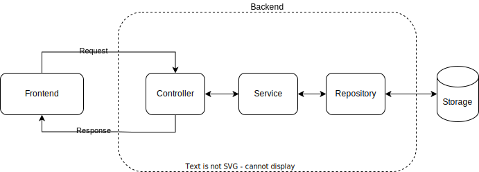
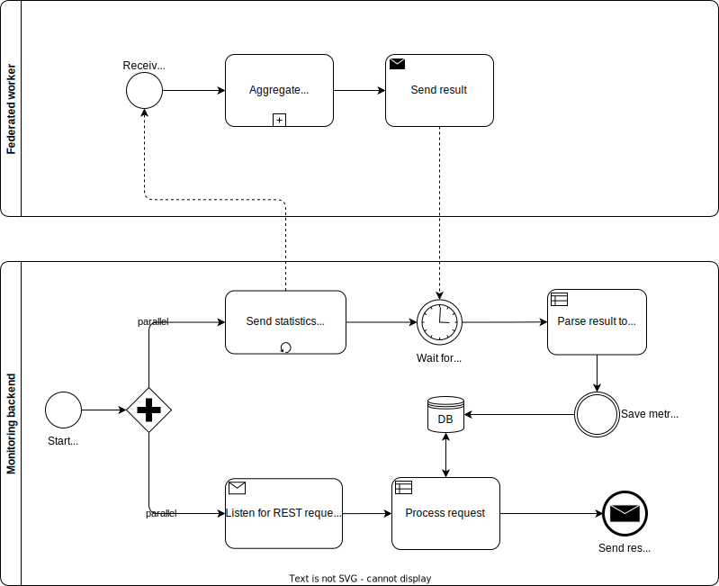

<!--

Licensed to the Apache Software Foundation (ASF) under one or more
contributor license agreements.  See the NOTICE file distributed with
this work for additional information regarding copyright ownership.
The ASF licenses this file to you under the Apache License, Version 2.0
(the "License"); you may not use this file except in compliance with
the License.  You may obtain a copy of the License at

http://www.apache.org/licenses/LICENSE-2.0

Unless required by applicable law or agreed to in writing, software
distributed under the License is distributed on an "AS IS" BASIS,
WITHOUT WARRANTIES OR CONDITIONS OF ANY KIND, either express or implied.
See the License for the specific language governing permissions and
limitations under the License.

-->

# Backend for monitoring tool of federated infrastructure

A backend application, used to collect, store, aggregate and return metrics data from coordinators and workers in the cluster

## Install & Run

The backend process can be started in a similar manner with how a worker is started:

```bash
  cd systemds
  mvn package
  ./bin/systemds [-r] FEDMONITORING [SystemDS.jar] <portnumber> [arguments]
```

Or with the specified **-fedMonitoring 8080** flag indicating the start of the backend process on the specified port, in our case **8080**.

## Main components

### Architecture

The following diagram illustrates the processes running in the backend.



#### Controller

Serves as the main integration point between the frontend and backend.

#### Service

Holds the business logic of the backend application.

#### Repository

serves as the main integration point between the backend and the chosen persistent storage. It can be extended to persist data in the file system, by extending the **IRepository** class and changing the instance in the service classes.

### Database schema

The following diagram illustrates the current state of the database schema.


### Important to note

- There is no foreign key constraint between the worker and statistics tables.
- The field for **coordinatorTraffic** is parsed into JSON format upon retrieval and saved as a string in the database. Example:

```json
{
  "datetime": "2022-06-24T17:08:56.897188", 
  "coordinatorAddress": "localhost:8445", 
  "byteAmount": 45000
}
```

- The field for **heavyHitters** is parsed into JSON format upon retrieval and saved as a string in the database. Example:

```json
{
  "instruction": "fed_uamin", 
  "count": 4, 
  "duration": 0.5
}
```

### Processes

The following diagram illustrates the processes running in the backend.



#### Statistics collection thread

There is a dedicated thread for the communication between the backend and the workers and statistics are gathered periodically (every 3 seconds by default).

#### Request processing

The main logic of the application listens for REST requests coming from the frontend.  
